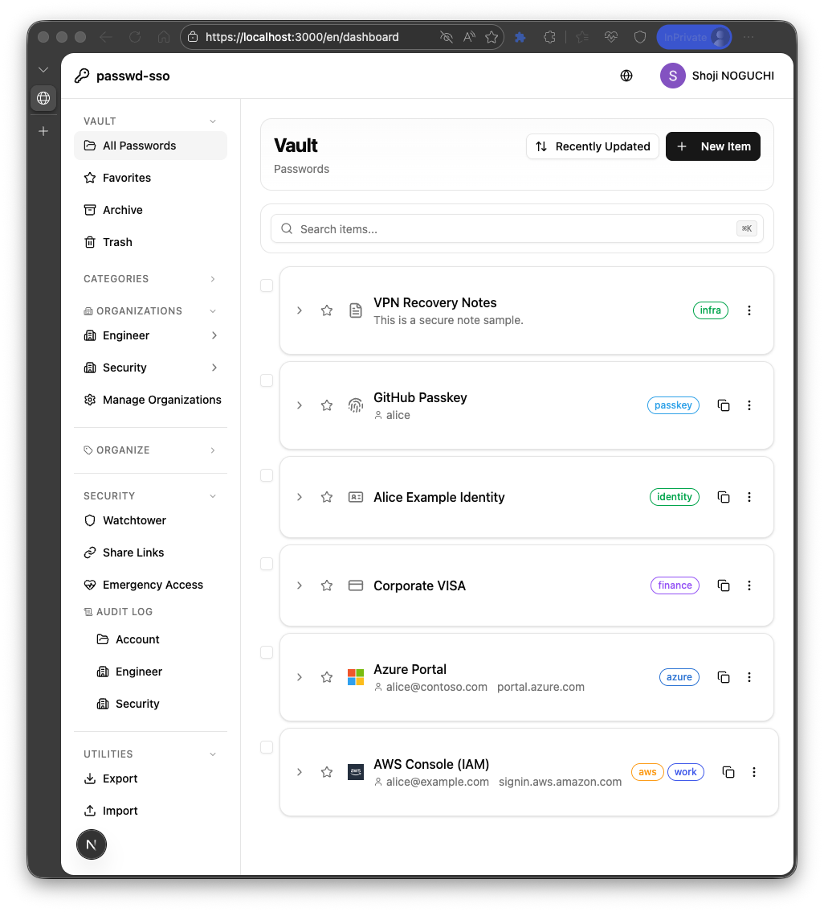
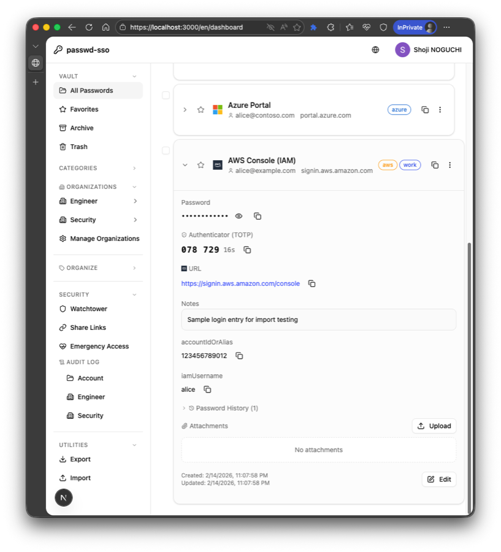
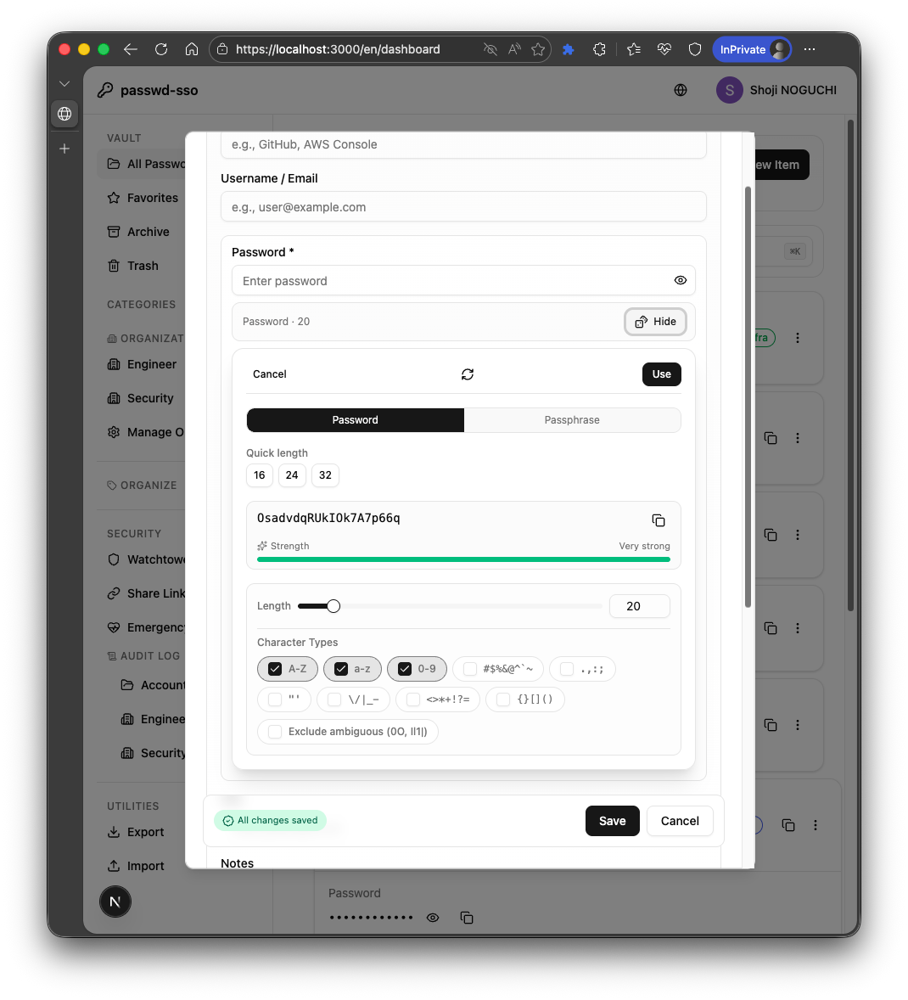
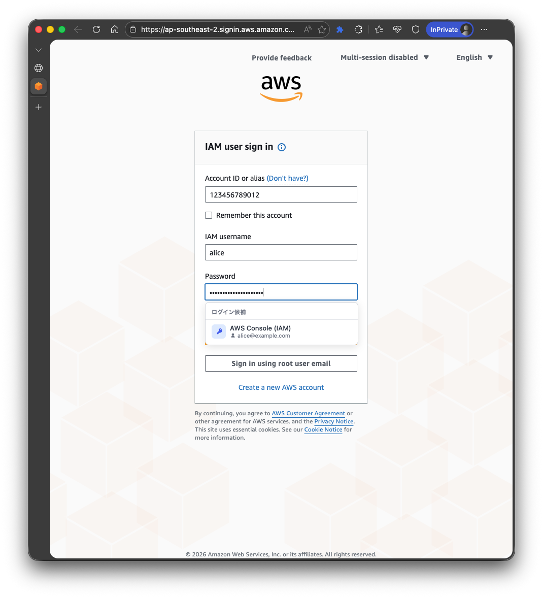
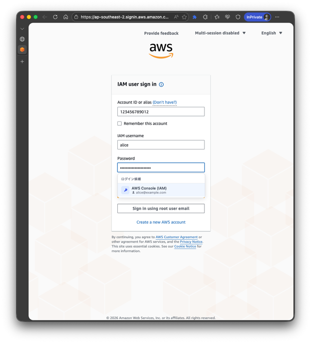

# passwd-sso

[English](README.md)

SSO 認証とエンドツーエンド暗号化を備えたセルフホスト型パスワードマネージャーです。

## 機能

- **SSO 認証** - Google OIDC + SAML 2.0（[BoxyHQ SAML Jackson](https://github.com/boxyhq/jackson) 経由）
- **エンドツーエンド暗号化** - AES-256-GCM; サーバーは平文パスワードを一切見ません
- **マスターパスフレーズ** - PBKDF2（600k iterations）+ HKDF 鍵導出、Secret Key 付き
- **複数エントリタイプ** - パスワード、セキュアノート、クレジットカード、ID/個人情報、パスキー記録
- **パスワード生成** - ランダムパスワード（8-128 文字）、diceware パスフレーズ（3-10 単語）
- **TOTP 認証** - 2FA コードの保存と生成（otpauth:// URI 対応）
- **セキュリティ監査（Watchtower）** - 漏洩（HIBP）、弱い、再利用、古い、HTTP URL の検出とスコア表示
- **インポート / エクスポート** - Bitwarden、1Password、Chrome CSV インポート; CSV/JSON エクスポート（互換 / passwd-sso 完全復元プロファイル）
- **パスワード保護エクスポート** - AES-256-GCM + PBKDF2（600k）で暗号化
- **ファイル添付** - 暗号化ファイル添付（個人/チームとも E2E）
- **共有リンク** - 期限付きの読み取り専用共有 + アクセスログ
- **監査ログ** - 個人/チームの監査ログ（フィルタ、エクスポートイベント記録）
- **緊急アクセス** - 鍵交換による一時的な Vault アクセスの申請/承認
- **セッション管理** - アクティブセッション一覧と個別/全体失効
- **セキュリティ通知** - 緊急アクセスイベントのメール通知
- **鍵ローテーション** - パスフレーズ検証による暗号化鍵の更新
- **タグ & 整理** - 色付きタグ、お気に入り、アーカイブ、ゴミ箱（30 日自動削除）
- **キーボードショートカット** - `/ or Cmd+K` 検索、`n` 新規、`?` ヘルプ、`Esc` クリア
- **多言語対応** - 日本語・英語（next-intl）
- **ダークモード** - ライト / ダーク / システム（next-themes）
- **チーム Vault** - チームでのパスワード共有（E2E 暗号化、RBAC: Owner/Admin/Member/Viewer）
- **回復キー** - 256 ビット回復キー（HKDF + AES-256-GCM）、Base32 エンコード + チェックサム; パスフレーズなしで Vault を復旧
- **Vault リセット** - 最終手段としての全データ削除（確認トークン "DELETE MY VAULT"）
- **アカウントロックアウト** - 段階的ロックアウト（5 回→15 分、10 回→1 時間、15 回→24 時間）+ 監査ログ
- **レート制限** - Redis による Vault アンロック試行制限
- **CSP & セキュリティヘッダー** - nonce ベースの Content Security Policy、CSP 違反レポート
- **SCIM 2.0 プロビジョニング** - テナントスコープのユーザー/グループ同期（RFC 7644）、Bearer トークン認証
- **マルチテナント分離** - PostgreSQL FORCE ROW LEVEL SECURITY（28 テーブル）、IdP クレームによるテナント解決
- **セルフホスト** - Docker Compose（PostgreSQL + SAML Jackson + Redis）
- **ブラウザ拡張（Chrome/Edge, MV3）** - 手動補完、インライン候補、AWS 3 フィールド補完（Account ID/Alias + IAM username + Password）

## 技術スタック

| レイヤー | 技術 |
|---|---|
| フレームワーク | Next.js 16（App Router, Turbopack） |
| 言語 | TypeScript 5.9 |
| データベース | PostgreSQL 16 |
| ORM | Prisma 7（driver adapter + pg） |
| 認証 | Auth.js v5（データベースセッション） |
| SAML ブリッジ | BoxyHQ SAML Jackson（Docker） |
| UI | Tailwind CSS 4 + shadcn/ui + Radix UI |
| 暗号化 | Web Crypto API（Vault E2E）+ AES-256-GCM（サーバーサイド: 共有リンク / Send） |
| キャッシュ / レート制限 | Redis 7 |

## アーキテクチャ

```
ブラウザ (Web Crypto API)
  │  ← 個人/チーム Vault: AES-256-GCM E2E 暗号化/復号
  ▼
Next.js アプリ (SSR / API Routes)
  │  ← Auth.js セッション、ルート保護、RBAC
  │  ← 共有リンク / Send: サーバーサイド AES-256-GCM 暗号化
  ▼
PostgreSQL ← Prisma 7          Redis ← レート制限
  │
  ▼
SAML Jackson (Docker) ← SAML 2.0 IdP (HENNGE, Okta, Azure AD 等)
```

**個人 Vault** — すべてのパスワードデータは**クライアントサイドで暗号化**されてからサーバーに送信されます。サーバーは暗号文のみを保存し、復号はユーザーのマスターパスフレーズから導出された鍵を使ってブラウザ内でのみ行われます。

**チーム Vault** — 共有パスワードは**クライアントサイド E2E**で暗号化されます。チーム鍵配布は ECDH-P256 によるメンバー鍵交換で行います。

## セットアップ

### 前提条件

- Node.js 20 以上
- Docker & Docker Compose
- Google Cloud プロジェクト（OIDC 用）および/または SAML IdP

### 1. クローンとインストール

```bash
git clone https://github.com/ngc-shj/passwd-sso.git
cd passwd-sso
npm install
```

### 2. 環境変数の設定

```bash
cp .env.example .env.local
```

`.env.local` を編集して以下を設定:

| 変数 | 説明 |
|---|---|
| `DATABASE_URL` | PostgreSQL 接続文字列 |
| `AUTH_SECRET` | `openssl rand -base64 32` で生成 |
| `AUTH_GOOGLE_ID` | Google OAuth クライアント ID |
| `AUTH_GOOGLE_SECRET` | Google OAuth クライアントシークレット |
| `GOOGLE_WORKSPACE_DOMAIN` | （任意）Google Workspace ドメインに制限 |
| `AUTH_TENANT_CLAIM_KEYS` | （任意）tenant 解決に使う IdP クレームキーをカンマ区切りで指定（例: `tenant_id,organization`） |
| `JACKSON_URL` | SAML Jackson URL（デフォルト: `http://localhost:5225`） |
| `AUTH_JACKSON_ID` | Jackson OIDC クライアント ID |
| `AUTH_JACKSON_SECRET` | Jackson OIDC クライアントシークレット |
| `SAML_PROVIDER_NAME` | サインインページの表示名（例: "HENNGE"） |
| `SHARE_MASTER_KEY` | サーバー暗号化される共有リンク / Send 用マスターキー — `openssl rand -hex 32` |
| `VERIFIER_PEPPER_KEY` | パスフレーズ検証用 pepper キー — `openssl rand -hex 32`（**本番必須**） |
| `REDIS_URL` | レート制限用 Redis URL（本番必須） |
| `BLOB_BACKEND` | 添付ファイルの保存先バックエンド（`db` / `s3` / `azure` / `gcs`） |
| `AWS_REGION`, `S3_ATTACHMENTS_BUCKET` | `BLOB_BACKEND=s3` の場合に必須 |
| `AZURE_STORAGE_ACCOUNT`, `AZURE_BLOB_CONTAINER` | `BLOB_BACKEND=azure` の場合に必須 |
| `AZURE_STORAGE_CONNECTION_STRING` または `AZURE_STORAGE_SAS_TOKEN` | `BLOB_BACKEND=azure` の場合はいずれか必須 |
| `GCS_ATTACHMENTS_BUCKET` | `BLOB_BACKEND=gcs` の場合に必須 |
| `BLOB_OBJECT_PREFIX` | クラウド保存時のオブジェクトキー接頭辞（任意） |

> **Redis は本番必須です。** 開発/テスト環境では `REDIS_URL` 未設定時に in-memory フォールバックを利用できます。

### 3. サービスの起動

**開発環境**（PostgreSQL + SAML Jackson + Next.js 開発サーバー）:

```bash
# 全サービスを起動（Redis でレート制限あり）
docker compose -f docker-compose.yml -f docker-compose.override.yml up -d db jackson redis

# Redis なしで起動（単一インスタンス / 最小構成）
docker compose -f docker-compose.yml -f docker-compose.override.yml up -d db jackson

# データベースマイグレーション
npm run db:migrate

# 開発サーバーを起動
npm run dev
```

[http://localhost:3000](http://localhost:3000) を開きます。

**本番環境**（Docker Compose 一括起動）:

```bash
docker compose up -d
```

### 4. 初回セットアップ

1. Google または SAML SSO でサインイン
2. マスターパスフレーズを設定（暗号化鍵の導出に使用）
3. パスワードの登録を開始

## ブラウザ拡張（Chrome/Edge）

本リポジトリには `extension/` 配下に MV3 拡張が含まれています。

### ビルド

```bash
cd extension
npm install
npm run build
```

### 読み込み（Unpacked）

1. `chrome://extensions`（または `edge://extensions`）を開く
2. **デベロッパーモード**を有効化
3. **パッケージ化されていない拡張機能を読み込む** をクリック
4. `extension/dist` を選択

### 基本フロー

1. 拡張ポップアップを開く
2. 必要に応じて拡張設定で `serverUrl` を設定
3. passwd-sso に接続/サインイン
4. Vault をアンロックして、手動補完 / インライン候補を利用
5. 必要時はポップアップの **Disconnect** で拡張トークンを失効（`DELETE /api/extension/token`）

## インポート用サンプル

- passwd-sso JSON サンプル: [`docs/samples/passwd-sso.json`](docs/samples/passwd-sso.json)
- passwd-sso CSV サンプル: [`docs/samples/passwd-sso.csv`](docs/samples/passwd-sso.csv)

## スクリーンショット

### ダッシュボード



### エントリー詳細（AWS 3フィールド例）



### パスワードジェネレーター



### 拡張スクリーンショット（AWS IAM 3フィールド補完）




## スクリプト

| コマンド | 説明 |
|---|---|
| `npm run dev` | 開発サーバー（Turbopack） |
| `npm run build` | プロダクションビルド |
| `npm run lint` | ESLint |
| `npm run test:watch` | テスト（ウォッチモード） |
| `npm run test:coverage` | テスト（カバレッジ付き） |
| `npm run test:e2e` | Playwright E2E テスト実行 |
| `npm run db:migrate` | Prisma マイグレーション（dev） |
| `npm run db:push` | マイグレーションなしでスキーマ反映 |
| `npm run db:seed` | シードデータ投入 |
| `npm run db:studio` | Prisma Studio GUI |
| `npm run generate:key` | 256 ビット hex キー生成 |
| `npm run licenses:check` | アプリ依存のライセンスチェック（non-strict） |
| `npm run licenses:check:strict` | アプリ依存のライセンスチェック（strict / CI用） |
| `npm run licenses:check:ext` | 拡張依存のライセンスチェック（non-strict） |
| `npm run licenses:check:ext:strict` | 拡張依存のライセンスチェック（strict / CI用） |
| `npm run test:load:smoke` | 負荷テスト用シードのスモークチェック |
| `npm run test:load:seed` | 負荷テスト用ユーザー/セッションをシード |
| `npm run test:load` | k6 mixed-workload シナリオ実行 |
| `npm run test:load:health` | k6 health シナリオ実行 |
| `npm run test:load:cleanup` | 負荷テスト用ユーザー/セッションを削除 |
| `npm run scim:smoke` | IdP なしで SCIM API のスモークチェック実行（`SCIM_TOKEN` 必須） |

ライフサイクルスクリプト（`available via npm run` には出ない）:
- `npm test` - テスト一括実行（`vitest run`）
- `npm start` - 本番サーバー起動（`next start`）

## プロジェクト構成

```
src/
├── app/[locale]/
│   ├── page.tsx              # ランディング / サインイン
│   ├── dashboard/            # 個人 Vault、チーム Vault、Watchtower 等
│   └── auth/                 # 認証ページ
├── app/api/
│   ├── auth/                 # Auth.js ハンドラー
│   ├── passwords/            # パスワード CRUD + 生成
│   ├── tags/                 # タグ CRUD
│   ├── vault/                # セットアップ、アンロック、ステータス、鍵ローテーション、回復キー、リセット
│   ├── teams/                # チーム管理API
│   ├── share-links/          # 共有リンク CRUD + アクセス
│   ├── audit-logs/           # 監査ログクエリ
│   ├── emergency-access/     # 緊急アクセスワークフロー
│   ├── watchtower/           # セキュリティ監査（HIBP、分析）
│   ├── health/               # ヘルスチェック（liveness + readiness）
│   ├── scim/v2/              # SCIM 2.0 プロビジョニング（Users / Groups）
│   └── csp-report/           # CSP 違反レポート
├── components/
│   ├── layout/               # Header, Sidebar, SearchBar
│   ├── passwords/            # PasswordList, PasswordForm, Generator、エントリタイプフォーム
│   ├── team/                 # チーム Vault UI（一覧、フォーム、設定、招待）
│   ├── emergency-access/     # 緊急アクセス UI
│   ├── share/                # 共有リンク UI
│   ├── watchtower/           # セキュリティ監査ダッシュボード
│   ├── vault/                # Vault ロック/アンロック UI、回復キーダイアログ/バナー
│   ├── tags/                 # TagInput, TagBadge
│   ├── providers/            # クライアントプロバイダー（テーマ、セッション等）
│   ├── auth/                 # SignOutButton
│   └── ui/                   # shadcn/ui コンポーネント
├── lib/
│   ├── crypto-client.ts      # クライアントサイド E2E 暗号化（個人 Vault）
│   ├── crypto-recovery.ts    # 回復キー暗号モジュール（HKDF + AES-256-GCM ラップ）
│   ├── crypto-server.ts      # 共有リンク / Send 用サーバー暗号 + verifier HMAC
│   ├── crypto-aad.ts         # 暗号化の追加認証データ（AAD）
│   ├── crypto-team.ts        # チーム E2E 暗号（ECDH-P256 鍵交換）
│   ├── crypto-emergency.ts   # 緊急アクセス鍵交換
│   ├── export-crypto.ts      # パスワード保護エクスポート暗号化
│   ├── team-auth.ts          # チーム RBAC 認可ヘルパー
│   ├── audit.ts              # 監査ログヘルパー
│   ├── vault-context.tsx     # Vault ロック/アンロック状態
│   ├── password-generator.ts # サーバーサイド安全生成
│   ├── password-analyzer.ts  # パスワード強度分析
│   ├── credit-card.ts        # クレジットカード検証 & フォーマット
│   ├── rate-limit.ts         # レート制限ロジック
│   ├── health.ts             # ヘルスチェックロジック（DB、Redis、タイムアウト）
│   ├── api-error-codes.ts    # API エラーコード一元管理 & i18n マッピング
│   ├── prisma.ts             # Prisma シングルトン
│   ├── redis.ts              # Redis クライアント（レート制限）
│   └── validations.ts        # Zod スキーマ
└── i18n/                     # next-intl ルーティング
extension/
├── src/background/           # Service Worker（トークン・アンロック・補完制御）
├── src/content/              # フォーム検知とページ内補完ロジック
├── src/popup/                # 拡張ポップアップ UI
└── manifest.config.ts        # MV3 マニフェスト定義
```

## セキュリティモデル

- **ゼロナレッジ** - サーバーは AES-256-GCM の暗号文のみを保存; ユーザーデータを復号できません
- **鍵導出** - パスフレーズ → PBKDF2（600k）→ ラッピング鍵 → ランダム 256 ビット秘密鍵をラップ
- **ドメイン分離** - 秘密鍵 → HKDF → 暗号化鍵 + 認証鍵に分離
- **Secret Key** - アカウント固有の追加ソルトでサーバー侵害に対する防御を強化
- **AAD バインディング** - 追加認証データで暗号文をユーザー・エントリ ID に紐付け
- **鍵ローテーション** - 全パスワード再入力なしで暗号化鍵を更新可能
- **セッションセキュリティ** - データベースセッション（JWT ではない）、8 時間タイムアウト + 1 時間延長
- **自動ロック** - 15 分無操作または 5 分タブ非表示で Vault をロック
- **クリップボードクリア** - コピーしたパスワードは 30 秒後に自動消去
- **チーム Vault** - E2E 暗号化（ECDH-P256）+ メンバーごとの鍵配布
- **RBAC** - Owner / Admin / Member / Viewer のロールベースアクセス制御
- **回復キー** - 256 ビットランダム → HKDF → AES-256-GCM で秘密鍵をラップ; サーバーは HMAC(pepper, verifierHash) のみ保存
- **Vault リセット** - 最終手段としての全データ削除（固定確認トークン）
- **アカウントロックアウト** - 段階的ロックアウト（5 回→15 分、10 回→1 時間、15 回→24 時間）、DB 永続 + 監査ログ
- **レート制限** - Redis による機密操作 API の制限（Vault アンロックを含む）
- **CSRF 防御** - JSON body + SameSite Cookie + CSP + Origin ヘッダー検証（破壊的エンドポイント）
- **CSP** - nonce ベースの Content Security Policy と違反レポート
- **マルチテナント分離** - PostgreSQL FORCE RLS（28 テーブル）+ CI ガードスクリプトで意図しない RLS バイパスを防止
- **SCIM 2.0** - テナントスコープ Bearer トークン、Users/Groups エンドポイント（RFC 7644）

## デプロイガイド

- Setup ドキュメント方針: `docs/setup/README.md`（英語版のみ）
- [Docker Compose セットアップ（English）](docs/setup/docker/en.md)
- [AWS デプロイ（English）](docs/setup/aws/en.md)
- [Vercel デプロイ（English）](docs/setup/vercel/en.md)
- [Terraform (AWS)（日本語）](infra/terraform/README.ja.md) / [English](infra/terraform/README.md)

## セキュリティドキュメント

- [Security Policy](SECURITY.md)
- [セキュリティ考慮事項（日本語）](docs/security/considerations/ja.md) / [English](docs/security/considerations/en.md)

## ライセンス

MIT
