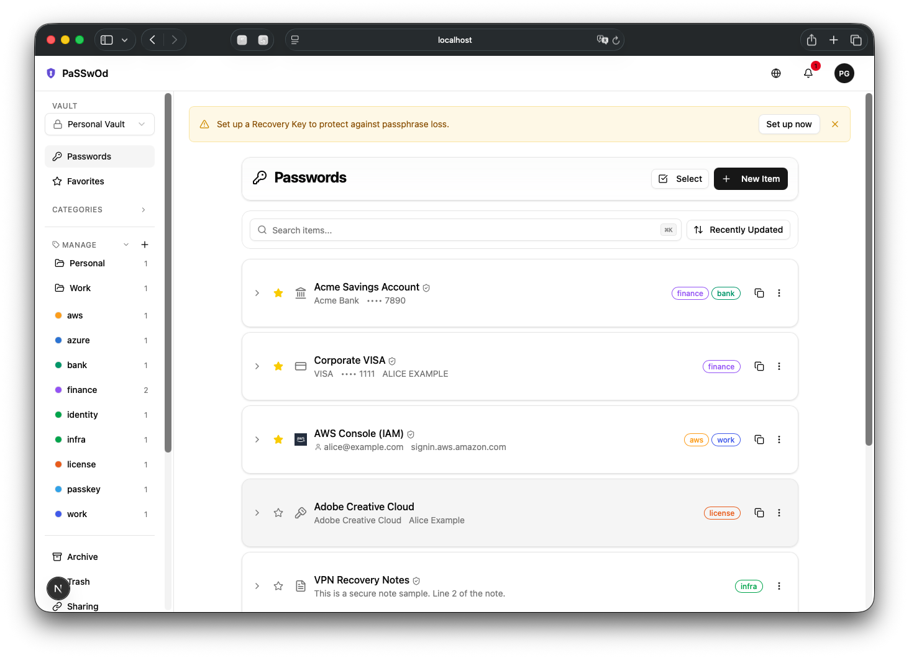
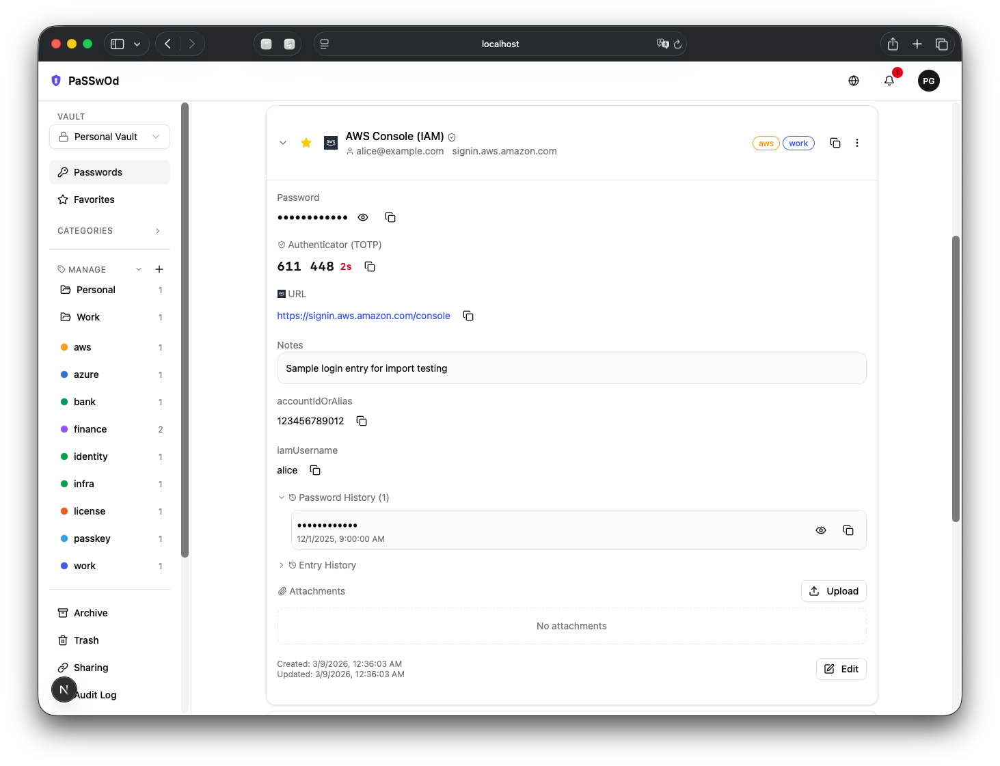
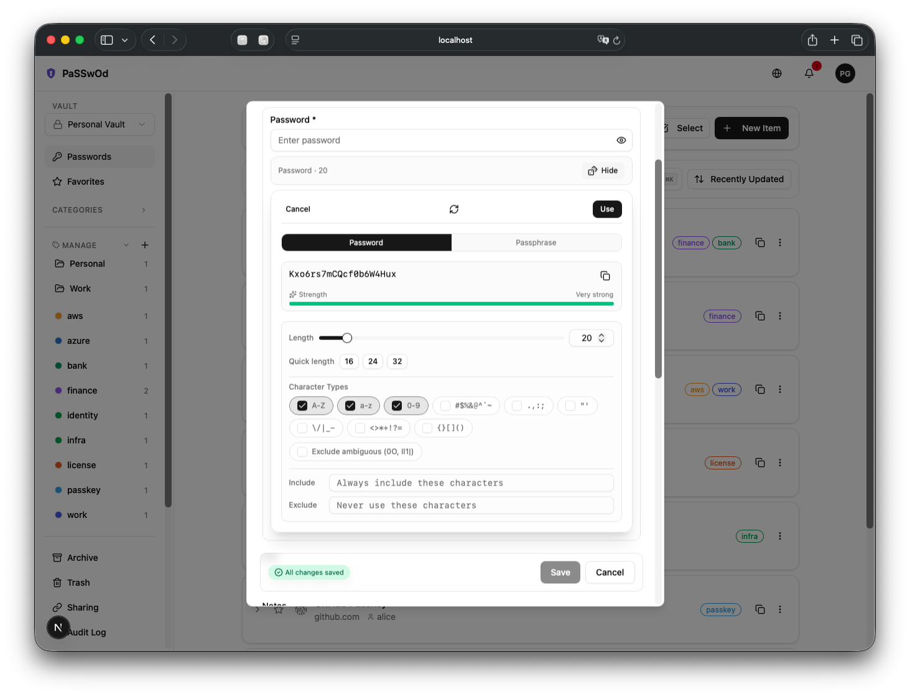
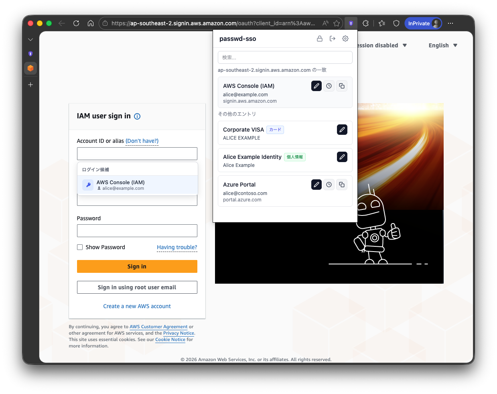
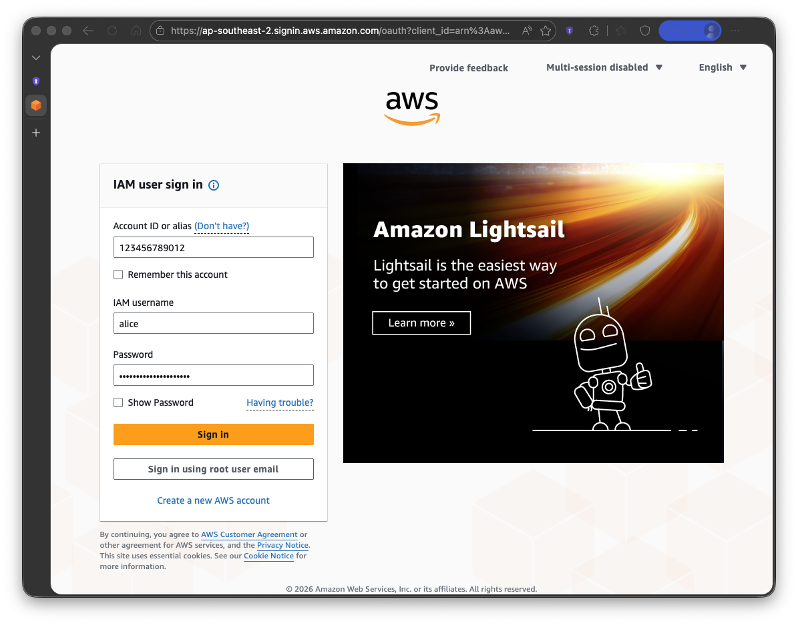

# passwd-sso

[English](README.md)

SSO 認証とエンドツーエンド暗号化を備えたセルフホスト型パスワードマネージャーです。

## スクリーンショット



<details>
<summary>その他のスクリーンショット</summary>

### エントリー詳細（カスタムフィールド自動補完例）



### パスワードジェネレーター



### ブラウザ拡張（カスタムフィールド自動補完）




</details>

## 機能

### Vault & エントリ

- **エンドツーエンド暗号化** — AES-256-GCM; サーバーは平文パスワードを一切見ません
- **複数エントリタイプ** — パスワード、セキュアノート、クレジットカード、ID/個人情報、パスキー、銀行口座、ソフトウェアライセンス、SSH 鍵
- **カスタムフィールド** — テキスト、非表示、URL、ブール値、日付、年月
- **パスワード生成** — ランダム（8-128 文字）、diceware パスフレーズ（3-10 単語）
- **TOTP 認証** — 2FA コードの保存/生成、カメラ QR キャプチャ対応
- **ファイル添付** — 暗号化ファイル添付（個人/チームとも E2E）
- **フォルダ & タグ** — ネスト対応の色付きタグ、階層フォルダ、お気に入り、アーカイブ、ゴミ箱（30 日自動削除）
- **変更履歴** — エントリのバージョン履歴、比較、復元
- **一括操作** — 複数エントリの一括アーカイブ、ゴミ箱移動、復元
- **インポート / エクスポート** — Bitwarden、1Password、KeePassXC、Chrome CSV インポート; CSV/JSON エクスポート（AES-256-GCM 暗号化オプション付き）

### 認証

- **SSO** — Google OIDC + SAML 2.0（[BoxyHQ SAML Jackson](https://github.com/boxyhq/jackson) 経由）
- **パスキーサインイン** — Discoverable FIDO2（WebAuthn）; PRF 対応キーは Vault を自動アンロック
- **メール + セキュリティキー** — メールアドレス検索による Non-discoverable クレデンシャル（タイミングオラクル対策付き）
- **マジックリンク** — ロケール対応テンプレートによるメールベースのパスワードレス認証
- **マスターパスフレーズ** — PBKDF2（600k）または Argon2id（64 MB）+ HKDF、Secret Key 付き

### セキュリティ & コンプライアンス

- **セキュリティ監査（Watchtower）** — 漏洩（HIBP）、弱い、再利用、古い、HTTP URL の検出; ダークウェブ常時監視とメールアラート
- **アカウントロックアウト** — 段階的ロックアウト（5 回→15 分、10 回→1 時間、15 回→24 時間）、閾値到達時にテナント管理者へメール & アプリ内通知
- **同時セッション制限** — テナント単位のセッション上限、超過時に最古セッションを自動切断
- **レート制限** — Redis による機密エンドポイントの制限; 本番向け Sentinel HA 対応
- **CSP & セキュリティヘッダー** — nonce ベースの CSP、違反レポート、OWASP ヘッダー
- **回復キー** — 256 ビット鍵（HKDF + AES-256-GCM）、Base32 エンコード; パスフレーズなしで Vault を復旧
- **Vault リセット** — 最終手段としての全削除（明示的な確認付き）
- **鍵ローテーション** — パスフレーズ検証による暗号化鍵の更新
- **トラベルモード** — 国境通過時に機密エントリを非表示; リモート無効化でアクセス復元
- **ネットワークアクセス制限** — テナント単位の CIDR 許可リストと Tailscale 連携
- **監査ログ & Webhook** — 個人/チーム/テナントログ、フィルタ、CSV/JSONL ダウンロード、Webhook 配信
- **監査ログ転送** — Fluent Bit サイドカー経由の構造化 JSON 出力（外部収集向け）
- **Break Glass** — テナント管理者による個人監査ログへの緊急アクセス（期限付き許可）
- **エラー追跡** — Sentry 統合（再帰的な機密データ除去付き）
- **CI セキュリティ** — CodeQL SAST、Trivy コンテナスキャン、暗号ドメイン台帳、npm audit
- **再現可能ビルド** — Docker ベースイメージの digest ピンニング、ビルドメタデータ検証

### チーム & 組織

- **チーム Vault** — E2E 暗号化共有（ECDH-P256）、RBAC（Owner/Admin/Member/Viewer）
- **チームセキュリティポリシー** — 共有/エクスポート制御、再認証必須化、パスワードポリシー指針
- **マルチテナント分離** — PostgreSQL FORCE RLS（33 テーブル）、IdP クレームによるテナント解決
- **SCIM 2.0 プロビジョニング** — テナントスコープのユーザー/グループ同期（RFC 7644）
- **ディレクトリ同期** — Azure AD、Google Workspace、Okta からメンバー同期
- **テナント管理** — メンバー管理、SCIM トークン、管理者 Vault リセット、テナント設定
- **共有リンク** — 期限付き共有、アクセスログ、表示権限制御
- **Send** — テキスト/ファイルの一時共有（自動有効期限付き）
- **緊急アクセス** — 鍵交換による一時的な Vault アクセスの申請/承認
- **セッション管理** — アクティブセッション一覧、個別/全体失効、メンバー削除時の自動無効化
- **通知機能** — 緊急アクセスと新規デバイスログインに対するアプリ内/メール通知

### 開発者ツール

- **CLI** — `passwd-sso`（13 コマンド）; OS キーチェーン連携、XDG 準拠の設定管理
- **SSH Agent** — `passwd-sso agent` で Vault の SSH 鍵を SSH エージェントプロトコル経由で提供
- **CI/CD シークレット** — `env` / `run` コマンドで Vault のシークレットを環境変数/サブプロセスに注入
- **ブラウザ拡張** — Chrome/Edge MV3; 自動補完、インライン候補、カスタムフィールド自動補完、マルチ URL マッチング、クレカ/住所、新規ログイン検出 & 保存
- **REST API v1** — `/api/v1/*`（OpenAPI 3.1 仕様付き）
- **API キー** — スコープ付きキー（SHA-256 ハッシュ、有効期限設定可能）

### AI & オートメーション（Machine Identity）

- **サービスアカウント** — スコープ付き `sa_` トークンによる非人間 ID 管理、テナント管理者 CRUD
- **MCP Gateway** — [Model Context Protocol](https://modelcontextprotocol.io/) サーバーとして AI エージェント（Claude Desktop、Cursor）にクレデンシャルアクセスを提供
- **OAuth 2.1 + PKCE** — MCP クライアント認証のための Authorization Code フロー
- **Just-in-Time アクセス** — SA 自己申請によるスコープ拡張リクエスト + 管理者承認ワークフロー
- **統合監査** — 全アクションを `actorType`（ユーザー / サービスアカウント / MCP エージェント）で横断的に追跡
- **ゼロ知識モデル維持** — MCP Gateway は暗号化データのみ返却; サーバーは平文を一切見ない（Delegated Decryption は将来対応）

### UI & ローカライゼーション

- **多言語対応** — 日本語・英語（next-intl）
- **ダークモード** — ライト / ダーク / システム（next-themes）
- **キーボードショートカット** — `/ or Cmd+K` 検索、`n` 新規、`?` ヘルプ、`Esc` クリア
- **ロケール保存** — DB に保存し、メール/通知に反映

## 技術スタック

| レイヤー | 技術 |
| --- | --- |
| フレームワーク | Next.js 16（App Router, Turbopack） |
| 言語 | TypeScript 5.9 |
| データベース | PostgreSQL 16 |
| ORM | Prisma 7（driver adapter + pg） |
| 認証 | Auth.js v5（データベースセッション） |
| SAML ブリッジ | BoxyHQ SAML Jackson（Docker） |
| UI | Tailwind CSS 4 + shadcn/ui + Radix UI |
| 暗号化 | Web Crypto API（Vault E2E）+ AES-256-GCM（サーバーサイド） |
| キャッシュ / レート制限 | Redis 7 |

## アーキテクチャ

```text
ブラウザ (Web Crypto API)
  │  ← 個人/チーム Vault: AES-256-GCM E2E 暗号化/復号
  ▼
Next.js アプリ (SSR / API Routes)
  │  ← Auth.js セッション、ルート保護、RBAC
  │  ← 共有リンク / Send: サーバーサイド AES-256-GCM 暗号化
  │  ← MCP Gateway: /api/mcp (Streamable HTTP, OAuth 2.1 PKCE)
  │  ← サービスアカウントトークン: sa_ プレフィックス、JIT アクセスワークフロー
  ▼
PostgreSQL ← Prisma 7          Redis ← レート制限
  │
  ▼
SAML Jackson (Docker) ← SAML 2.0 IdP (HENNGE, Okta, Azure AD 等)
```

**個人 Vault** — すべてのデータは**クライアントサイドで暗号化**されてからサーバーに送信されます。サーバーは暗号文のみを保存します。

**チーム Vault** — 共有パスワードは**クライアントサイド E2E** で暗号化されます。チーム鍵配布は ECDH-P256 によるメンバー鍵交換で行います。

## セットアップ

### 前提条件

- Node.js 20 以上
- Docker & Docker Compose
- Google Cloud プロジェクト（OIDC 用）および/または SAML IdP

### 1. クローンとインストール

```bash
git clone https://github.com/ngc-shj/passwd-sso.git
cd passwd-sso
npm install
```

### 2. 環境変数の設定

```bash
cp .env.example .env.local
```

`.env.local` を編集 — 主要な変数:

| 変数 | 説明 |
| --- | --- |
| `DATABASE_URL` | PostgreSQL 接続文字列 |
| `AUTH_SECRET` | `openssl rand -base64 32` |
| `AUTH_GOOGLE_ID` / `AUTH_GOOGLE_SECRET` | Google OAuth 資格情報 |
| `JACKSON_URL` | SAML Jackson URL（デフォルト: `http://localhost:5225`） |
| `AUTH_JACKSON_ID` / `AUTH_JACKSON_SECRET` | Jackson OIDC 資格情報 |
| `SHARE_MASTER_KEY` | `openssl rand -hex 32` — 共有リンクのサーバー暗号化用 |
| `VERIFIER_PEPPER_KEY` | `openssl rand -hex 32` — パスフレーズ検証 pepper（**本番必須**） |
| `REDIS_URL` | レート制限用 Redis URL（**本番必須**） |

<details>
<summary>全環境変数</summary>

| 変数 | 説明 |
| --- | --- |
| `NEXT_PUBLIC_APP_NAME` | （任意）UI に表示するアプリ名 |
| `NEXT_PUBLIC_BASE_PATH` | （任意）リバースプロキシ配下のサブパス（例: `/passwd-sso`）。ビルド前に設定 |
| `APP_URL` | （任意）リバースプロキシ / CDN 配下の外部 URL（オリジンのみ） |
| `DATABASE_URL` | PostgreSQL 接続文字列 |
| `AUTH_URL` | アプリケーションのオリジン（例: `http://localhost:3000`） |
| `AUTH_SECRET` | `openssl rand -base64 32` |
| `AUTH_GOOGLE_ID` | Google OAuth クライアント ID |
| `AUTH_GOOGLE_SECRET` | Google OAuth クライアントシークレット |
| `GOOGLE_WORKSPACE_DOMAINS` | （任意）Google Workspace ドメインに制限（カンマ区切りで複数可） |
| `AUTH_TENANT_CLAIM_KEYS` | （任意）tenant 解決に使う IdP クレームキー（例: `tenant_id,organization`） |
| `JACKSON_URL` | SAML Jackson URL（デフォルト: `http://localhost:5225`） |
| `AUTH_JACKSON_ID` | Jackson OIDC クライアント ID |
| `AUTH_JACKSON_SECRET` | Jackson OIDC クライアントシークレット |
| `SAML_PROVIDER_NAME` | サインインページの表示名（例: "HENNGE"） |
| `SHARE_MASTER_KEY` | `openssl rand -hex 32` — 共有リンク / Send 用マスターキー |
| `VERIFIER_PEPPER_KEY` | `openssl rand -hex 32` — パスフレーズ検証 pepper（**本番必須**） |
| `DIRECTORY_SYNC_MASTER_KEY` | `openssl rand -hex 32` — ディレクトリ同期資格情報の暗号化（**本番必須**） |
| `WEBAUTHN_RP_ID` | （任意）Relying Party ID（ドメイン名） |
| `WEBAUTHN_RP_NAME` | （任意）Relying Party 表示名 |
| `WEBAUTHN_RP_ORIGIN` | （任意）検証用 RP オリジン（例: `http://localhost:3000`） |
| `WEBAUTHN_PRF_SECRET` | `openssl rand -hex 32` — パスキー Vault アンロック用 PRF ソルト導出 |
| `OPENAPI_PUBLIC` | （任意）`false` で OpenAPI 仕様に認証を要求 |
| `REDIS_URL` | レート制限用 Redis URL（**本番必須**） |
| `BLOB_BACKEND` | 添付ファイルの保存先（`db` / `s3` / `azure` / `gcs`） |
| `AWS_REGION`, `S3_ATTACHMENTS_BUCKET` | `BLOB_BACKEND=s3` の場合に必須 |
| `AZURE_STORAGE_ACCOUNT`, `AZURE_BLOB_CONTAINER` | `BLOB_BACKEND=azure` の場合に必須 |
| `AZURE_STORAGE_CONNECTION_STRING` または `AZURE_STORAGE_SAS_TOKEN` | `BLOB_BACKEND=azure` の場合はいずれか必須 |
| `GCS_ATTACHMENTS_BUCKET` | `BLOB_BACKEND=gcs` の場合に必須 |
| `BLOB_OBJECT_PREFIX` | クラウド保存時のオブジェクトキー接頭辞（任意） |
| `AUDIT_LOG_FORWARD` | （任意）構造化 JSON 監査ログを stdout に出力 |
| `AUDIT_LOG_APP_NAME` | （任意）監査ログ転送時のアプリ名 |
| `EMAIL_PROVIDER` | （任意）`resend` または `smtp` — 空欄でメール送信無効 |
| `EMAIL_FROM` | メール送信元アドレス |
| `RESEND_API_KEY` | `EMAIL_PROVIDER=resend` の場合に必須 |
| `SMTP_HOST`, `SMTP_PORT`, `SMTP_USER`, `SMTP_PASS` | `EMAIL_PROVIDER=smtp` の場合に必須 |
| `DB_POOL_MAX`, `DB_POOL_*` | （任意）PostgreSQL コネクションプール調整 |
| `NEXT_PUBLIC_CHROME_STORE_URL` | （任意）ブラウザ拡張配布用 Chrome Web Store URL |
| `NEXT_PUBLIC_SENTRY_DSN`, `SENTRY_DSN` | （任意）Sentry エラートラッキング DSN |
| `SENTRY_AUTH_TOKEN` | （任意）ソースマップアップロード用 Sentry 認証トークン |

</details>

> **Redis は本番必須です。** 開発/テスト環境では `REDIS_URL` 未設定時に in-memory フォールバックを利用できます。

### 3. サービスの起動

**開発環境:**

```bash
docker compose -f docker-compose.yml -f docker-compose.override.yml up -d db jackson redis
npm run db:migrate
npm run dev
```

[http://localhost:3000](http://localhost:3000) を開きます。

**本番環境:**

```bash
docker compose up -d
```

### 4. 初回セットアップ

1. Google または SAML SSO でサインイン
2. マスターパスフレーズを設定
3. パスワードの登録を開始

## ブラウザ拡張（Chrome/Edge）

`extension/` 配下の MV3 拡張です。

```bash
cd extension && npm install && npm run build
```

1. `chrome://extensions` → **デベロッパーモード**有効化 → **パッケージ化されていない拡張機能を読み込む** → `extension/dist` を選択
2. 必要に応じて拡張設定で `serverUrl` を設定
3. 接続、Vault アンロック、自動補完を利用

## セキュリティモデル

ゼロナレッジアーキテクチャ — サーバーは暗号文のみを保存し、ユーザーデータを復号できません。

- **鍵導出** — パスフレーズ → PBKDF2/Argon2id → ラッピング鍵 → ランダム 256 ビット秘密鍵をラップ
- **ドメイン分離** — 秘密鍵 → HKDF → 暗号化鍵 + 認証鍵に分離
- **Secret Key** — アカウント固有の追加ソルトでサーバー侵害に対する防御を強化
- **AAD バインディング** — 追加認証データで暗号文をユーザー・エントリ ID に紐付け
- **セッションセキュリティ** — データベースセッション（JWT ではない）、8 時間タイムアウト、15 分無操作または 5 分タブ非表示で自動ロック
- **クリップボードクリア** — コピーしたパスワードは 30 秒後に自動消去
- **CSRF 防御** — JSON body + SameSite Cookie + CSP + Origin ヘッダー検証

詳細は[暗号設計ホワイトペーパー](docs/security/cryptography-whitepaper.md)を参照してください。

## プロジェクト構成

```text
src/
├── app/[locale]/         # ページ（ランディング、ダッシュボード、認証）
├── app/api/              # API ルート（vault、passwords、tags、teams、SCIM 等）
├── components/           # UI コンポーネント（passwords、team、vault、settings 等）
├── lib/                  # コアロジック（暗号化、認証、バリデーション、レート制限）
└── i18n/                 # next-intl ルーティング
extension/                # Chrome/Edge MV3 ブラウザ拡張
cli/                      # Node.js CLI ツール
docs/                     # ドキュメント（アーキテクチャ、セキュリティ、運用、セットアップ）
```

## スクリプト

| コマンド | 説明 |
| --- | --- |
| `npm run dev` | 開発サーバー（Turbopack） |
| `npm run build` | プロダクションビルド |
| `npm run lint` | ESLint |
| `npm test` | テスト一括実行（vitest） |
| `npm run test:watch` | テスト（ウォッチモード） |
| `npm run test:coverage` | テスト（カバレッジ付き） |
| `npm run test:e2e` | Playwright E2E テスト |
| `npm run db:migrate` | Prisma マイグレーション（dev） |
| `npm run db:push` | マイグレーションなしでスキーマ反映 |
| `npm run db:seed` | シードデータ投入 |
| `npm run db:studio` | Prisma Studio GUI |
| `npm run generate:key` | 256 ビット hex キー生成 |
| `npm run generate:icons` | アプリアイコン生成 |

<details>
<summary>CI / セキュリティ / 負荷テスト / ライセンススクリプト</summary>

| コマンド | 説明 |
| --- | --- |
| `npm run check:team-auth-rls` | チーム認証 + RLS パターン検証 |
| `npm run check:bypass-rls` | クエリ内の RLS バイパス検出 |
| `npm run check:crypto-domains` | 暗号ドメイン分離の検証 |
| `npm run licenses:check` | アプリ依存のライセンスチェック |
| `npm run licenses:check:strict` | ライセンスチェック（strict / CI用） |
| `npm run licenses:check:ext` | 拡張依存のライセンスチェック |
| `npm run licenses:check:ext:strict` | 拡張ライセンスチェック（strict / CI用） |
| `npm run licenses:check:cli` | CLI 依存のライセンスチェック |
| `npm run licenses:check:cli:strict` | CLI ライセンスチェック（strict / CI用） |
| `npm run test:cli` | CLI テスト実行 |
| `npm run test:load:smoke` | 負荷テスト用シードのスモークチェック |
| `npm run test:load:seed` | 負荷テスト用ユーザー/セッションをシード |
| `npm run test:load` | k6 mixed-workload シナリオ実行（要 k6） |
| `npm run test:load:health` | k6 health シナリオ実行（要 k6） |
| `npm run test:load:cleanup` | 負荷テスト用データの削除 |
| `npm run scim:smoke` | SCIM スモークチェック（`SCIM_TOKEN` 必須） |

</details>

## インポート用サンプル

- passwd-sso JSON: [`docs/assets/passwd-sso.json`](docs/assets/passwd-sso.json)
- passwd-sso CSV: [`docs/assets/passwd-sso.csv`](docs/assets/passwd-sso.csv)

## ドキュメント

- [Security Policy](SECURITY.md)
- [暗号設計ホワイトペーパー](docs/security/cryptography-whitepaper.md) — 鍵階層と暗号設計の全体像
- [脅威モデル STRIDE](docs/security/threat-model.md) — 体系的な脅威分析
- [セキュリティ考慮事項（日本語）](docs/security/considerations/ja.md) / [English](docs/security/considerations/en.md)
- [Docker セットアップ](docs/setup/docker/en.md) · [AWS](docs/setup/aws/en.md) · [Vercel](docs/setup/vercel/en.md) · [Azure](docs/setup/azure/en.md) · [GCP](docs/setup/gcp/en.md)
- [Terraform (AWS)（日本語）](infra/terraform/README.ja.md) / [English](infra/terraform/README.md)
- [デプロイ運用](docs/operations/deployment.md)
- [バックアップ & リカバリ（日本語）](docs/operations/backup-recovery/ja.md) / [English](docs/operations/backup-recovery/en.md)
- [Redis HA](docs/operations/redis-ha.md) — Redis Sentinel/Cluster 構成
- [監査ログリファレンス](docs/operations/audit-log-reference.md)
- [インシデント対応手順書](docs/operations/incident-runbook.md)
- [全ドキュメント](docs/README.md)

## ライセンス

MIT
