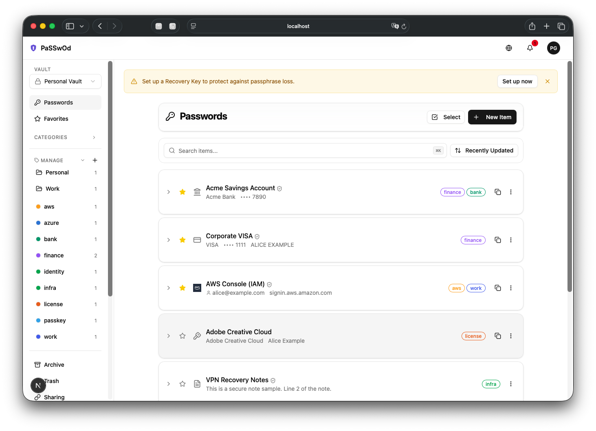
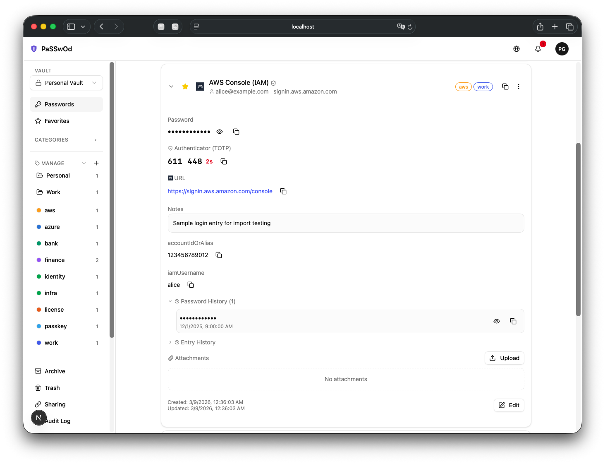
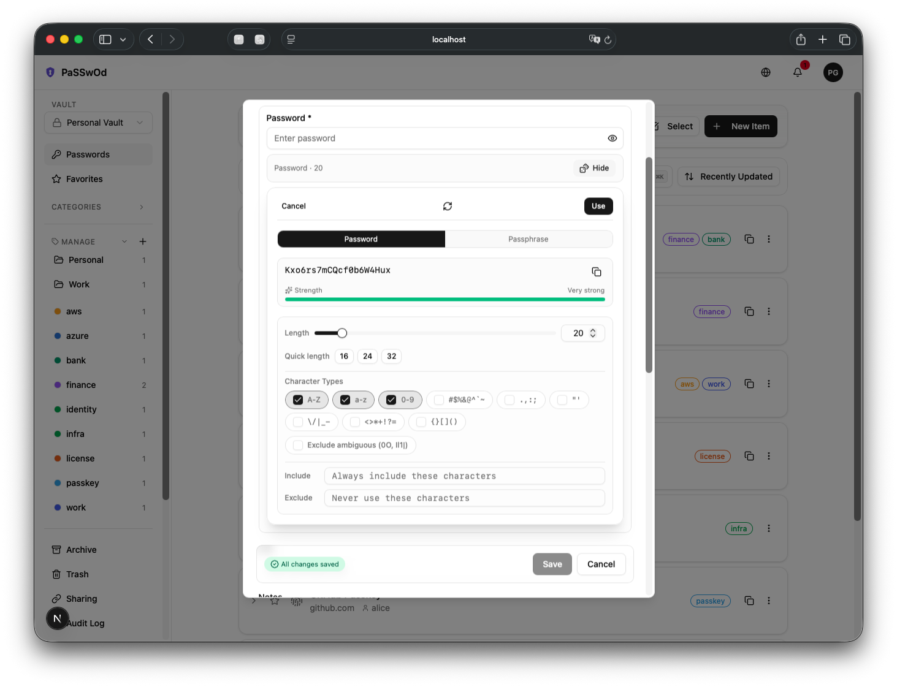
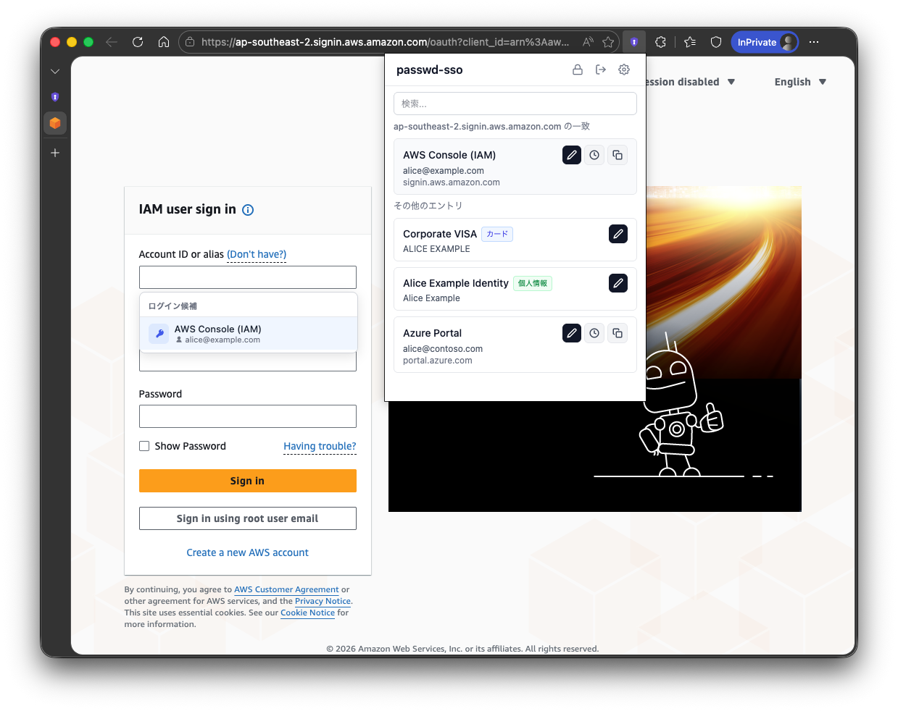
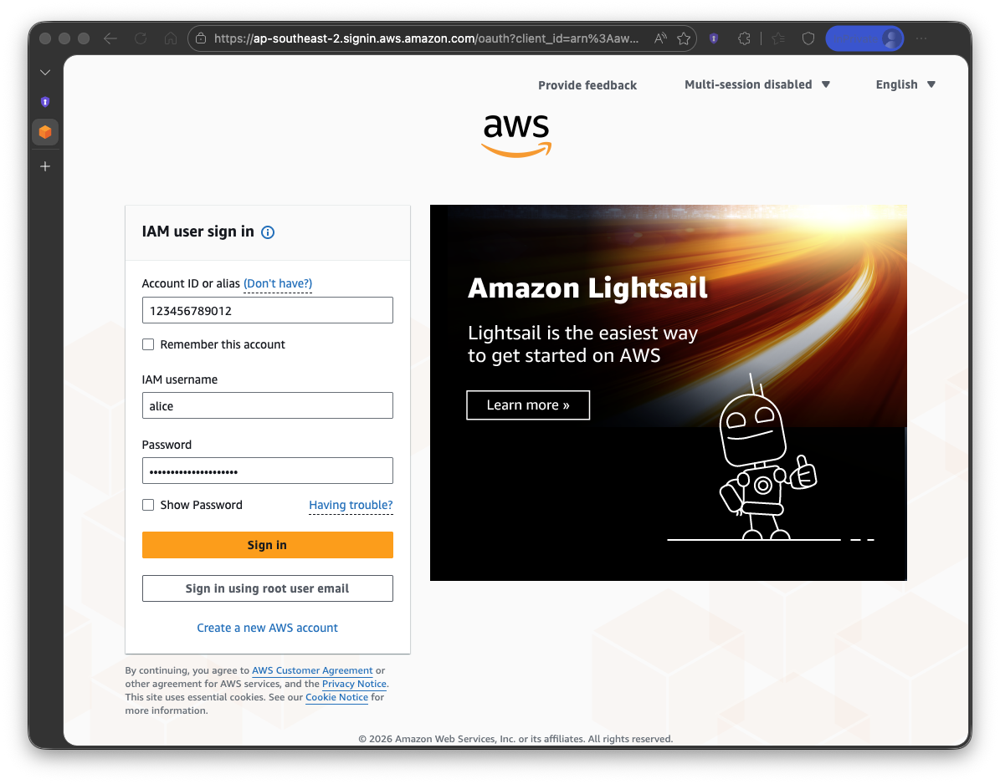

# passwd-sso

[日本語](README.ja.md)

A self-hosted password manager with SSO authentication, end-to-end encryption, and a modern web UI.

## Screenshots



<details>
<summary>More screenshots</summary>

### Entry Detail (custom field autofill example)



### Password Generator



### Browser Extension (custom field autofill)




</details>

## Features

### Vault & Entries

- **End-to-End Encryption** — AES-256-GCM; the server never sees plaintext passwords
- **Multiple Entry Types** — Passwords, secure notes, credit cards, identity, passkeys, bank accounts, software licenses, SSH keys
- **Custom Fields** — TEXT, HIDDEN, URL, BOOLEAN, DATE, MONTH_YEAR
- **Password Generator** — Random (8-128 chars) and diceware passphrases (3-10 words)
- **TOTP Authenticator** — Store/generate 2FA codes with camera QR capture
- **Attachments** — Encrypted file attachments (personal and team E2E)
- **Folders & Tags** — Nested color-coded tags, hierarchical folders, favorites, archive, soft-delete trash (30-day auto-purge)
- **Entry History** — Version history with comparison and restore
- **Bulk Operations** — Batch archive, trash, restore across multiple entries
- **Import / Export** — Bitwarden, 1Password, KeePassXC, Chrome CSV import; CSV/JSON export with optional AES-256-GCM encryption

### Authentication

- **SSO** — Google OIDC + SAML 2.0 (via [BoxyHQ SAML Jackson](https://github.com/boxyhq/jackson))
- **Passkey Sign-In** — Discoverable FIDO2 (WebAuthn); PRF-capable keys auto-unlock vault
- **Email + Security Key** — Non-discoverable credential via email lookup with timing-oracle mitigation
- **Magic Link** — Email-based passwordless authentication with locale-aware templates
- **Master Passphrase** — PBKDF2 (600k) or Argon2id (64 MB) + HKDF with Secret Key

### Security & Compliance

- **Security Audit (Watchtower)** — Breached (HIBP), weak, reused, old, HTTP-URL detection; dark-web monitoring with email alerts
- **Account Lockout** — Progressive lockout (5→15min, 10→1h, 15→24h) with tenant admin email & in-app alerts on threshold crossing
- **Concurrent Session Limits** — Tenant-level max session cap with automatic oldest-session eviction
- **Rate Limiting** — Redis-backed on sensitive endpoints; optional Sentinel HA for production
- **CSP & Security Headers** — Nonce-based CSP, violation reporting, OWASP headers
- **Recovery Key** — 256-bit key (HKDF + AES-256-GCM) with Base32 encoding; recover vault without passphrase
- **Vault Reset** — Last-resort full deletion with explicit confirmation
- **Key Rotation** — Rotate encryption key with passphrase verification
- **Travel Mode** — Hide sensitive entries when crossing borders; remote disable restores access
- **Network Access Restriction** — Per-tenant CIDR allowlist, checked first and independent of Tailscale (the lockout recovery path); optional Tailscale integration additionally verifies the exact tailnet via WhoIs when a tailnet name is pinned, otherwise any peer in the Tailscale CGNAT range is allowed
- **Outbound SSRF Protection** — Blocks private/loopback/link-local/CGNAT/metadata destinations and standardized IPv6 transition tunnels (Teredo, 6to4, IPv4-compatible, RFC 6666 discard-only) on every fetch to a tenant- or user-influenced host, including the well-known NAT64 prefix (`64:ff9b::/96`), whose embedded IPv4 is decoded and re-checked. Operator-assigned NAT64 prefixes (RFC 7050 discovery) are not recognizable from the address alone and are therefore not covered — deployments relying on one should also enforce an egress firewall
- **Audit Logs & Webhooks** — Personal/team/tenant logs with filters, CSV/JSONL download, webhook delivery
- **Durable Audit Outbox** — Audit events emit a synchronous structured log, then enqueue to an `audit_outbox` table drained by a background worker (dedup + dead-letter). The in-transaction enqueue path (`enqueueAuditInTx`) is atomic with the business write; the common route path is best-effort post-commit, with the structured log as the safety net
- **Audit Log Forwarding** — Structured JSON output via Fluent Bit sidecar for external collection
- **Break Glass** — Tenant admin emergency access to personal audit logs with time-limited grants
- **Error Tracking** — Sentry with recursive sensitive data scrubbing
- **CI Security** — CodeQL SAST, Trivy container scan, crypto domain ledger, npm audit
- **Reproducible Builds** — Docker base image digest pinning with build metadata verification

### Team & Organization

- **Team Vault** — E2E encrypted sharing (ECDH-P256) with RBAC (Owner/Admin/Member/Viewer)
- **Team Security Policies** — Sharing/export controls, reprompt requirements, password-policy guidance
- **Multi-Tenant Isolation** — PostgreSQL FORCE RLS on 50+ tables with IdP claim-based tenant resolution
- **SCIM 2.0 Provisioning** — Tenant-scoped user/group sync (RFC 7644)
- **Directory Sync** — Azure AD, Google Workspace, Okta member sync
- **Tenant Admin** — Member management, SCIM tokens, admin vault reset, tenant settings
- **Share Links** — Time-limited sharing with access logs and visibility controls
- **Sends** — Ephemeral text/file sharing with automatic expiration
- **Emergency Access** — Request/approve temporary vault access with key exchange
- **Session Management** — Active session list, single/all revoke, auto-invalidation on member removal
- **Notifications** — In-app and email for emergency-access events and new-device logins

### Developer Tools

- **CLI** — [`passwd-sso-cli`](https://www.npmjs.com/package/passwd-sso-cli) (`npm install -g passwd-sso-cli`); OAuth 2.1 PKCE login, XDG-compliant config
- **SSH Agent** — `passwd-sso agent` proxies vault SSH keys via SSH agent protocol
- **CI/CD Secrets** — `env` and `run` commands inject vault secrets into environment/subprocess. Set `PSSO_PASSPHRASE` for non-interactive auto-unlock in CI pipelines. **Security note**: `PSSO_PASSPHRASE` is intended for CI/automation only — the passphrase is readable from the process environment (e.g., via /proc on Linux). Do not use in shared or interactive environments; use `passwd-sso unlock` (TTY prompt) instead.
- `env` / `run` read `.passwd-sso-env.json` and use the saved CLI `serverUrl` from `passwd-sso login`. In that file, `secrets` is a mapping from output env var name to vault entry/field. Example: `"DATABASE_PASSWORD": { "entry": "<entry-id>", "field": "password" }` means "fetch the `password` field from that vault entry and expose it as `DATABASE_PASSWORD`". The key name is just the output env var name and the CLI exposes the fetched field value as-is — it does not synthesize connection strings or transform the value. **Do not commit `.passwd-sso-env.json` if it contains an `apiKey`** — it's a long-lived credential. Add the file to `.gitignore` and inject the key from your CI secrets store at runtime.
- **Browser Extension** — Chrome/Edge MV3; autofill, inline suggestions, custom field autofill, multi-URL matching, CC/address fill, new-login detect & save, vault-wide search from the popup, **passkey provider** (intercepts WebAuthn get/create, offers vault passkeys before platform authenticator)
- **iOS App + AutoFill Extension** — native iPhone app (iOS 17+) with credential provider extension; password + TOTP fill, QuickType inline suggestions, and **passkey (WebAuthn) assertion** in Safari and apps with Associated Domains; Face ID vault unlock, in-app entry create/edit, extension-parity settings (auto-lock, clipboard clear, theme), English/Japanese localization. Source: [`ios/`](./ios/). The server generates the required `apple-app-site-association` (AASA) file — set `IOS_APP_TEAM_ID` / `IOS_APP_BUNDLE_ID` and wire `https://<server>/.well-known/apple-app-site-association` to `/api/mobile/.well-known/apple-app-site-association` at your reverse proxy; see [`ios/README.md`](./ios/README.md)
- **REST API v1** — `/api/v1/*` with OpenAPI 3.1 spec
- **API Keys** — Scoped keys with SHA-256 hashed tokens and configurable expiration

### AI & Automation (Machine Identity)

- **Service Accounts** — Non-human identity management with scoped `sa_` tokens, tenant admin CRUD
- **MCP Gateway** — [Model Context Protocol](https://modelcontextprotocol.io/) server for AI agent credential access (Claude Desktop, Cursor)
- **OAuth 2.1 + PKCE** — Authorization Code flow for MCP client authentication
- **Just-in-Time Access** — SA self-service scope requests with admin approval workflow
- **Cross-Actor Audit** — All actions tracked with `actorType` (Human/Service Account/MCP Agent) across personal, team, and tenant logs
- **Delegated Decryption** — Human unlocks vault in browser, selectively delegates plaintext entries to MCP sessions with per-entry consent and short TTLs
- **Zero-Knowledge Preserved** — Server never sees plaintext; MCP agents access delegated entries only through envelope-encrypted Redis cache

### UI & Localization

- **i18n** — English and Japanese (next-intl)
- **Dark Mode** — Light / dark / system (next-themes)
- **Keyboard Shortcuts** — `/ or Cmd+K` search, `n` new, `?` help, `Esc` clear
- **Locale Persistence** — Saved to DB, used for emails/notifications

## Tech Stack

| Layer | Technology |
| --- | --- |
| Framework | Next.js 16 (App Router, Turbopack) |
| Language | TypeScript 5.9 |
| Database | PostgreSQL 16 |
| ORM | Prisma 7 (driver adapter with pg) |
| Auth | Auth.js v5 (database sessions) |
| SAML Bridge | BoxyHQ SAML Jackson (Docker) |
| UI | Tailwind CSS 4 + shadcn/ui + Radix UI |
| Encryption | Web Crypto API (vault E2E) + AES-256-GCM (server-side) |
| Cache / Rate Limit | Redis 7 |

## Architecture

```text
Browser (Web Crypto API)
  │  ← Personal & team vault: AES-256-GCM E2E encrypt/decrypt
  ▼
Next.js App (SSR / API Routes)
  │  ← Auth.js sessions, route protection, RBAC
  │  ← Share links / sends: server-side AES-256-GCM encryption
  │  ← MCP Gateway: /api/mcp (Streamable HTTP, OAuth 2.1 PKCE)
  │  ← Service Account tokens: sa_ prefix, JIT access workflow
  ▼
PostgreSQL ← Prisma 7          Redis ← rate limiting, session cache
  │  ← audit_outbox (post-commit enqueue; in-tx via enqueueAuditInTx)
  ▼
Audit Outbox Worker (separate process) ← drains audit_outbox → audit_logs
  │
SAML Jackson (Docker) ← SAML 2.0 IdP (HENNGE, Okta, Azure AD, etc.)
```

**Docker services** — Six containers: `app` (Next.js), `db` (PostgreSQL 16), `jackson` (SAML Jackson), `redis` (Redis 7), `migrate` (one-shot Prisma migration), `audit-outbox-worker` (audit drain worker, dev override only — deploy separately in production).

**Personal vault** — All data is encrypted **client-side** before reaching the server. The server stores only ciphertext.

**Team vault** — Shared passwords use **client-side E2E** encryption with ECDH-P256 member-key exchange.

## Getting Started

### Prerequisites

- Node.js 20+
- Docker & Docker Compose
- At least one identity provider: Google Cloud project (OIDC), a SAML IdP, or Magic Link / Passkey-only (no external IdP required)

### 1. Clone and install

```bash
git clone https://github.com/ngc-shj/passwd-sso.git
cd passwd-sso
npm install
```

### 2. Configure environment

Run the interactive generator — it walks you through every required variable, auto-generates cryptographic secrets, and validates the result against the Zod schema before writing:

```bash
npm run init:env                       # interactive, default profile=dev
npm run init:env -- --profile=production    # prompts for real provider secrets
```

The generator writes `.env` atomically with mode `0o600` and refuses to overwrite unless you explicitly say so. Generated secrets are shown as `[generated]` placeholders in the terminal transcript; use `--print-secrets` only when you need to copy them.

If you prefer to edit manually, copy the template:

```bash
cp .env.example .env
```

`.env.example` is generated from `src/lib/env-schema.ts` (the single source of truth) — regenerate it with `npm run generate:env-example` after changing the schema. Run `npm run check:env-docs` to verify `.env.example`, the allowlist, and `docker-compose*.yml` stay in sync.

**`.env` vs `.env.local`** — the canonical file is `.env`. Both Docker Compose (auto-load) and the Next.js app (via `src/lib/load-env.ts`) read it natively. `.env.local` is loaded *after* `.env` and overrides any of its values, matching the Next.js convention. Use it for individual-developer tweaks (different DB port, alternate Tailscale hostname, etc.) — leave the canonical configuration in `.env`. No `--env-file` flag needed:

```bash
npm run docker:up     # wraps: docker compose -f docker-compose.yml -f docker-compose.override.yml up
npm run docker:down   # stops and tears down
```

> **Migration from older clones**: if your repo predates this change you may have a `.env.local` and no `.env`. Run `mv .env.local .env` so Docker Compose can find it without `--env-file`. Re-running `npm run init:env` warns when both files exist.

The bottom of `.env.example` has a dedicated **External / Build-time** section listing variables that are NOT read by the Next.js app but ARE required by docker-compose, provisioning scripts, or the production build (`JACKSON_API_KEY` for the Jackson container, `PASSWD_SUPERUSER_PASSWORD` / `PASSWD_APP_PASSWORD` / `PASSWD_OUTBOX_WORKER_PASSWORD` / `PASSWD_RETENTION_GC_WORKER_PASSWORD` for the DB roles, `SENTRY_AUTH_TOKEN` for source-map upload, `NEXT_DEV_ALLOWED_ORIGINS` for the dev server). `npm run init:env` prompts for these alongside the Zod-declared vars and writes them into the same `.env`.

Key variables:

| Variable | Description |
| --- | --- |
| `DATABASE_URL` | PostgreSQL connection string |
| `AUTH_SECRET` | `openssl rand -base64 32` |
| `AUTH_GOOGLE_ID` / `AUTH_GOOGLE_SECRET` | Google OAuth credentials |
| `JACKSON_URL` | SAML Jackson URL (default: `http://localhost:5225`) |
| `AUTH_JACKSON_ID` / `AUTH_JACKSON_SECRET` | Jackson OIDC credentials |
| `SHARE_MASTER_KEY` | `openssl rand -hex 32` — for server-encrypted share links |
| `VERIFIER_PEPPER_KEY` | `openssl rand -hex 32` — passphrase verifier pepper (**required in prod**) |
| `REDIS_URL` | Redis URL for rate limiting (**required in prod**) |

<details>
<summary>All environment variables</summary>

| Variable | Description |
| --- | --- |
| `NEXT_PUBLIC_APP_NAME` | (Optional) Display name shown in the UI |
| `NEXT_PUBLIC_BASE_PATH` | (Optional) Sub-path for reverse proxy (e.g., `/passwd-sso`). Set before build |
| `APP_URL` | (Recommended) External URL when behind reverse proxy/CDN (origin only). Used as the canonical Origin for cookie-auth CSRF checks |
| `DATABASE_URL` | PostgreSQL connection string (app role, e.g. `passwd_app`) |
| `MIGRATION_DATABASE_URL` | PostgreSQL connection for migrations (superuser role, e.g. `passwd_user`). Required for `npm run db:migrate` |
| `AUTH_URL` | Application origin (e.g., `http://localhost:3000`). Used as the canonical Origin when `APP_URL` is unset |
| `AUTH_SECRET` | `openssl rand -base64 32` |
| `COOKIE_PARTITIONED` | (Optional) Opt in to the Partitioned (CHIPS) session-cookie attribute. Accepts `true` or `false` only. Default: `false`. Requires Secure cookies; no effect outside third-party iframe contexts. See [Upgrade notes](#upgrade-notes-environment-variables-that-now-fail-closed) |
| `AUTH_GOOGLE_ID` | Google OAuth client ID |
| `AUTH_GOOGLE_SECRET` | Google OAuth client secret |
| `GOOGLE_WORKSPACE_DOMAINS` | (Optional) Restrict to Google Workspace domain(s), comma-separated |
| `AUTH_TENANT_CLAIM_KEYS` | (Optional) Comma-separated IdP claim keys for tenant resolution, tried in order. **Leaving it unset is not "no configuration"** — it selects `tenant_id, tenantId, organization, org, company, company_id`, all of which are IdP-asserted, and all of which are tried *before* Google's attested `hd`. `AUTH_TENANT_CLAIM_KEYS=hd` is the attested-only configuration **for Google sign-in only**: `hd` is honoured for the `google` provider alone, so on a SAML deployment it resolves no claim at all and new users land in personal bootstrap tenants as OWNER. Read the guidance under [IdP domain changed / tenant locked out](#idp-domain-changed--tenant-locked-out) before setting it |
| `JACKSON_URL` | SAML Jackson URL (default: `http://localhost:5225`) |
| `AUTH_JACKSON_ID` | Jackson OIDC client ID |
| `AUTH_JACKSON_SECRET` | Jackson OIDC client secret |
| `SAML_PROVIDER_NAME` | Sign-in page display name (e.g., "HENNGE") |
| `SHARE_MASTER_KEY` | `openssl rand -hex 32` — for server-encrypted share links/sends |
| `VERIFIER_PEPPER_KEY` | `openssl rand -hex 32` — passphrase verifier pepper (**required in prod**) |
| `DIRECTORY_SYNC_MASTER_KEY` | `openssl rand -hex 32` — directory sync credential encryption (**required in prod**) |
| `WEBAUTHN_RP_ID` | (Optional) Relying Party ID (your domain) |
| `WEBAUTHN_RP_NAME` | (Optional) Relying Party display name |
| `WEBAUTHN_RP_ORIGIN` | (Optional) RP origin for verification (e.g., `http://localhost:3000`) |
| `WEBAUTHN_PRF_SECRET` | `openssl rand -hex 32` — PRF salt derivation for passkey vault unlock |
| `OPENAPI_PUBLIC` | (Optional) Set to `false` to require auth for OpenAPI spec |
| `REDIS_URL` | Redis URL for rate limiting (**required in prod**) |
| `BLOB_BACKEND` | Attachment backend (`db` / `s3` / `azure` / `gcs`) |
| `AWS_REGION`, `S3_ATTACHMENTS_BUCKET` | Required when `BLOB_BACKEND=s3` |
| `AZURE_STORAGE_ACCOUNT`, `AZURE_BLOB_CONTAINER` | Required when `BLOB_BACKEND=azure` |
| `AZURE_STORAGE_CONNECTION_STRING` or `AZURE_STORAGE_SAS_TOKEN` | Required when `BLOB_BACKEND=azure` |
| `GCS_ATTACHMENTS_BUCKET` | Required when `BLOB_BACKEND=gcs` |
| `BLOB_OBJECT_PREFIX` | Optional key prefix for cloud object paths |
| `AUDIT_LOG_FORWARD` | (Optional) Emit structured JSON audit logs to stdout |
| `AUDIT_LOG_APP_NAME` | (Optional) App name for audit log forwarding |
| `AUDIT_IDENTIFIER_PEPPER` | (Optional) HMAC pepper for the identifier hashed onto `AUTH_LOGIN_FAILURE` audit events. Must be exactly 64 hex characters (`npm run generate:key`) when set. Falls back to a key derived from `AUTH_SECRET` (HKDF, if ≥32 chars); if neither is available, no hash is computed and `identifierHashScope` is recorded as `"unkeyed"`. See [Upgrade notes](#upgrade-notes-environment-variables-that-now-fail-closed) and [Audit Log Schema](docs/security/audit-log-schema.md) |
| `BREAKGLASS_COOLING_OFF_SECONDS` | (Optional) Delay in seconds before a first same-requester/target Break Glass grant in a 24h window executes. Non-negative integer. Default: `3600`. Set to `0` to disable. See [Upgrade notes](#upgrade-notes-environment-variables-that-now-fail-closed) |
| `EMAIL_PROVIDER` | (Optional) `resend` or `smtp` — leave empty to disable email |
| `EMAIL_FROM` | Sender address for emails |
| `RESEND_API_KEY` | Required when `EMAIL_PROVIDER=resend` |
| `SMTP_HOST`, `SMTP_PORT`, `SMTP_USER`, `SMTP_PASS` | Required when `EMAIL_PROVIDER=smtp` |
| `DB_POOL_MAX`, `DB_POOL_*` | (Optional) PostgreSQL connection pool tuning |
| `OUTBOX_WORKER_DATABASE_URL` | (Optional) Worker DB connection (`passwd_outbox_worker` role). Required for `npm run worker:audit-outbox` |
| `PASSWD_SUPERUSER_PASSWORD` | (Required for `docker compose`) Password for the `passwd_user` SUPERUSER DB role. docker-compose fails to start if unset. See [Docker Setup](docs/setup/docker/en.md) for upgrade notes. |
| `PASSWD_APP_PASSWORD` | (Required for `docker compose`) Password for the `passwd_app` runtime DB role. docker-compose fails to start if unset. |
| `PASSWD_OUTBOX_WORKER_PASSWORD` | (Required for `docker compose`) Password for the `passwd_outbox_worker` DB role. Used by initdb on first boot; for existing clusters use `scripts/set-outbox-worker-password.sh` |
| `PASSWD_RETENTION_GC_WORKER_PASSWORD` | (Required for `docker compose`) Password for the `passwd_retention_gc_worker` DB role. Used by initdb on first boot; for existing clusters use `scripts/set-retention-gc-worker-password.sh` |
| `OUTBOX_BATCH_SIZE`, `OUTBOX_*` | (Optional) Audit outbox worker tuning. See `.env.example` for all options |
| `NEXT_DEV_ALLOWED_ORIGINS` | (Optional) Allowed origins for dev server (e.g., Tailscale hostname) |
| `NEXT_PUBLIC_CHROME_STORE_URL` | (Optional) Chrome Web Store URL for extension distribution |
| `IOS_APP_TEAM_ID` | Apple Developer Team ID (10-char string). Required for the AASA route to serve iOS Universal Links; the route returns 503 when unset |
| `IOS_APP_BUNDLE_ID` | (Optional) iOS app bundle identifier. Default: `jp.jpng.passwd-sso`, matching `PRODUCT_BUNDLE_IDENTIFIER` in `ios/project.yml` |
| `NEXT_PUBLIC_SENTRY_DSN`, `SENTRY_DSN` | (Optional) Sentry DSN for error tracking |
| `SENTRY_AUTH_TOKEN` | (Optional) Sentry auth token for source map upload |
| `KEY_PROVIDER` | (Optional) Key provider backend: `env` (default), `azure-kv`, or `gcp-sm`. See [KMS Setup](docs/operations/key-provider-setup.md) |
| `SM_CACHE_TTL_MS` | (Optional) TTL for KMS decrypted key cache in ms (default: 300000 = 5 min) |
| `QUOTA_MAX_PASSWORDS_PER_USER` | (Optional) Maximum password entries per user. Default: `10000` |
| `QUOTA_MAX_ATTACHMENT_BYTES_PER_USER` | (Optional) Maximum total attachment bytes per user. Default: `1073741824` (1 GiB) |
| `QUOTA_MAX_SHARE_LINKS_PER_USER` | (Optional) Maximum active share links per user. Default: `1000` |
| `QUOTA_MAX_WEBHOOKS_PER_TENANT` | (Optional) Maximum webhooks (tenant + team combined) per tenant. Default: `100` |

</details>

> **Redis is required in production.** In dev/test, omit `REDIS_URL` for in-memory fallback.
>
> **Canonical origin is required for cookie-authenticated mutating APIs.** `assertOrigin()` now fails closed when neither `APP_URL` nor `AUTH_URL` is configured, instead of deriving same-origin from request `Host` headers.

### Upgrade notes: environment variables that now fail closed

Four variables that were previously read loosely are now validated when the environment schema is parsed. Each fails **closed** — the process refuses to start rather than run with a value it cannot interpret, which is the intended direction, but a deployment whose current value was silently tolerated will **not boot** after the upgrade. Check all four before rolling out.

| Variable | Previously | Now | What breaks |
| --- | --- | --- | --- |
| `AUDIT_IDENTIFIER_PEPPER` | Any string, used verbatim as the HMAC key; unset meant an empty-key HMAC | Exactly 64 hex characters (`npm run generate:key`) when set, or unset | **Boot failure** for any value that is not 64 hex characters — including one that is too long or the right length but not hex, not only one that is too short. See the hash-correlation note below |
| `COOKIE_PARTITIONED` | Compared with `=== "true"`, so `1`, `TRUE` and `yes` all read as *off* | `true` or `false`, or unset (`false`) | **Boot failure** for any other spelling. A deployment that intended to enable CHIPS with `COOKIE_PARTITIONED=1` never had it enabled — set `true` |
| `BREAKGLASS_COOLING_OFF_SECONDS` | Unvalidated | Non-negative integer (seconds), or unset (`3600`) | **Boot failure** for a non-numeric value such as `1h` |
| `AUTH_TENANT_CLAIM_KEYS` | Any string; entries that named nothing were dropped, so `,` behaved exactly like leaving it unset | Must name at least one claim key when set, or be unset | **Boot failure** only for a value that names *no* key at all (`,`, `,,`). A repeated key and a stray empty entry (`org,,tenant`) still boot — they name the keys they appear to. The old fall-through was not harmless: on a SAML deployment it silently resolved no claim for any sign-in, so first-time users were created in their own bootstrap tenant as OWNER |

**`AUDIT_IDENTIFIER_PEPPER` also breaks hash correlation, whichever way you fix it.** `identifierHash` on `AUTH_LOGIN_FAILURE` is an HMAC keyed by the pepper, so any change of key makes new hashes unrelated to the ones already in `audit_logs` — the same identifier no longer produces the same hash, and correlation across the upgrade boundary is lost. This happens in every migration path, not just the boot failure:

- a set-but-not-64-hex value **must** change to boot at all;
- a deployment that never set the variable also changes key, because the empty-key fallback is gone: the pepper is now derived from `AUTH_SECRET` by HKDF (or, if `AUTH_SECRET` is absent too, no hash is computed and `identifierHashScope` records `"unkeyed"`).

There is no supported way to keep the old hashes correlating; treat the upgrade as the start of a new correlation window and keep the cutover timestamp with your audit records. See [Audit Log Schema](docs/security/audit-log-schema.md).

### Admin / maintenance scripts

Maintenance scripts (`scripts/purge-history.sh`, `scripts/purge-audit-logs.sh`, `scripts/rotate-master-key.sh`) require a per-operator `op_*` Bearer token — the old shared `ADMIN_API_TOKEN` environment variable is removed. Operators mint tokens at `/<locale>/admin/tenant/operator-tokens` and pass them at script invocation time:

```bash
ADMIN_API_TOKEN=op_<token> scripts/purge-history.sh
ADMIN_API_TOKEN=op_<token> scripts/purge-audit-logs.sh
ADMIN_API_TOKEN=op_<token> TARGET_VERSION=<int> scripts/rotate-master-key.sh
```

See [Admin Token Setup](docs/operations/admin-tokens.md) for token minting and rotation guidance.

### IdP domain changed / tenant locked out

Symptom: after an IdP starts asserting a different tenant claim (a Google Workspace domain rename, a SAML attribute change), existing tenant members are denied at sign-in, visible in `audit_logs` as `AUTH_LOGIN_FAILURE`. There are **four** causes, and only the first two are fixed with this tool:

| `metadata.reason` | claim fields (`metadata.claim` / `metadata.claimRefusal`) | Cause | Remedy |
|---|---|---|---|
| `tenant_claim_unmapped` | the claim | not registered to any tenant | `tenant-domain add` |
| `tenant_mismatch` | the claim | registered to a *different* tenant | investigate the user, or `add --from` to move the claim |
| `tenant_mismatch` | `claimRefusal` set (`claim` absent) | the IdP's asserted value was **refused at ingest** — an unpaired surrogate, a control/bidi/zero-width character, over 255 characters, or whitespace the storage layer cannot round-trip | **fix it at the IdP.** `add` cannot register the value, so the tool cannot repair this one; `claimRefusal` names the rule the value broke |
| `tenant_mismatch` | `claimRefusal` set **and** `claim` present | the asserted value passed ingest but **cannot be stored** — it is not printable ASCII, which the registry's `CHECK` constraint rejects (see `preflight` below) | **fix it at the IdP**, or register an ASCII claim for the tenant. `add` refuses this value on the same predicate |

Key the last two cases on the **field**, not on the text: `claimRefusal` is written only by this deployment's own refusal adjudicators, whereas anything inside `claim` was supplied by the IdP and can be made to look like whatever the reader is told to trust. `unmapped` reports the four causes under three headings — the two `claimRefusal` cases share one, because they share a remedy. Diagnose and recover offline with `scripts/tenant-domain.ts` (`npm run tenant-domain`) — it needs `MIGRATION_DATABASE_URL` (a privileged connection string; the app's own `DATABASE_URL` role cannot bypass the table's row-level security):

```bash
# See which unregistered claims were denied recently (default window: 30 days)
MIGRATION_DATABASE_URL=<url> npm run tenant-domain -- unmapped
MIGRATION_DATABASE_URL=<url> npm run tenant-domain -- unmapped --days 180

# Register the new claim for the existing tenant (idempotent — safe to re-run)
MIGRATION_DATABASE_URL=<url> npm run tenant-domain -- add --tenant <ref> --domain <new-claim> --by <operator-label>
```

`<ref>` is the tenant's UUID, one of its already-registered claims, or its `external_id` — the last matters when the pre-flight check below reports that a tenant's backfill row was skipped, because such a tenant has no claim to be named by. `slug` is deliberately **not** accepted: a sign-in-created tenant's slug is derived from the IdP claim with `[^a-z0-9]+` collapsed, so it is many-to-one and can be pre-empted by whoever causes the first tenant to take it.

`unmapped`'s window is a *query* window, not this deployment's retention: it defaults to the configurable retention floor (30 days) and says so in its output. Widen it with `--days <n>` before concluding that nothing was denied.

`list`, `preflight`, `remove`, and `history` are also available; run the command with no subcommand for the full usage banner. **Breaking change:** `remove` now requires `--by <operator-label>` too (`... remove --tenant <ref> --domain <claim> --by <operator-label>`) — a revocation, like a registration, now writes an attributed row to the routing history below, and an unattributed one would leave that record with no operator behind it.

**`tenant_mismatch`: the claim is registered to the wrong tenant.** This is reachable with no operator action at all — a single sign-in presenting a mistyped or squatted claim registers it (`created_by = 'signin'`) against whatever tenant that sign-in created. `remove` will *not* free it: it soft-deletes the row (sets `revoked_at`) and leaves the owner unchanged, so a following `add` refuses again. Move the claim with `add --from`, naming the current owner:

```bash
# --from takes the current owner's tenant UUID exactly as `list` prints it.
# It is not resolved through slugs, claims or external ids: a reassignment can
# deny an entire tenant's members, so it must not be reachable by a typo.
MIGRATION_DATABASE_URL=<url> npm run tenant-domain -- list --tenant <claim>
MIGRATION_DATABASE_URL=<url> npm run tenant-domain -- add \
  --tenant <gaining-tenant-ref> --domain <claim> --by <operator-label> \
  --from <current-owner-uuid>

# Reconstruct what happened to a claim's routing — every registration,
# revocation and reassignment, each with its operator label and the Postgres
# principal that executed it. --tenant matches even after the tenant row
# itself is gone.
MIGRATION_DATABASE_URL=<url> npm run tenant-domain -- history --domain <claim>
MIGRATION_DATABASE_URL=<url> npm run tenant-domain -- history --tenant <uuid>
```

Before writing anything, `add --from` prints both tenants — id, name, slug and **active member count** — plus what the move costs the losing side, and asks for confirmation (`--yes` for non-interactive use). It refuses if `--from` is not the row's actual owner, and it does **not** require the row to be revoked first: a revoke-then-reassign sequence would open a window in which the claim resolves to nobody and *both* tenants' members are denied. The row's `created_by` is left untouched by the move — it records who first registered the claim, which is the evidence an incident needs. A move overwrites `tenant_claims.tenant_id`, and re-registering a revoked claim clears `revoked_at`, so the `tenant_claims` row itself no longer shows the previous owner, that it had been revoked, or who changed it. That is no longer the only record: `add` and `remove` both append an attributed row to the `tenant_claim_events` table, and `tenant-domain history` reads it back.

**If `GOOGLE_WORKSPACE_DOMAINS` is set** (recommended in [SECURITY.md](SECURITY.md)), registering the claim alone changes nothing. `src/auth.config.ts`'s `signIn` callback denies any Google sign-in whose `hd` is not in `GOOGLE_WORKSPACE_DOMAINS` *before* tenant-claim resolution runs at all, recorded as `reason: "provider_error"` — the denial never reaches the tenant-claim check, so `tenant-domain unmapped` shows nothing for it. Add the new domain to `GOOGLE_WORKSPACE_DOMAINS` too, and note which tenant it was added for: the variable is deployment-global while the claim registry is tenant-scoped, so without that note it silently accumulates every domain any tenant has ever renamed to. Remove the entry once no tenant depends on it. **Do not unset `GOOGLE_WORKSPACE_DOMAINS` to work around a lockout** — `allowDangerousEmailAccountLinking` is derived from `allowedGoogleDomains.length > 0`, so unsetting it flips that flag to `false` (*stricter*, not looser) and produces a second, different failure, `OAuthAccountNotLinked`, on top of the original denial.

**Before running `prisma migrate deploy` on an existing deployment**, run the pre-flight check — the backfill excludes two classes of row from the registry, and both need an operator decision first:

```bash
MIGRATION_DATABASE_URL=<url> npm run tenant-domain -- preflight
```

It reports three things: **normalisation collisions** (two or more tenants whose `external_id` folds to one claim), **non-ASCII `external_id` values**, and **fold mismatches** between Postgres and the application's own normalisation. All three are excluded from the registry.

**A collision excludes every side of it, not just the losers.** The backfill registers the claim for **none** of the colliding tenants — do not read a reported collision as "one of them already holds the claim and the others need registering". Keeping one would silently place the other tenants' *new* members into the winner's tenant, because those tenants are distinct today (the pre-upgrade resolver matched `external_id` exactly) and nothing would raise an error. Every row the pre-flight check returns therefore needs an explicit decision, followed by an explicit registration:

- for a collision, which tenant gets the shared claim string, and what the others are given instead — then `tenant-domain add` for each;
- for a non-ASCII `external_id`, whether that tenant needs an ASCII claim registered separately — then `tenant-domain add` for it.

Re-running the backfill will not fill any of these in. The exclusion is unconditional rather than skip-if-present, so a second run is a **no-op** for exactly this population, by construction; `tenant-domain add` is the only thing that registers them. Until then each of these tenants keeps resolving through the release-1 `external_id` exact-match fallback, exactly as it does today — so the upgrade itself does not lock them out. That fallback is removed in a later release, and at that point a tenant with no registered claim is a lockout: decide before then, not after.

Run the CLI rather than hand-written SQL. The printable-ASCII predicate the checks turn on has one source of truth, `NON_PRINTABLE_ASCII_SQL_CLASS` in `src/lib/tenant/tenant-claim-registry.ts`, and a drift guard pins the migration's CHECK, the backfill and its extracted `.sql` twin to it. A predicate retyped from documentation is outside that guard, and a pre-flight check whose predicate has drifted from the CHECK reports a confident "all clear" at exactly the moment it matters. If your environment genuinely cannot run the CLI, copy the predicate and the fold expression out of `scripts/tenant-domain.ts`'s `cmdPreflight` — do not retype them.

**What the backfill inherits.** On any deployment that has already run the `20260228010000_tenant_external_id_and_bootstrap` migration, `tenant_claims` inherits one row per pre-existing tenant's `external_id` — which, for tenants older than that migration, is the tenant's own UUID (`UPDATE tenants SET external_id = id ...` for every non-bootstrap, non-orphan tenant). `tenant_id` is the first key `AUTH_TENANT_CLAIM_KEYS` falls back to when unset, so a bare UUID can now resolve tenant membership as a claim. Review what the backfill inherited:

```sql
SELECT tenant_id, claim, created_by, created_at FROM tenant_claims WHERE created_by = 'backfill' ORDER BY created_at;
```

This is pre-existing behavior — the same UUID has resolved sign-in through `Tenant.externalId` since that earlier migration — made visible here rather than introduced by it. Deployments running a deliberate `AUTH_TENANT_CLAIM_KEYS` should decide whether keeping `tenant_id` / `tenantId` in the default claim-key list is still wanted now that the claim namespace is explicit.

**`AUTH_TENANT_CLAIM_KEYS` guidance.** The safe value depends on which provider your users sign in through. The configuration that hardens a Google deployment silently disables tenant resolution on a SAML one, so read the section for your provider — not the other.

**Leaving the variable unset does not reach any hardened configuration** — it selects the built-in list `tenant_id, tenantId, organization, org, company, company_id`, every member of which is an IdP-asserted attribute, and all six are tried *before* `hd` is consulted at all. A multi-connection SAML deployment that never sets the variable is therefore already in the unsafe configuration described below, not outside it.

**Google sign-in — `hd` is the attested-only configuration:**

```bash
# Attested-only: `hd` is asserted by Google, not carried in a self-describing
# profile attribute, and is honoured for the Google provider alone.
AUTH_TENANT_CLAIM_KEYS=hd
```

**`hd` is Google-only. Do not set it on a deployment whose users sign in through SAML.** The key is honoured only when the account's provider is `google` — a SAML assertion carrying a field literally named `hd` is ignored, and that provider gate is exactly what makes "named `hd`" mean "attested by Google". So on a SAML-only deployment, `AUTH_TENANT_CLAIM_KEYS=hd` makes claim extraction resolve **nothing, for every sign-in**. That is not a denial and it produces no diagnostic:

- a sign-in resolving no claim is treated as *"no claim was presented"*, so nothing is refused and no `AUTH_LOGIN_FAILURE` row is written;
- a **first-ever** user is then created in their own personal bootstrap tenant, as its **OWNER**, instead of joining the organisation's tenant — one new tenant per user, fanning out silently;
- `tenant-domain unmapped` shows none of it, because it lists claims that were presented and refused, and here none was presented;
- it also arms the absorption path described under *Incident: a claim was registered that should not have been* — the moment a claim does resolve for those users, each personal estate is migrated into the tenant in place.

**SAML sign-in — bind the tenant to the connection, not to a claim the customer's IdP chooses.** There is no deployment-wide claim key that is attested for SAML the way `hd` is for Google: every SAML attribute that reaches this app is asserted by the customer's own IdP, and `saml-jackson` is a single deployment-wide OIDC client, so nothing binds the claim namespace to the connection that asserted it. Consequently:

- pointing the variable at an attribute your IdP asserts through SAML (e.g. `organization`) is safe **only** while this deployment provisions exactly **one** SSO connection — then the single customer's IdP is the only one that can assert through it;
- with **two or more** provisioned SSO connections, one customer's IdP administrator can assert another customer's registered claim string and select their tenant. The operator controls whether a connection exists; the customer's own IdP controls what it asserts through it — the exploit needs only the second;
- the answer for a multi-customer SAML estate is therefore **per-connection tenant binding**: the tenant is decided by which SSO connection the sign-in arrived on, not by an attribute inside the assertion. This deployment shape does not provide that binding today, so until it does, keep one provisioned SSO connection per deployment (a separate deployment, with its own Jackson OIDC client, per customer) and review registered claims with `tenant-domain list`.

None of this fires on Google-`hd`-only deployments, which is the shape of the incident this section exists for.

**Incident: a claim was registered that should not have been.** `tenant-domain remove` soft-deletes the row (`revokedAt`) rather than deleting it — deleting it first would destroy `tenant_claims.createdAt`, one of the two timestamps the query below needs, making this procedure unexecutable in the order it will actually be followed in an incident. Removing the row does **not** undo what it already granted:

- *New members.* Enumerate `TenantMember` rows created while the claim was live:
  ```sql
  SELECT tm.tenant_id, tm.user_id, tm.created_at AS member_created_at
  FROM tenant_members tm
  JOIN tenant_claims tc ON tc.tenant_id = tm.tenant_id AND tc.claim = '<claim>'
  WHERE tm.created_at >= tc.created_at
    AND (tc.revoked_at IS NULL OR tm.created_at <= tc.revoked_at);
  ```
- *Absorbed personal vaults.* A bootstrap-tenant user's first sign-in presenting the claim reassigns their **entire personal estate** into the tenant, in one transaction: `User`/`Account`, `passwordEntry`, `tag`, `folder`, `session`, `extensionToken`, `passwordEntryHistory`, `vaultKey`, `audit_logs` (via the `audit_log_tenant_migrate` procedure), `emergencyAccessGrant`, `emergencyAccessKeyPair`, `passwordShare`, `shareAccessLog`, `attachment`, `notification`, `apiKey`, `webAuthnCredential`, and `TenantMember` (see the bootstrap-migration block in `src/auth.ts`). Every table is updated **in place** — there is no history table recording the previous `tenantId`, and the migrated user's own `audit_logs` rows are reassigned to the new tenant by that same transaction, so nothing in the database still says "this used to belong to tenant X." **This case may be irreversible.** The closest available evidence is circumstantial: the affected user's `AUTH_LOGIN` row in `audit_logs` around the time the claim was live, cross-referenced against the removed claim's `tenant_claims.createdAt` / `revokedAt`.

### 3. Start services

**Development:**

```bash
docker compose -f docker-compose.yml -f docker-compose.override.yml up -d db jackson redis
npm run db:migrate
npm run dev
```

Open [http://localhost:3000](http://localhost:3000).

**Production:**

```bash
docker compose up -d
```

### 4. First-time setup

1. Sign in with Google or SAML SSO
2. Set up your master passphrase
3. Start adding passwords

## Browser Extension (Chrome/Edge)

MV3 extension in `extension/`.

```bash
cd extension && npm install && npm run build
```

1. Open `chrome://extensions` → Enable **Developer mode** → **Load unpacked** → select `extension/dist`
2. Set server URL in extension settings if needed
3. Connect, unlock vault, use autofill

## Security Model

Zero-knowledge architecture — the server stores only ciphertext and cannot decrypt user data.

- **Key derivation** — Passphrase → PBKDF2/Argon2id → wrapping key → wraps random 256-bit secret key
- **Domain separation** — Secret key → HKDF → separate encryption key + auth key
- **Secret Key** — Account-specific salt for defense against server compromise
- **AAD binding** — Additional Authenticated Data ties ciphertext to user and entry IDs (E2E vault); server-side share links / Sends bind ciphertext to the owning tenant
- **Session security** — Database sessions (not JWT), tenant/team-policy-driven absolute timeout (default 30 days, configurable down to 5 minutes per policy), auto-lock after a single idle timeout (default 15 min, configurable) regardless of tab visibility
- **Clipboard clear** — Copied passwords auto-clear after 30 seconds
- **CSRF defense** — JSON body + SameSite cookie + CSP + Origin validation against configured `APP_URL` / `AUTH_URL` (fail-closed if unset)

For the full design, see the [Cryptography Whitepaper](docs/security/cryptography-whitepaper.md).

## Project Structure

```text
src/
├── app/[locale]/         # Pages (landing, dashboard, auth)
├── app/api/              # API routes (vault, passwords, tags, teams, SCIM, etc.)
├── components/           # UI components (passwords, team, vault, settings, etc.)
├── lib/                  # Core logic (crypto, auth, validation, rate limiting)
└── i18n/                 # next-intl routing
extension/                # Chrome/Edge MV3 browser extension
ios/                      # Native iOS app + AutoFill credential provider extension
cli/                      # Node.js CLI tool
docs/                     # Documentation (architecture, security, operations, setup)
```

## Scripts

| Command | Description |
| --- | --- |
| `npm run dev` | Development server (Turbopack) |
| `npm run build` | Production build |
| `npm run lint` | ESLint |
| `npm test` | Run tests once (vitest) |
| `npm run test:watch` | Tests in watch mode |
| `npm run test:coverage` | Tests with coverage |
| `npm run test:e2e` | Playwright E2E tests |
| `npm run db:migrate` | Prisma migrate (dev) |
| `npm run db:push` | Push schema without migration |
| `npm run db:seed` | Seed data |
| `npm run db:studio` | Prisma Studio GUI |
| `npm run generate:key` | Generate 256-bit hex key |
| `npm run init:env` | Interactive .env generator (dev/ci/production) |
| `npm run generate:env-example` | Regenerate .env.example from Zod schema + sidecar |
| `npm run check:env-docs` | Drift check: schema ↔ .env.example ↔ allowlist ↔ compose |
| `npm run worker:audit-outbox` | Run audit outbox drain worker (requires `OUTBOX_WORKER_DATABASE_URL`) |
| `npm run test:integration` | Run real-DB integration tests (requires running Postgres) |
| `npm run version:bump` | Suggest next version from git log (interactive) |
| `npm run generate:icons` | Generate app icons |

<details>
<summary>CI / security / load-test / license scripts</summary>

| Command | Description |
| --- | --- |
| `npm run check:team-auth-rls` | Verify team auth + RLS patterns |
| `npm run check:bypass-rls` | Detect RLS bypass in queries |
| `npm run check:crypto-domains` | Validate crypto domain separation |
| `npm run licenses:check` | Check app dependency licenses |
| `npm run licenses:check:strict` | Strict license check (CI) |
| `npm run licenses:check:ext` | Check extension dependency licenses |
| `npm run licenses:check:ext:strict` | Strict extension license check (CI) |
| `npm run licenses:check:cli` | Check CLI dependency licenses |
| `npm run licenses:check:cli:strict` | Strict CLI license check (CI) |
| `npm run test:cli` | Run CLI tests |
| `npm run test:load:smoke` | Load-test seed smoke checks |
| `npm run test:load:seed` | Seed load-test users/sessions |
| `npm run test:load` | k6 mixed-workload scenario (requires k6) |
| `npm run test:load:health` | k6 health endpoint scenario (requires k6) |
| `npm run test:load:cleanup` | Cleanup load-test data |
| `npm run scim:smoke` | SCIM smoke checks (requires `SCIM_TOKEN`) |

</details>

## Import Samples

- passwd-sso JSON: [`docs/assets/passwd-sso.json`](docs/assets/passwd-sso.json)
- passwd-sso CSV: [`docs/assets/passwd-sso.csv`](docs/assets/passwd-sso.csv)

## Documentation

- [Security Policy](SECURITY.md)
- [Cryptography Whitepaper](docs/security/cryptography-whitepaper.md) — full key hierarchy and crypto design
- [Threat Model (STRIDE)](docs/security/threat-model.md) — systematic threat analysis
- [Security Considerations](docs/security/considerations/en.md) / [日本語](docs/security/considerations/ja.md)
- [Docker Setup](docs/setup/docker/en.md) · [AWS](docs/setup/aws/en.md) · [Vercel](docs/setup/vercel/en.md) · [Azure](docs/setup/azure/en.md) · [GCP](docs/setup/gcp/en.md)
- [Terraform (AWS)](infra/terraform/README.md) / [日本語](infra/terraform/README.ja.md)
- [Deployment Operations](docs/operations/deployment.md)
- [Backup & Recovery](docs/operations/backup-recovery/en.md) / [日本語](docs/operations/backup-recovery/ja.md)
- [Redis HA](docs/operations/redis-ha.md) — Redis Sentinel/Cluster configuration
- [Machine Identity & MCP Gateway](docs/architecture/machine-identity.md) — service accounts, OAuth 2.1 PKCE, DCR, delegated decryption
- [Audit Log Reference](docs/operations/audit-log-reference.md)
- [Incident Runbook](docs/operations/incident-runbook.md)
- [All docs](docs/README.md)

## License

MIT
