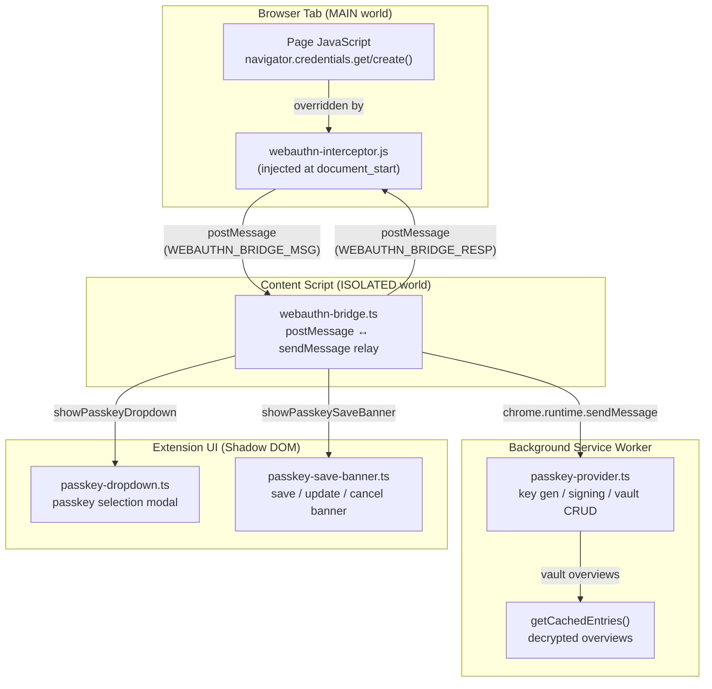
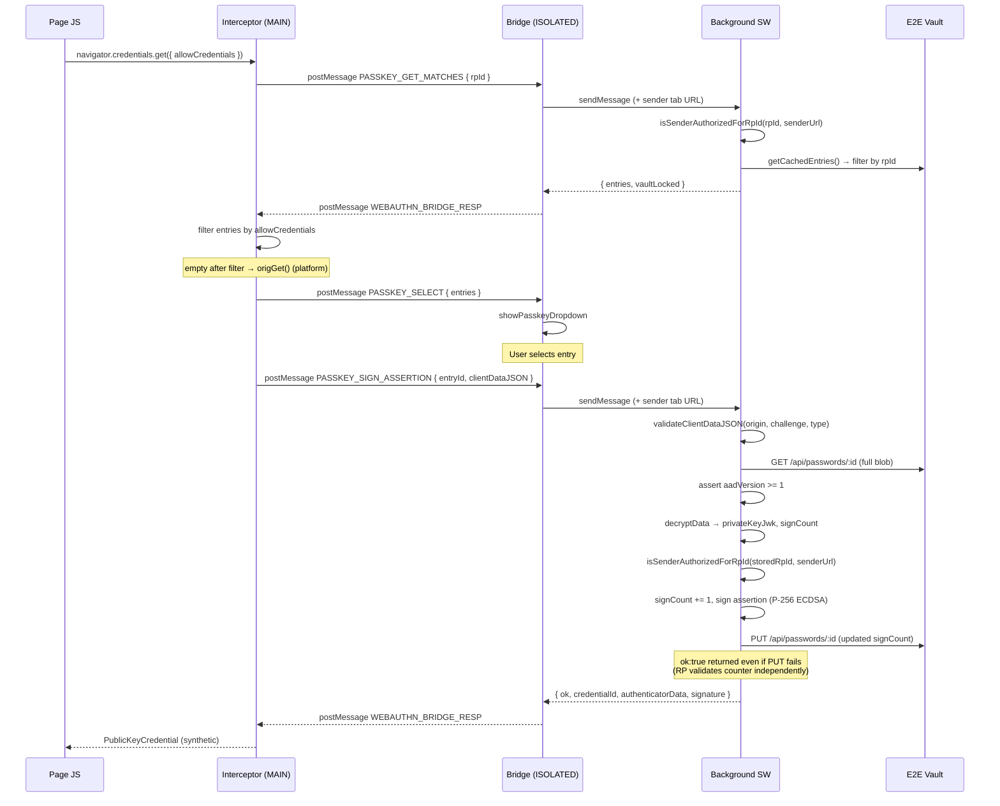
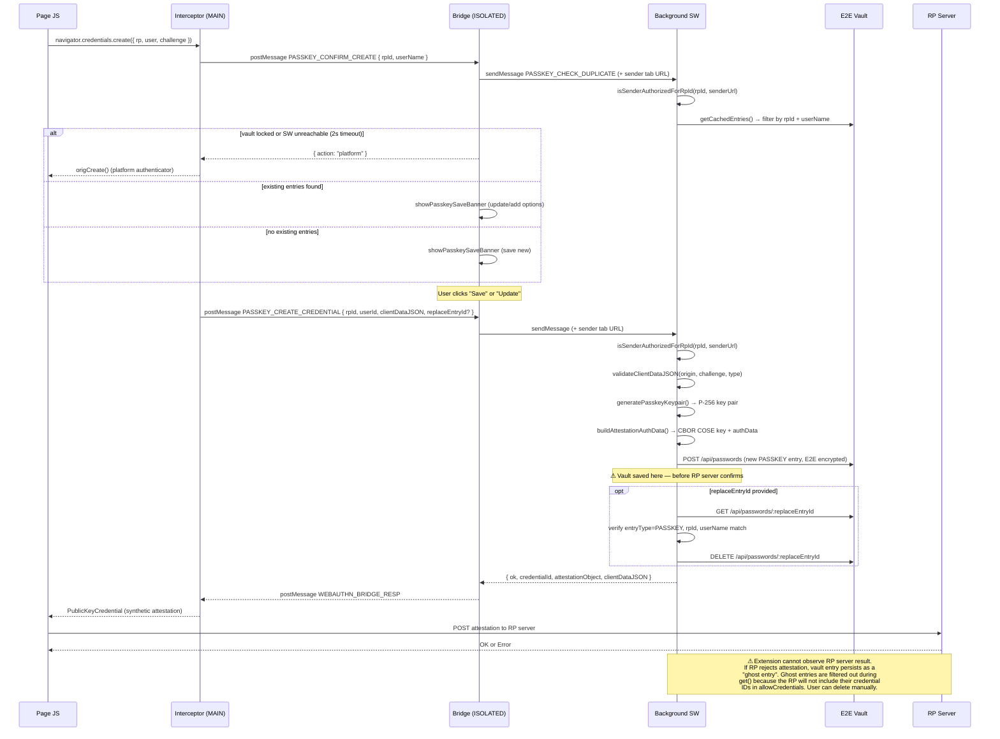

# Extension Passkey Provider Architecture

This document describes how the passwd-sso browser extension intercepts
WebAuthn calls and provides passkey registration and authentication using
credentials stored in the E2E-encrypted vault.

---

## Overview

The extension operates across three worlds:

- **MAIN world** (`webauthn-interceptor.js`): Overrides `navigator.credentials.get/create()` before page JS runs
- **ISOLATED world** (`webauthn-bridge.ts`): Relays postMessage between MAIN world and background
- **Background SW** (`passkey-provider.ts`): Performs key generation, signing, and vault CRUD

---

## Authentication Flow (get)

---

## Registration Flow (create)

---

## Security Properties

| Property | Mechanism |
|----------|-----------|
| Cross-origin enumeration prevention | `isSenderAuthorizedForRpId()` — checks sender tab hostname matches rpId (domain suffix) |
| Origin binding | `validateClientDataJSON()` — verifies `origin` field matches sender tab origin |
| AAD downgrade prevention | `aadVersion < 1` → `INVALID_ENTRY` (PASSKEY entries always created with aadVersion=1) |
| Concurrent signing collision | `withSigningLock()` — per-credential mutex prevents counter race |
| Replay prevention | Sign counter incremented and persisted on every assertion |
| replaceEntryId safety | Verifies entryType=PASSKEY, rpId, and userName match before DELETE |
| Defense-in-depth | rpId re-validated post-decrypt against stored value in encrypted blob |

## Known Limitations

- **Ghost entries**: If the RP server rejects the attestation after vault save, the entry persists but is inert (filtered by `allowCredentials`). No fix without fetch interception or pending-entry state — deferred.
- **excludeCredentials not enforced**: `excludeCredentialIds` is forwarded but not checked against vault entries. Duplicate registrations are possible.
- **postMessage origin**: MAIN world origin check uses `window.location.origin` (only option available). ISOLATED world `event.origin` check is correct.
- **Google passkey page**: Google's passkey management page uses its own JS wrapper (`passkeys.js`) that may reject the synthetic credential or timeout before the extension responds.
