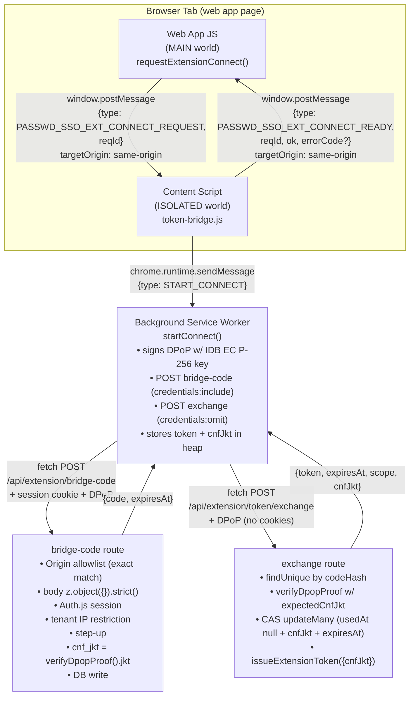
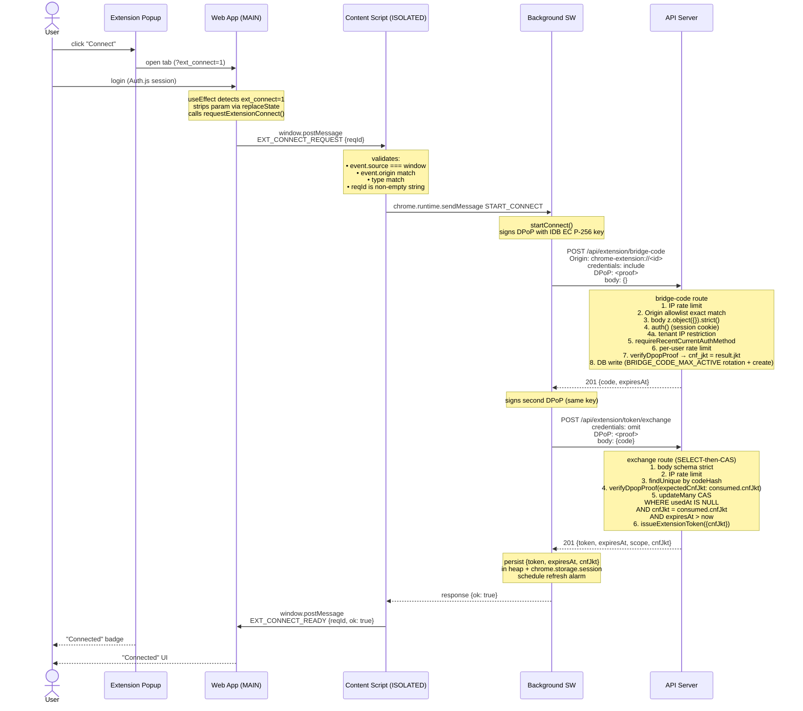
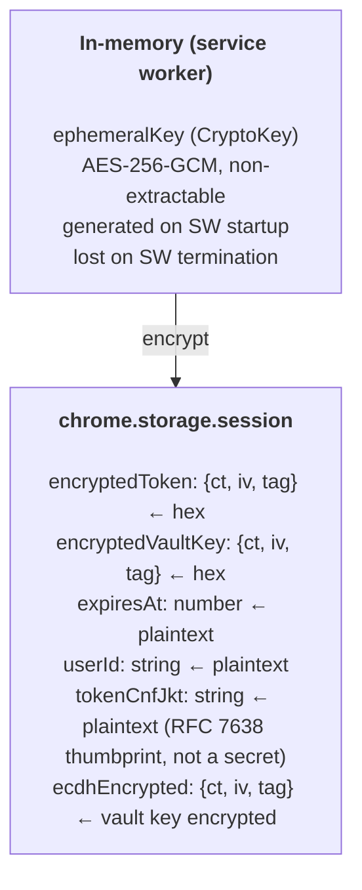
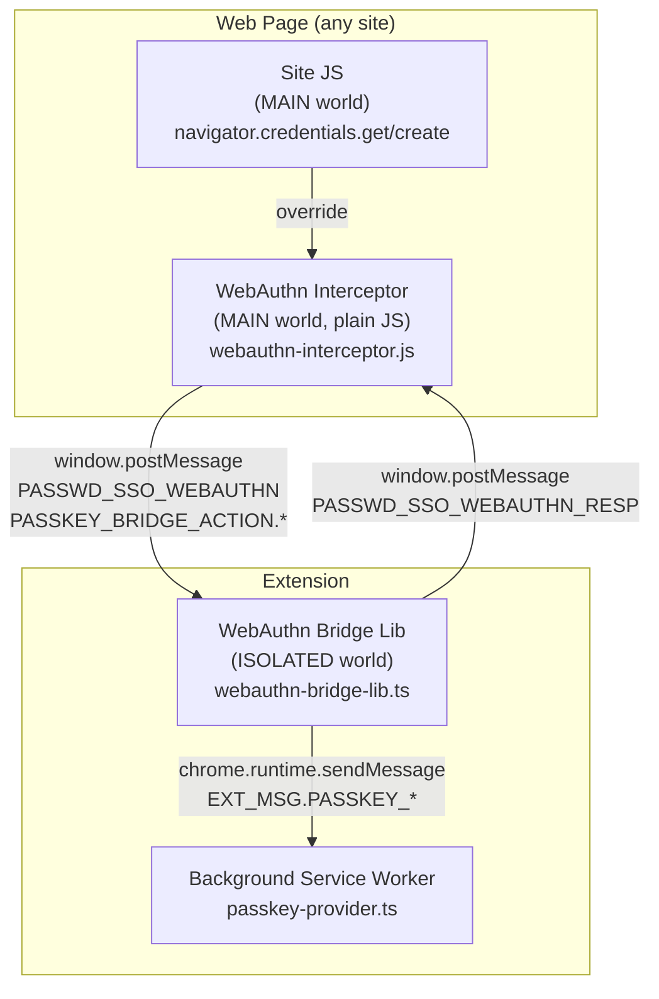
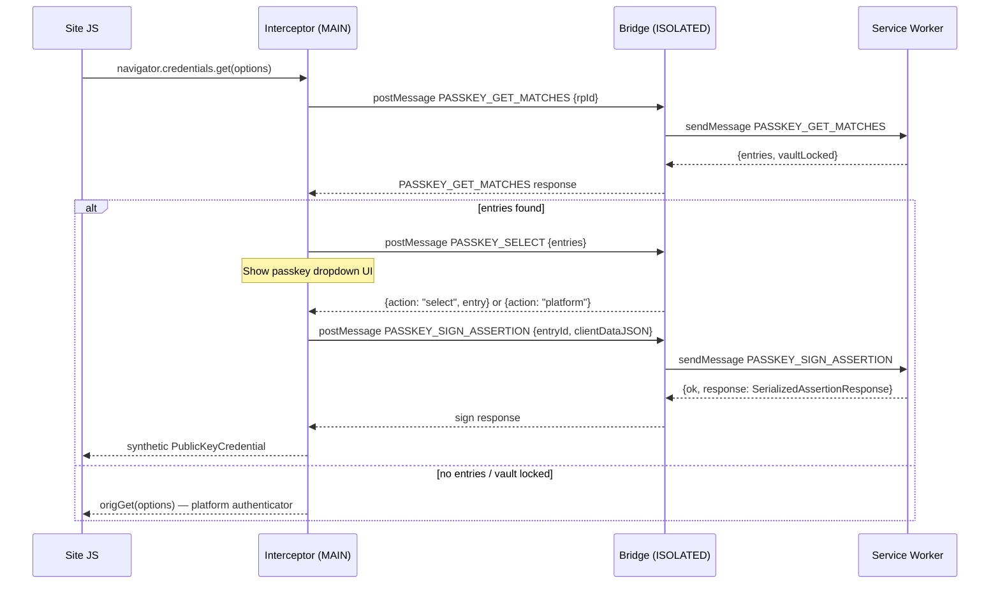
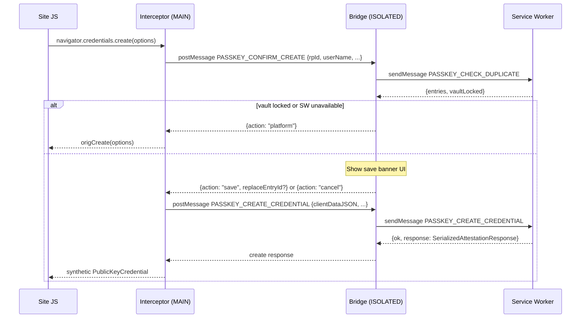

# Extension Token Bridge Architecture

This document describes how the browser extension authenticates with the
web application and maintains a secure session.

---

## Overview

The extension connects to the web app via a Bearer token whose lifetime is
governed by tenant policy (`extensionTokenIdleTimeoutMinutes` /
`extensionTokenAbsoluteTimeoutMinutes`; defaults: 7d idle / 30d absolute).
Token delivery uses a **SW-initiated bridge code exchange** (rewritten in
the extension JKT trust-path PR; see §Migration status):

1. The web app's UI posts `EXT_CONNECT_REQUEST` to its content script. The
   payload carries only a `reqId` — no code, no token, no key material.
2. The content script forwards `EXT_MSG.START_CONNECT` to the background
   service worker.
3. The SW signs a DPoP proof with its IDB-resident EC P-256 key and calls
   `POST /api/extension/bridge-code` with `credentials: "include"` (Auth.js
   session cookie attached) and an empty body `{}`. The server derives
   `cnf_jkt` from the verifier's thumbprint of the proof's JWK — never
   from any client-supplied field.
4. The SW signs a second DPoP proof (same key) and calls
   `POST /api/extension/token/exchange` with `credentials: "omit"` and the
   bridge code in the body. The server verifies the proof against the
   bridge code's `cnf_jkt` (locking the key chain), atomically consumes
   the code, and returns the Bearer token.
5. The SW persists `{ token, expiresAt, cnfJkt }` in its own heap +
   `chrome.storage.session`. The content script posts `EXT_CONNECT_READY
   { ok, errorCode? }` back to the web app — never the token or the code.

The bridge code is short-lived (60 s TTL) and single-use, enforced via
SELECT-then-CAS in the exchange route. The bearer token and bridge code
**never appear in any `postMessage` payload visible to the page** — a
MAIN-world XSS that listens for `EXT_CONNECT_READY` sees only `{ ok,
errorCode }`. The cnf_jkt persistence chain (`bridge_code.cnf_jkt` →
`token.cnf_jkt` → future DPoP verifies) anchors the entire token's
lifetime to the SW's non-extractable key.



## Connection Flow



## Token Lifecycle

| Phase | Mechanism | TTL |
|-------|-----------|-----|
| **Issue (bridge code)** | `POST /api/extension/bridge-code` from SW with `credentials:"include"` + DPoP — requires Auth.js session + tenant IP policy + step-up; `cnf_jkt` derived from `verifyDpopProof().jkt` | 60 s code TTL |
| **Connect-request delivery** | `window.postMessage EXT_CONNECT_REQUEST` (page → content script) → `chrome.runtime.sendMessage START_CONNECT` (content script → SW). Payload is `{ reqId }` only — no code, no key material | instant |
| **Code → token exchange** | `POST /api/extension/token/exchange` from SW with `credentials:"omit"` + DPoP — SELECT-then-CAS: findUnique → verifyDpopProof(expectedCnfJkt) → updateMany CAS → issueExtensionToken | issues token with tenant-policy TTL (default 7d idle / 30d absolute) |
| **Connect-result delivery** | `EXT_CONNECT_READY {reqId, ok, errorCode?}` (SW → content script → page). Token is never in the payload | instant |
| **Storage** | Encrypted with ephemeral AES-256-GCM key in `chrome.storage.session` | until browser close |
| **Refresh** | `POST /api/extension/token/refresh` (Bearer + DPoP). Server carries `cnf_jkt` forward unchanged | tenant-policy TTL (new token) |
| **Refresh trigger** | `ALARM_TOKEN_REFRESH` fires before idle expiry | — |
| **Revocation** | `DELETE /api/extension/token` (Bearer + DPoP) or token expiry | — |
| **SW restart** | Ephemeral key lost → token unreadable → re-connect required | — |

### Server-side identity resolution

The exchange endpoint resolves `userId`, `tenantId`, `scope`, and `cnfJkt`
**from the consumed bridge code DB record**, never from the request body.
The SW only supplies the 64-char hex code; everything else comes from the
row that was atomically claimed by the CAS `updateMany`. This prevents
horizontal privilege escalation if a code is intercepted, and locks the
issued token's `cnf_jkt` to the same thumbprint the bridge-code POST
established.

The bridge-code endpoint similarly never trusts the request body for
`cnf_jkt` — the body schema is `z.object({}).strict()`, which rejects
any field. `cnf_jkt` is sourced exclusively from the DPoP verifier's
returned `jkt` (RFC 7638 thumbprint of the proof's JWK).

### Failure path logging

Failed exchanges (unknown / consumed / expired code, malformed body) at
the early step cannot be attributed to a user — there is no resolvable
`userId` / `tenantId`. They are logged via `getLogger().warn(...)` (pino,
structured app log) instead of `logAudit(...)`. Once `findUnique` resolves
a row, the failure paths (invalid DPoP, etc.) have `consumed.userId` and
`consumed.tenantId` available and emit
`EXTENSION_TOKEN_EXCHANGE_FAILURE` audit events.

A separate `EXTENSION_TOKEN_EXCHANGE_FAILURE` audit action is emitted when
the bridge code is consumed successfully but `issueExtensionToken()` throws
afterwards.

## Session Storage Encryption

Sensitive fields (`token`, `vaultSecretKey`) are encrypted before
persisting to `chrome.storage.session`. `tokenCnfJkt` is the public
RFC 7638 thumbprint of the DPoP key — not a secret on its own — and
is stored in plaintext for the SW-restart sanity check below:



On service worker restart, `hydrateFromSession()` loads encrypted blobs,
attempts decryption with the ephemeral key (which is gone) → returns
`null` → token cleared, vault locked → user must reconnect and re-enter
passphrase. The persisted `tokenCnfJkt` is also re-checked against the
SW's IDB DPoP key thumbprint; mismatch (e.g., the key was reset via the
Options page) clears the session so the next request triggers a fresh
connect.

## Content Script Registration

The content script (`token-bridge.js`) is **dynamically registered** by the
background service worker using `chrome.scripting.registerContentScripts`:

- Registered for the configured server URL origin only (not all sites)
- Runs at `document_start` in ISOLATED world
- Persists across service worker restarts (`persistAcrossSessions: true`)
- File is included in `web_accessible_resources` for CRXJS bundling

## Validation Checks

The content script performs three checks before forwarding any message:

| Check | Purpose | Failure mode |
|-------|---------|-------------|
| `event.source === window` | Reject messages from child iframes | Silent drop |
| `event.origin === window.location.origin` | Reject cross-origin messages | Silent drop |
| `event.data.type === "PASSWD_SSO_EXT_CONNECT_REQUEST"` | Reject unrelated postMessage traffic | Silent drop |
| `event.data.reqId` is non-empty string | Reject malformed envelopes | Silent drop |

All rejections are silent (no error response) to prevent oracle attacks.
The content script forwards **only the message type** (no `reqId`,
no extras) to the SW — extra fields injected by a malicious page never
reach the SW message envelope.

### Origin allowlist + CORS for the bridge-code endpoint

`POST /api/extension/bridge-code` is reached from the extension SW via
`fetch()` with `credentials: "include"`. The proxy classifies this path
as `ROUTE_POLICY_KIND.API_EXTENSION_BRIDGE_CODE` and short-circuits the
baseline CSRF gate (which would otherwise reject the chrome-extension
Origin with 403). The route handler then enforces its own Origin check
against `EXTENSION_BRIDGE_CODE_ALLOWED_ORIGINS` — exact-string match on
a precomputed `Set<string>` (never substring). When the env var is unset
the Set is empty and every Origin is rejected (fail-closed).

`applyCorsHeaders(..., { allowExtensionCredentials: true })` emits
`Access-Control-Allow-Credentials: true` **only** when the request's
Origin is in the allowlist. Bearer-bypass routes (the exchange endpoint
below) use `allowExtension` without the `Credentials` suffix and never
emit `Allow-Credentials`.

### CORS for the exchange endpoint

`POST /api/extension/token/exchange` is reached from the SW via direct
`fetch()` with `credentials: "omit"`. The proxy `applyCorsHeaders(...,
{ allowExtension: true })` adds CORS headers permitting `chrome-extension://`,
`moz-extension://`, and `safari-web-extension://` origins for preflight,
but never emits `Allow-Credentials: true` (the exchange is authenticated
by the bridge code + DPoP, not by cookies). CSRF / Origin checks are not
applied because the bridge code is single-use and short-lived, and the
DPoP proof binds the request to the cnfJkt established at issuance.

### Browser-session issuance hardening

The bridge-code endpoint requires a recent Auth.js session via the shared
`requireRecentCurrentAuthMethod()` helper. This prevents an attacker with
a stolen but older dashboard session from upgrading it into a longer-lived
extension credential. When the gate fires, the response is HTTP 403 with
`{ "error": "SESSION_STEP_UP_REQUIRED" }`, which the SW propagates
verbatim and the web app's `auto-extension-connect` component surfaces
as a passkey-reauth CTA.

## Threat Model

The SW-initiated bridge code exchange replaces the previous web-app-issued
postMessage scheme. The trust path for `cnf_jkt` is now:

```
extension SW's IDB-resident EC P-256 key
  ↓ DPoP proof signed with private key
server-side verifier (verifyDpopProof)
  ↓ thumbprint derived from the proof's own JWK header
extension_bridge_codes.cnf_jkt (DB)
  ↓ findUnique + CAS predicate
extension_tokens.cnf_jkt (DB)
  ↓ every future authenticated request's expectedCnfJkt
```

The page (MAIN world) and the content script (ISOLATED world) never see
the bridge code, the token, or any DPoP key material. A MAIN-world XSS
can call `window.postMessage({type: "PASSWD_SSO_EXT_CONNECT_REQUEST",
reqId: ...})` to trigger a connect attempt, but:

1. The connect attempt still requires the legitimate user's Auth.js
   session cookie (the SW's `credentials:"include"` sends the same cookie
   the user already has — no privilege escalation).
2. The token issued lands in the SW's heap, not the page's. The page
   only receives `{ ok: true }`.
3. The cnf_jkt is bound to the SW's IDB key, which a page-script cannot
   read or replace. An attacker who later steals the Bearer token cannot
   use it without producing DPoP proofs signed by the same key.

| Attack vector | Pre-rewrite | Post-rewrite (this design) |
|--------------|-------------|----------------------------|
| `window.postMessage` listener captures bridge code | Captures a 60-s single-use code | **Never reachable** — code stays in SW heap |
| `window.postMessage` listener captures bearer token | Captures `EXT_CONNECT_READY` only contains `{ok, errorCode}` | **Never reachable** — same |
| Page-script forges request body with `cnfJkt: attacker-key-jkt` | Was accepted; server stored attacker's jkt | **Rejected** — body is `z.object({}).strict()`; cnf_jkt comes from verifier |
| Stolen bridge code consumed by attacker's DPoP | Consumed the code on attacker's failed verify (DoS) | **No consume** — SELECT-then-CAS; verify failure leaves `used_at` NULL |
| Cross-tenant escalation via tampered request | N/A — server-side identity resolution | Same |
| Replay (after legitimate consume) | Atomic UPDATE returns count=0 → 401 | CAS predicate (`usedAt: null`) returns count=0 → 401 |
| DevTools / memory forensics | Memory only | Memory only |
| Page-script triggers unauthorized connect | N/A | **Blocked at content-script gate** — `EXT_CONNECT_REQUEST` is silently dropped unless `navigator.userActivation.isActive` is true; programmatic `.click()` and synthesized `MouseEvent` do not set activation per HTML User Activation v2 |

### XSS-acts-as-user mitigation: user-activation gate (C15-v2)

The content-script relay (`extension/src/content/token-bridge-lib.ts` and
the parallel `token-bridge.js`) requires
`navigator.userActivation.isActive` before forwarding
`EXT_CONNECT_REQUEST` to the service worker. The web app cooperates by
**not** auto-connecting on `?ext_connect=1`; it renders an
`AWAITING_CLICK` confirmation card and calls `requestExtensionConnect()`
only from the Allow button's onClick handler, so a legitimate flow
always carries fresh transient activation at the `postMessage` site.

Activation failure is a **silent drop** — no `EXT_CONNECT_READY` reply,
no audit emission — to avoid an `EXTENSION_ABSENT` oracle that would
distinguish "extension installed but lacking activation" from
"extension absent." The page-side
`requestExtensionConnect()` 8-second timeout collapses both cases to
`EXTENSION_ABSENT` from the page's perspective.

The gate reads `isActive` (transient activation, ~5 s implementation-
defined window) and never `hasBeenActive` (sticky activation persists
for the document lifetime and would defeat the gate).

**Residual** (acknowledged limitations):

- A same-origin XSS that races a real user gesture within the
  transient-activation window may still trigger a connect "as the
  user." The attacker does NOT obtain the token, the bridge code, or
  the DPoP key (all SW-confined); the observable harm is limited to
  one extra bridge-code + exchange round-trip, audit-log noise, and
  rate-limit budget consumption.
- The bridge-code route's per-IP (60/min) and per-user (10/15 min)
  rate limiters bound the attack rate; `EXTENSION_BRIDGE_CODE_ISSUE_FAILURE`
  audit emissions provide forensic visibility.
- A SW-side `_sender.tab?.url` sender check on `START_CONNECT` is a
  separate defense-in-depth opportunity (not blocking; tracked as
  future hardening).

## File Map

| File | Role |
|------|------|
| `src/lib/extension-connect-request.ts` | Web app: posts `EXT_CONNECT_REQUEST`, awaits matching `EXT_CONNECT_READY`, returns `{ ok, errorCode? }` |
| `src/app/api/extension/bridge-code/route.ts` | Web app endpoint: issues a one-time code (Origin allowlist + Auth.js session + tenant IP + step-up + DPoP-derived cnf_jkt) |
| `src/app/api/extension/token/exchange/route.ts` | Web app endpoint: SELECT-then-CAS — finds the code, verifies DPoP against `consumed.cnfJkt`, atomically consumes, issues token |
| `src/lib/proxy/route-policy.ts` | Web app: `ROUTE_POLICY_KIND.API_EXTENSION_BRIDGE_CODE` classification |
| `src/lib/proxy/api-route.ts` | Web app: orchestrator early-return for `API_EXTENSION_BRIDGE_CODE` (skips baseline CSRF gate) |
| `src/lib/http/cors.ts` | Web app: `isBridgeCodeOriginAllowed()` exact-match allowlist + `allowExtensionCredentials` CORS option |
| `src/lib/auth/tokens/extension-token.ts` | Shared `issueExtensionToken({cnfJkt})` helper used by `/api/extension/token/exchange` |
| `src/lib/constants/integrations/extension.ts` | Shared constants: `EXT_CONNECT_REQUEST_MSG_TYPE`, `EXT_CONNECT_READY_MSG_TYPE`, `BRIDGE_CODE_TTL_MS`, `BRIDGE_CODE_MAX_ACTIVE`, `BRIDGE_CODE_LENGTH` |
| `src/components/extension/auto-extension-connect.tsx` | Web app UI: invokes `requestExtensionConnect()`, branches on `errorCode` for reauth / extension-update / generic-failure CTAs |
| `extension/src/content/token-bridge.js` | Content script (ISOLATED): receives `EXT_CONNECT_REQUEST`, forwards `START_CONNECT` to SW, posts `EXT_CONNECT_READY` back. Plain JS — see project memory `project_extension_parallel_impl.md`. |
| `extension/src/content/token-bridge-lib.ts` | TypeScript version of content script (for tests only — not registered at runtime) |
| `extension/src/background/token-handler.ts` | SW `startConnect()`: signs two DPoP proofs, POSTs bridge-code + exchange, persists token + cnfJkt |
| `extension/src/background/index.ts` | SW: token state, refresh, `EXT_MSG.START_CONNECT` dispatch, dynamic script registration |
| `extension/src/lib/dpop-key.ts` | Extension: IDB-persisted EC P-256 keypair + `signDpopProof()` |
| `extension/src/lib/constants.ts` | Extension constants (mirrors web app; cross-repo sync test enforces equality) |
| `extension/src/lib/api-paths.ts` | Extension paths: `EXTENSION_BRIDGE_CODE`, `EXTENSION_TOKEN_EXCHANGE`, etc. |
| `extension/src/lib/session-crypto.ts` | Ephemeral AES-256-GCM key for session encryption |
| `extension/src/lib/session-storage.ts` | Encrypted persist/load for `chrome.storage.session` (carries `tokenCnfJkt`) |
| `prisma/schema.prisma` | `ExtensionBridgeCode` model (with `cnf_jkt` column) + `EXTENSION_BRIDGE_CODE_ISSUE` / `EXTENSION_TOKEN_EXCHANGE_SUCCESS` / `EXTENSION_TOKEN_EXCHANGE_FAILURE` audit actions |

### Migration status

The extension JKT trust-path rewrite (PR #492, 2026-05) inverted the
bridge-code flow: the web app no longer issues codes or carries the
token. The SW initiates the bridge-code + exchange handshake itself,
deriving `cnf_jkt` from the DPoP verifier rather than from any
client-supplied body field. The exchange route was reordered to
SELECT-then-CAS so an invalid DPoP no longer consumes the bridge code
(closes a DoS-via-consumption window for stolen codes).

The previous legacy postMessage relay (`PASSWD_SSO_BRIDGE_CODE` carrying
`{code, expiresAt}`) and the body-`cnfJkt` field on the bridge-code POST
were removed in the same PR. The dead `src/lib/inject-extension-bridge-code.ts`
and `src/lib/extension-jkt-request.ts` modules were deleted.

The legacy `POST /api/extension/token` endpoint was retired earlier (2026-05)
and now always returns HTTP 410 Gone with `Deprecation: true` +
`Cache-Control: no-store` headers. Calls are still observable via
`event: extension_token_legacy_issuance_blocked` (warn-level structured log)
and the `EXTENSION_TOKEN_LEGACY_ISSUANCE_BLOCKED` audit action. The full
handler deletion is scheduled for the next Minor release after one
observation window of zero surprise traffic.

---

## Passkey Provider Bridge

The extension also acts as a **WebAuthn passkey provider** — intercepting
`navigator.credentials.get()` and `navigator.credentials.create()` on any
web page to offer vault-stored passkeys before falling through to the platform
authenticator.

### Architecture layers



### Message flow (get)



### Message flow (create)



### Constants separation

Two constant objects govern the two message layers:

| Constant | Layer | Purpose |
|----------|-------|---------|
| `PASSKEY_BRIDGE_ACTION` | MAIN world ↔ content script (postMessage) | Action names embedded in `window.postMessage` payloads |
| `EXT_MSG.PASSKEY_*` | Content script ↔ Service Worker (`chrome.runtime.sendMessage`) | SW message type discriminants |

The string values overlap intentionally (e.g., both use `"PASSKEY_GET_MATCHES"`),
but keeping them as separate constants makes the layer boundary explicit and
prevents accidental cross-layer coupling.

### Security properties

| Property | Mechanism |
|----------|-----------|
| Origin validation (MAIN→ISOLATED) | Bridge checks `event.source === window` and `event.origin === window.location.origin` |
| rpId spoofing prevention | SW validates sender tab URL via `isSenderAuthorizedForRpId(rpId, sender.tab.url)` |
| senderUrl not in payload | SW reads `sender.tab.url` from Chrome runtime — never from message payload |
| Vault locked fallthrough | `vaultLocked: true` in any response causes immediate fallthrough to platform |
| Timeout | 2-minute pending request timeout in interceptor; resolves `null` → platform fallthrough |

### WebAuthn Interceptor registration

`webauthn-interceptor.js` runs in the **MAIN world** (same JS context as site
code) and is registered via `chrome.scripting.registerContentScripts` with
`world: "MAIN"`. It is a plain JS IIFE (no TypeScript/ESM) because CRXJS
copies `web_accessible_resources` files without transpilation.

A guard flag (`window.__pssoWebAuthnInterceptor`) prevents double-registration
on navigations.

### Passkey Provider file map

| File | Role |
|------|------|
| `extension/src/content/webauthn-interceptor.js` | MAIN world override of `navigator.credentials.get/create` |
| `extension/src/content/webauthn-bridge.ts` | Entry point: registers ISOLATED world message listener |
| `extension/src/content/webauthn-bridge-lib.ts` | Bridge logic: routes postMessage → sendMessage and back |
| `extension/src/content/webauthn-inject.ts` | Registers the MAIN world interceptor script via `registerContentScripts` |
| `extension/src/content/ui/passkey-dropdown.ts` | Passkey selection dropdown UI (shown by bridge in ISOLATED world) |
| `extension/src/content/ui/passkey-save-banner.ts` | Save/replace confirmation banner UI |
| `extension/src/background/passkey-provider.ts` | SW handlers: get matches, check duplicate, sign assertion, create credential |
| `extension/src/lib/webauthn-crypto.ts` | P-256 keypair gen, CBOR encoding, COSE key, assertion signing |
| `extension/src/lib/cbor.ts` | Minimal CBOR encoder for attestation object |
| `extension/src/lib/constants.ts` | `PASSKEY_BRIDGE_ACTION`, `EXT_MSG.PASSKEY_*`, `WEBAUTHN_BRIDGE_MSG/RESP` |
