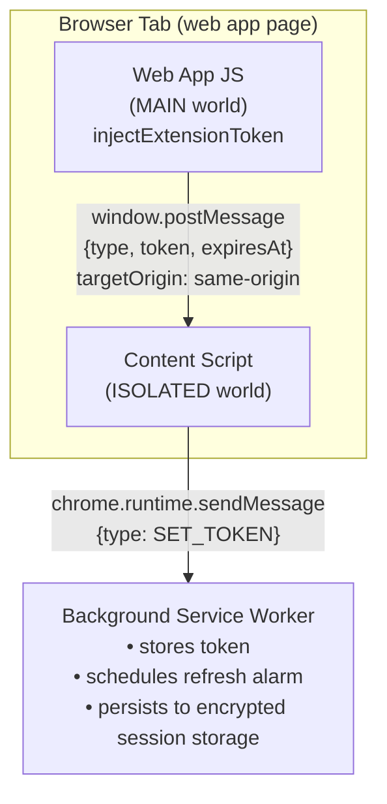
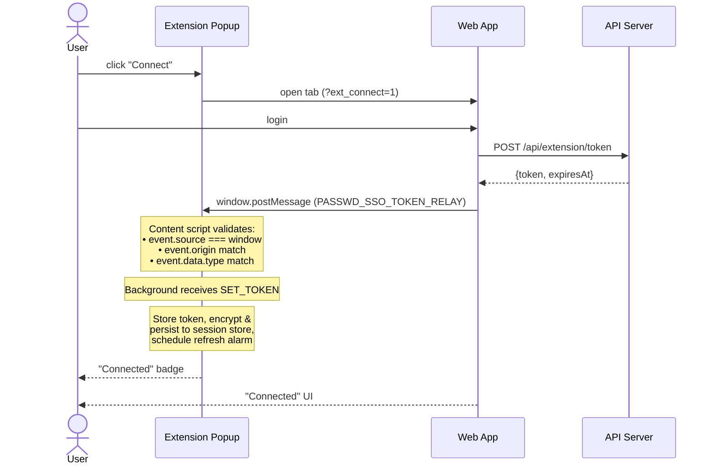
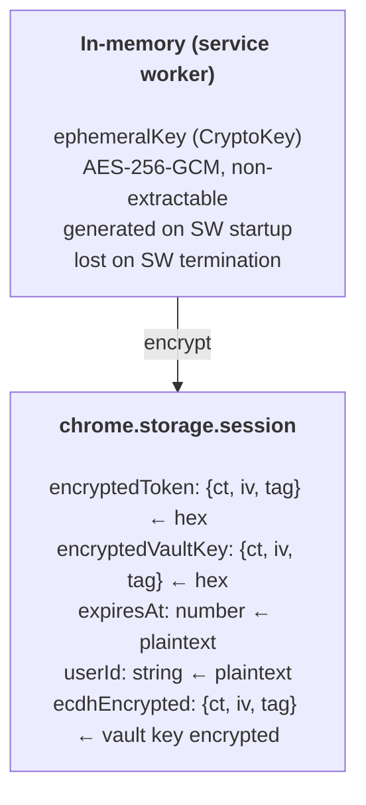
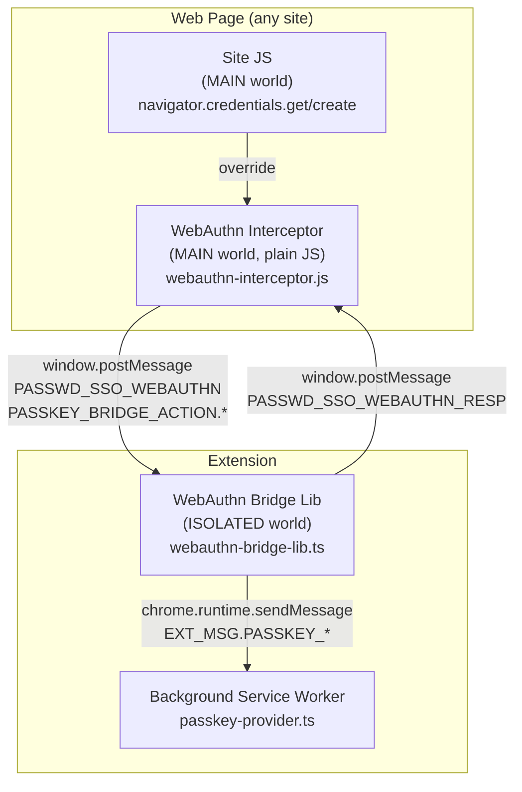
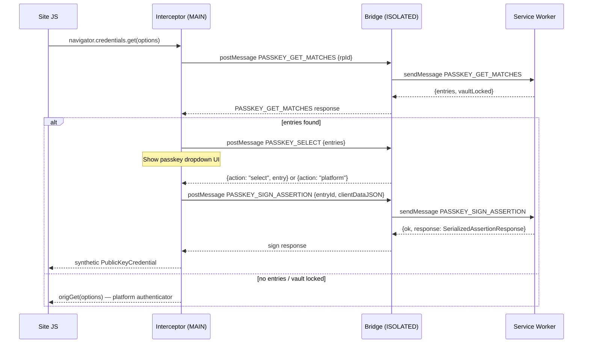
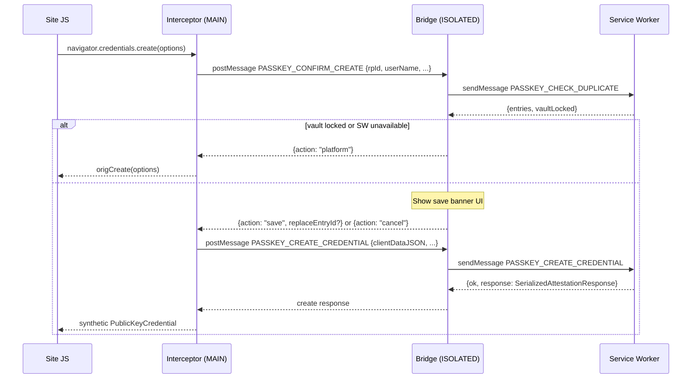

# Extension Token Bridge Architecture

This document describes how the browser extension authenticates with the
web application and maintains a secure session.

---

## Overview

The extension connects to the web app via a short-lived Bearer token
(15-minute TTL). The token is delivered from the web app to the extension
through a `postMessage` bridge — the web app's JavaScript sends the token
via `window.postMessage`, and an ISOLATED-world content script receives it
and forwards it to the background service worker.

## Connection Flow

## Token Lifecycle

| Phase | Mechanism | TTL |
|-------|-----------|-----|
| **Issue** | `POST /api/extension/token` (requires Auth.js session) | 15 min |
| **Delivery** | `window.postMessage` → content script → background | instant |
| **Storage** | Encrypted with ephemeral AES-256-GCM key in `chrome.storage.session` | until browser close |
| **Refresh** | `POST /api/extension/token/refresh` (Bearer + session) | 15 min (new token) |
| **Refresh trigger** | `ALARM_TOKEN_REFRESH` fires 2 min before expiry | — |
| **Revocation** | `DELETE /api/extension/token` or token expiry | — |
| **SW restart** | Ephemeral key lost → token unreadable → re-auth required | — |

## Session Storage Encryption

Sensitive fields (`token`, `vaultSecretKey`) are encrypted before persisting
to `chrome.storage.session`:

On service worker restart:
1. `hydrateFromSession()` loads encrypted blobs
2. Attempts decryption with ephemeral key — **key is gone** → returns `null`
3. Token cleared, vault locked → user must reconnect and re-enter passphrase

## Content Script Registration

The content script (`token-bridge.js`) is **dynamically registered** by the
background service worker using `chrome.scripting.registerContentScripts`:

- Registered for the configured server URL origin only (not all sites)
- Runs at `document_start` in ISOLATED world
- Persists across service worker restarts (`persistAcrossSessions: true`)
- File is included in `web_accessible_resources` for CRXJS bundling

## Validation Checks

The content script performs three checks before forwarding:

| Check | Purpose | Failure mode |
|-------|---------|-------------|
| `event.source === window` | Reject messages from child iframes | Silent drop |
| `event.origin === window.location.origin` | Reject cross-origin messages | Silent drop |
| `event.data.type === "PASSWD_SSO_TOKEN_RELAY"` | Reject unrelated postMessage traffic | Silent drop |

All rejections are silent (no error response) to prevent oracle attacks.

## Threat Model

The `postMessage` approach eliminates the 10-second DOM attribute exposure
of the old hidden-`
` injection. However, it does **not** mitigate
MAIN-world-level attackers (e.g., supply-chain-compromised npm packages)
who can call `window.addEventListener("message", ...)` to intercept the token.

This is a **defense-in-depth improvement** — the full mitigation would require
a one-time-code + PKCE exchange (tracked as a future enhancement).

| Attack vector | Old (DOM injection) | New (postMessage) |
|--------------|-------------------|------------------|
| DOM query (`getElementById`) | 10-sec window | Not applicable |
| MutationObserver | 10-sec window | Not applicable |
| postMessage listener | Not applicable | Single event cycle |
| MAIN-world event listener | Not applicable | Single event cycle |
| DevTools / memory forensics | DOM + memory | Memory only |

## File Map

| File | Role |
|------|------|
| `src/lib/inject-extension-token.ts` | Web app: dispatches `postMessage` with token |
| `src/lib/constants/extension.ts` | Shared constants: `TOKEN_BRIDGE_MSG_TYPE` |
| `extension/src/content/token-bridge.js` | Content script (ISOLATED): receives postMessage, forwards to background |
| `extension/src/content/token-bridge-lib.ts` | TypeScript version of content script (for tests) |
| `extension/src/lib/constants.ts` | Extension constants (mirrors web app constants) |
| `extension/src/lib/session-crypto.ts` | Ephemeral AES-256-GCM key for session encryption |
| `extension/src/lib/session-storage.ts` | Encrypted persist/load for `chrome.storage.session` |
| `extension/src/background/index.ts` | Background SW: token state, refresh, dynamic script registration |

---

## Passkey Provider Bridge

The extension also acts as a **WebAuthn passkey provider** — intercepting
`navigator.credentials.get()` and `navigator.credentials.create()` on any
web page to offer vault-stored passkeys before falling through to the platform
authenticator.

### Architecture layers

### Message flow (get)

### Message flow (create)

### Constants separation

Two constant objects govern the two message layers:

| Constant | Layer | Purpose |
|----------|-------|---------|
| `PASSKEY_BRIDGE_ACTION` | MAIN world ↔ content script (postMessage) | Action names embedded in `window.postMessage` payloads |
| `EXT_MSG.PASSKEY_*` | Content script ↔ Service Worker (`chrome.runtime.sendMessage`) | SW message type discriminants |

The string values overlap intentionally (e.g., both use `"PASSKEY_GET_MATCHES"`),
but keeping them as separate constants makes the layer boundary explicit and
prevents accidental cross-layer coupling.

### Security properties

| Property | Mechanism |
|----------|-----------|
| Origin validation (MAIN→ISOLATED) | Bridge checks `event.source === window` and `event.origin === window.location.origin` |
| rpId spoofing prevention | SW validates sender tab URL via `isSenderAuthorizedForRpId(rpId, sender.tab.url)` |
| senderUrl not in payload | SW reads `sender.tab.url` from Chrome runtime — never from message payload |
| Vault locked fallthrough | `vaultLocked: true` in any response causes immediate fallthrough to platform |
| Timeout | 2-minute pending request timeout in interceptor; resolves `null` → platform fallthrough |

### WebAuthn Interceptor registration

`webauthn-interceptor.js` runs in the **MAIN world** (same JS context as site
code) and is registered via `chrome.scripting.registerContentScripts` with
`world: "MAIN"`. It is a plain JS IIFE (no TypeScript/ESM) because CRXJS
copies `web_accessible_resources` files without transpilation.

A guard flag (`window.__pssoWebAuthnInterceptor`) prevents double-registration
on navigations.

### Passkey Provider file map

| File | Role |
|------|------|
| `extension/src/content/webauthn-interceptor.js` | MAIN world override of `navigator.credentials.get/create` |
| `extension/src/content/webauthn-bridge.ts` | Entry point: registers ISOLATED world message listener |
| `extension/src/content/webauthn-bridge-lib.ts` | Bridge logic: routes postMessage → sendMessage and back |
| `extension/src/content/webauthn-inject.ts` | Registers the MAIN world interceptor script via `registerContentScripts` |
| `extension/src/content/ui/passkey-dropdown.ts` | Passkey selection dropdown UI (shown by bridge in ISOLATED world) |
| `extension/src/content/ui/passkey-save-banner.ts` | Save/replace confirmation banner UI |
| `extension/src/background/passkey-provider.ts` | SW handlers: get matches, check duplicate, sign assertion, create credential |
| `extension/src/lib/webauthn-crypto.ts` | P-256 keypair gen, CBOR encoding, COSE key, assertion signing |
| `extension/src/lib/cbor.ts` | Minimal CBOR encoder for attestation object |
| `extension/src/lib/constants.ts` | `PASSKEY_BRIDGE_ACTION`, `EXT_MSG.PASSKEY_*`, `WEBAUTHN_BRIDGE_MSG/RESP` |
