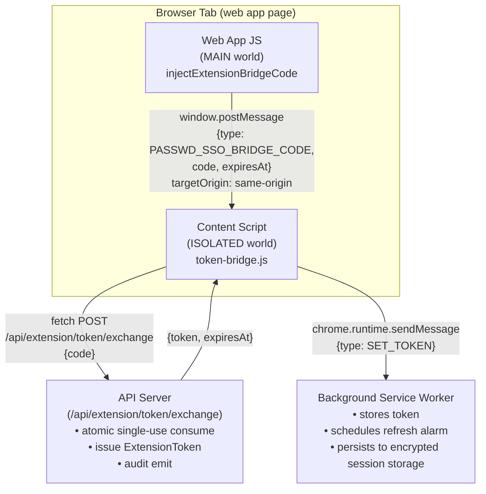
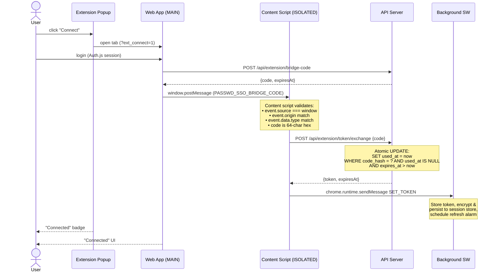
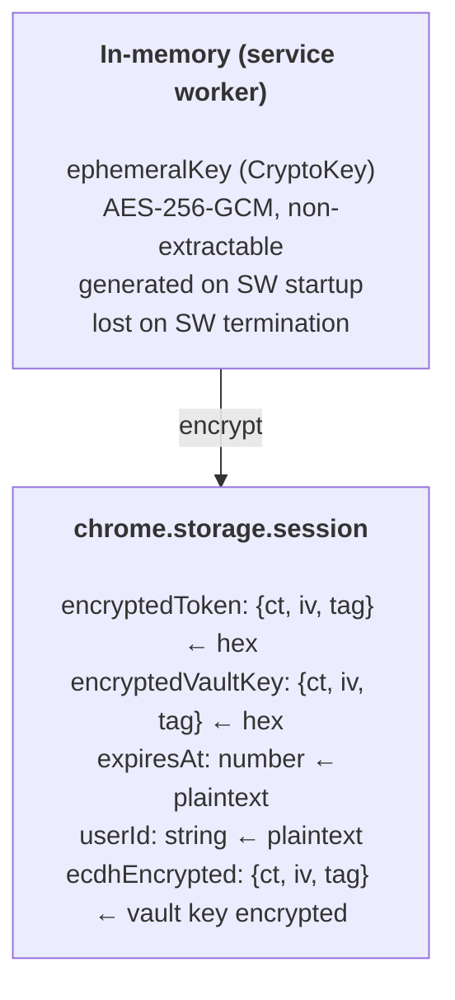
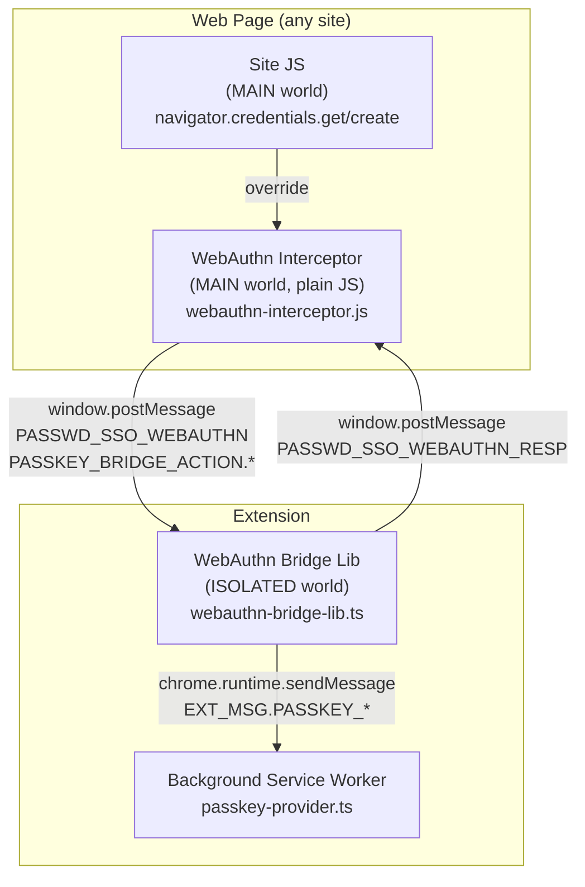
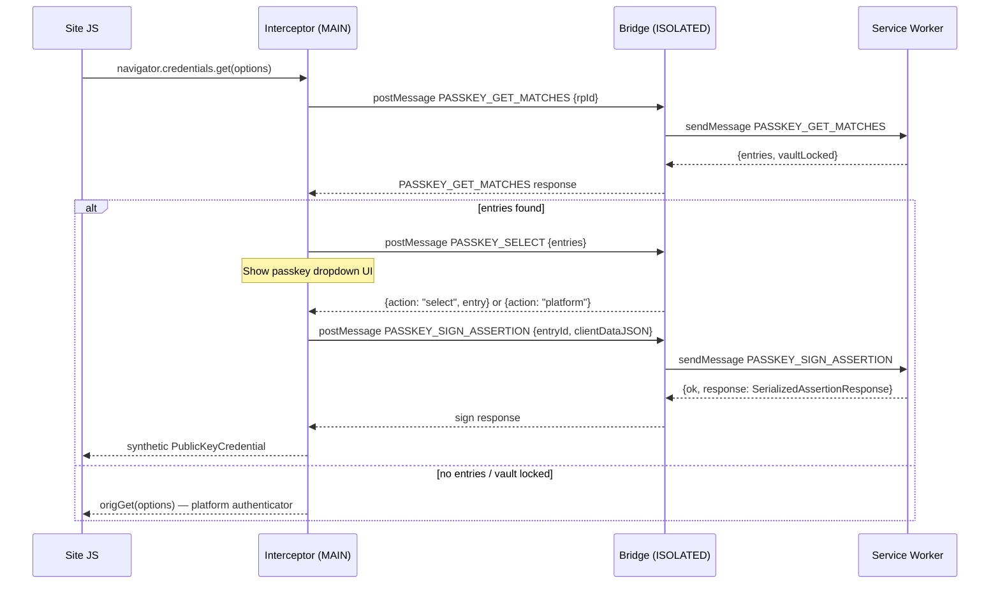
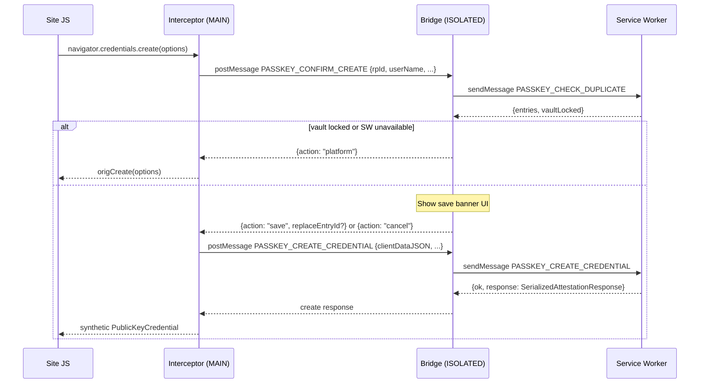

# Extension Token Bridge Architecture

This document describes how the browser extension authenticates with the
web application and maintains a secure session.

---

## Overview

The extension connects to the web app via a short-lived Bearer token
(15-minute TTL). Token delivery uses a **one-time bridge code exchange**
(introduced in PR #364):

1. The web app's JavaScript obtains a single-use bridge code from
   `POST /api/extension/bridge-code` (requires Auth.js session).
2. The web app posts the code via `window.postMessage` to the content script.
3. The content script (ISOLATED world) calls `POST /api/extension/token/exchange`
   directly via `fetch()` to atomically consume the code and receive a token.
4. The content script forwards the token to the background service worker.

The bridge code is short-lived (60 s TTL) and single-use, enforced server-side
via a single atomic `UPDATE`. The bearer token never appears in any
`postMessage` payload — only the code does — so a MAIN-world XSS that observes
the postMessage receives a code, not a token, and must race the legitimate
content script to consume it before being blocked by single-use enforcement.

## Connection Flow

## Token Lifecycle

| Phase | Mechanism | TTL |
|-------|-----------|-----|
| **Issue (bridge code)** | `POST /api/extension/bridge-code` (requires Auth.js session) | 60 s code TTL |
| **Code delivery** | `window.postMessage` (MAIN → ISOLATED) | instant |
| **Code → token exchange** | `POST /api/extension/token/exchange` (no session, atomic single-use consume) | issues 15-min token |
| **Issue (legacy direct)** | `POST /api/extension/token` (Auth.js session) — **DEPRECATED** | 15 min |
| **Storage** | Encrypted with ephemeral AES-256-GCM key in `chrome.storage.session` | until browser close |
| **Refresh** | `POST /api/extension/token/refresh` (Bearer + session) | 15 min (new token) |
| **Refresh trigger** | `ALARM_TOKEN_REFRESH` fires 2 min before expiry | — |
| **Revocation** | `DELETE /api/extension/token` or token expiry | — |
| **SW restart** | Ephemeral key lost → token unreadable → re-auth required | — |

### Server-side identity resolution

The exchange endpoint resolves `userId`, `tenantId`, and `scope` **from the
consumed bridge code DB record**, never from the request body. The client
only supplies the 64-char hex code; everything else comes from the row that
was atomically claimed by the `UPDATE`. This prevents horizontal privilege
escalation if a code is intercepted.

### Failure path logging

Failed exchanges (unknown / consumed / expired code, malformed body) cannot
be attributed to a user — there is no resolvable `userId` / `tenantId`. They
are logged via `getLogger().warn(...)` (pino, structured app log) instead of
`logAudit(...)` (which requires a user/tenant context). The successful
exchange path uses `logAudit({ action: EXTENSION_TOKEN_EXCHANGE_SUCCESS, ... })`
with values from the consumed record.

A separate `EXTENSION_TOKEN_EXCHANGE_FAILURE` audit action is emitted when
the bridge code is consumed successfully but `issueExtensionToken()` throws
afterwards (we have a known `consumed.userId` / `consumed.tenantId` in that
branch).

## Session Storage Encryption

Sensitive fields (`token`, `vaultSecretKey`) are encrypted before persisting
to `chrome.storage.session`:

On service worker restart:
1. `hydrateFromSession()` loads encrypted blobs
2. Attempts decryption with ephemeral key — **key is gone** → returns `null`
3. Token cleared, vault locked → user must reconnect and re-enter passphrase

## Content Script Registration

The content script (`token-bridge.js`) is **dynamically registered** by the
background service worker using `chrome.scripting.registerContentScripts`:

- Registered for the configured server URL origin only (not all sites)
- Runs at `document_start` in ISOLATED world
- Persists across service worker restarts (`persistAcrossSessions: true`)
- File is included in `web_accessible_resources` for CRXJS bundling

## Validation Checks

The content script performs four checks before forwarding:

| Check | Purpose | Failure mode |
|-------|---------|-------------|
| `event.source === window` | Reject messages from child iframes | Silent drop |
| `event.origin === window.location.origin` | Reject cross-origin messages | Silent drop |
| `event.data.type === "PASSWD_SSO_BRIDGE_CODE"` | Reject unrelated postMessage traffic | Silent drop |
| `code.length === 64` and hex (bridge code path only) | Reject malformed payloads | Silent drop |

All rejections are silent (no error response) to prevent oracle attacks.

### Cross-origin / CORS for the exchange endpoint

`POST /api/extension/token/exchange` is reached from the content script via
direct `fetch()`. Although content scripts share the page's `Origin` for
fetch, the request still must succeed regardless of the page origin matching
`APP_URL`. The proxy (`src/proxy.ts`) special-cases this path:

- Bypasses the session check (the whole point of the endpoint is to bootstrap
  auth from a code, not from a session).
- `applyCorsHeaders(..., { allowExtension: true })` adds CORS headers permitting
  `chrome-extension://`, `moz-extension://`, and `safari-web-extension://` origins.
- Preflight `OPTIONS` requests are handled with the same `allowExtension` flag.

CSRF protection (`assertOrigin`) is intentionally NOT applied to this endpoint
because the content script's effective origin may be `chrome-extension://`,
which would fail any same-origin check. The compensating control is the
256-bit single-use code.

## Threat Model

The bridge code exchange replaces the previous bearer-in-postMessage scheme.
A MAIN-world attacker (XSS, supply-chain-compromised npm package) can still
call `window.addEventListener("message", ...)` to intercept the postMessage,
but the payload is now a one-time, 60-second-TTL, server-side single-use code
— not a bearer token. The captured code yields a token only if the attacker:

1. Acts within 60 seconds of issuance.
2. Wins a race against the legitimate content script's exchange call.
3. The atomic `UPDATE` (`SET used_at = now WHERE used_at IS NULL`) lets only
   one party succeed; the loser receives 401 and the failed exchange is
   logged via pino for forensic correlation.

Even if the attacker wins the race, they obtain a token with the same scope
and TTL the legitimate user would have received — no horizontal escalation,
no cross-tenant access. The legitimate flow degrades to "extension stays
unconnected" (the user retries).

A future enhancement (Stage 4 of the original plan, **out of scope**) would
add a PKCE-style verifier so that even capturing the code does not enable
exchange. This was deferred because a meaningful PKCE design requires the
extension to register a `code_challenge` with the server through a channel
the web app cannot tamper with — that requires a bootstrap mechanism the
extension does not yet have.

| Attack vector | Old direct token (legacy) | New bridge code exchange |
|--------------|-------------------------|------------------------|
| DOM query (`getElementById`) | N/A (bearer in postMessage) | N/A |
| MutationObserver | N/A | N/A |
| postMessage listener captures bearer | **Token captured directly (15-min TTL)** | Captures a 60-s single-use code |
| MAIN-world event listener captures payload | Token (15-min TTL) | Code (60-s TTL, single-use, race with content script) |
| Replay (after legitimate consume) | N/A | Atomic `UPDATE` returns count = 0 → 401 |
| DevTools / memory forensics | Memory only | Memory only |
| Cross-tenant escalation via tampered request | N/A | Server-side identity resolution from DB record |

After the 2026-04 cleanup the postMessage column is no longer reachable from any in-tree code; the column is retained for historical comparison.

## File Map

| File | Role |
|------|------|
| `src/lib/inject-extension-bridge-code.ts` | Web app: dispatches `postMessage` with bridge code (replaces `inject-extension-token.ts`) |
| `src/app/api/extension/bridge-code/route.ts` | Web app endpoint: issues a one-time code (Auth.js session required) |
| `src/app/api/extension/token/exchange/route.ts` | Web app endpoint: atomically consumes a code, returns a token (no session) |
| `src/lib/auth/tokens/extension-token.ts` | Shared `issueExtensionToken()` helper used by legacy POST + new exchange |
| `src/lib/constants/integrations/extension.ts` | Shared constants: `BRIDGE_CODE_MSG_TYPE`, `BRIDGE_CODE_TTL_MS`, `BRIDGE_CODE_MAX_ACTIVE` |
| `extension/src/content/token-bridge.js` | Content script (ISOLATED): receives postMessage, exchanges bridge code, forwards token to background. Plain JS — see project memory `project_extension_parallel_impl.md`. |
| `extension/src/content/token-bridge-lib.ts` | TypeScript version of content script (for tests only — not registered at runtime) |
| `extension/src/lib/constants.ts` | Extension constants (mirrors web app constants; cross-repo sync test enforces equality) |
| `extension/src/lib/api-paths.ts` | Extension paths: includes `EXTENSION_TOKEN_EXCHANGE` |
| `extension/src/lib/session-crypto.ts` | Ephemeral AES-256-GCM key for session encryption |
| `extension/src/lib/session-storage.ts` | Encrypted persist/load for `chrome.storage.session` |
| `extension/src/background/index.ts` | Background SW: token state, refresh, dynamic script registration |
| `prisma/schema.prisma` | `ExtensionBridgeCode` model + `EXTENSION_BRIDGE_CODE_ISSUE` / `EXTENSION_TOKEN_EXCHANGE_SUCCESS` / `EXTENSION_TOKEN_EXCHANGE_FAILURE` audit actions |

### Migration status

The legacy `TOKEN_BRIDGE_MSG_TYPE` postMessage relay path was removed in the
2026-04 cleanup; the extension content script no longer accepts that message
type. The legacy `POST /api/extension/token` endpoint remains operational and
continues to emit a structured log entry (`event: extension_token_legacy_issuance`)
on every call so we can measure when legacy traffic drops to zero — that
endpoint's removal is tracked separately.

---

## Passkey Provider Bridge

The extension also acts as a **WebAuthn passkey provider** — intercepting
`navigator.credentials.get()` and `navigator.credentials.create()` on any
web page to offer vault-stored passkeys before falling through to the platform
authenticator.

### Architecture layers

### Message flow (get)

### Message flow (create)

### Constants separation

Two constant objects govern the two message layers:

| Constant | Layer | Purpose |
|----------|-------|---------|
| `PASSKEY_BRIDGE_ACTION` | MAIN world ↔ content script (postMessage) | Action names embedded in `window.postMessage` payloads |
| `EXT_MSG.PASSKEY_*` | Content script ↔ Service Worker (`chrome.runtime.sendMessage`) | SW message type discriminants |

The string values overlap intentionally (e.g., both use `"PASSKEY_GET_MATCHES"`),
but keeping them as separate constants makes the layer boundary explicit and
prevents accidental cross-layer coupling.

### Security properties

| Property | Mechanism |
|----------|-----------|
| Origin validation (MAIN→ISOLATED) | Bridge checks `event.source === window` and `event.origin === window.location.origin` |
| rpId spoofing prevention | SW validates sender tab URL via `isSenderAuthorizedForRpId(rpId, sender.tab.url)` |
| senderUrl not in payload | SW reads `sender.tab.url` from Chrome runtime — never from message payload |
| Vault locked fallthrough | `vaultLocked: true` in any response causes immediate fallthrough to platform |
| Timeout | 2-minute pending request timeout in interceptor; resolves `null` → platform fallthrough |

### WebAuthn Interceptor registration

`webauthn-interceptor.js` runs in the **MAIN world** (same JS context as site
code) and is registered via `chrome.scripting.registerContentScripts` with
`world: "MAIN"`. It is a plain JS IIFE (no TypeScript/ESM) because CRXJS
copies `web_accessible_resources` files without transpilation.

A guard flag (`window.__pssoWebAuthnInterceptor`) prevents double-registration
on navigations.

### Passkey Provider file map

| File | Role |
|------|------|
| `extension/src/content/webauthn-interceptor.js` | MAIN world override of `navigator.credentials.get/create` |
| `extension/src/content/webauthn-bridge.ts` | Entry point: registers ISOLATED world message listener |
| `extension/src/content/webauthn-bridge-lib.ts` | Bridge logic: routes postMessage → sendMessage and back |
| `extension/src/content/webauthn-inject.ts` | Registers the MAIN world interceptor script via `registerContentScripts` |
| `extension/src/content/ui/passkey-dropdown.ts` | Passkey selection dropdown UI (shown by bridge in ISOLATED world) |
| `extension/src/content/ui/passkey-save-banner.ts` | Save/replace confirmation banner UI |
| `extension/src/background/passkey-provider.ts` | SW handlers: get matches, check duplicate, sign assertion, create credential |
| `extension/src/lib/webauthn-crypto.ts` | P-256 keypair gen, CBOR encoding, COSE key, assertion signing |
| `extension/src/lib/cbor.ts` | Minimal CBOR encoder for attestation object |
| `extension/src/lib/constants.ts` | `PASSKEY_BRIDGE_ACTION`, `EXT_MSG.PASSKEY_*`, `WEBAUTHN_BRIDGE_MSG/RESP` |
