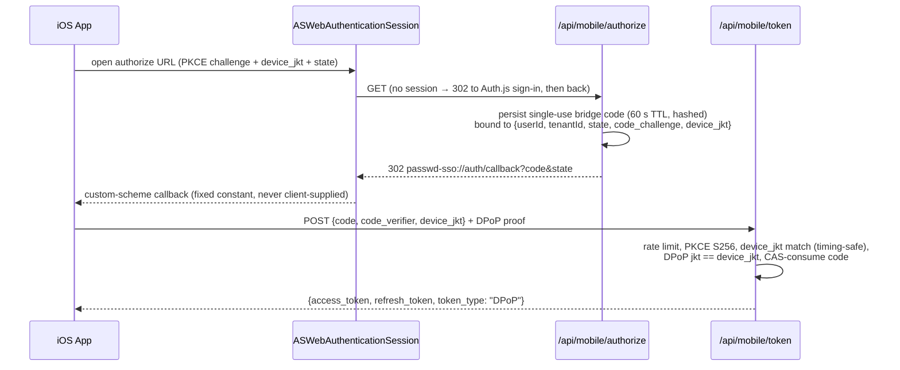

# iOS App & AutoFill Extension Architecture

This document describes how the native iOS app (`ios/`) authenticates with the
web application, how vault material flows between the host app and the AutoFill
credential-provider extension, and the integrity controls protecting the shared
cache. It is the iOS counterpart of
[extension-token-bridge.md](extension-token-bridge.md) and
[extension-passkey-provider.md](extension-passkey-provider.md).

---

## Components

| Target | Role |
| --- | --- |
| `PasswdSSOApp` | Host app: OAuth sign-in, vault unlock (passphrase + Face ID), entry list/search/detail, create + edit (personal), sync, settings, lock/sign-out |
| `PasswdSSOAutofillExtension` | `ASCredentialProvider` extension: password/TOTP fill, QuickType inline suggestions, passkey (WebAuthn) assertion provider |
| `Shared` | Framework shared by both: API client, DPoP, crypto (KDF/AAD/AES-GCM), App Group + Keychain storage, URL matching |

The two processes share:

- **App Group container** (`group.jp.jpng.passwd-sso.shared`): encrypted entry
  cache, wrapped vault/team keys, rollback-flag files (ciphertext only).
- **Keychain access group** (`$(AppIdentifierPrefix)jp.jpng.passwd-sso.shared`):
  the bridge key (biometry-gated) and its metadata.

The plaintext vault key is **never persisted** in either location; each consumer
reconstructs it in memory and zeroes it after use.

## Sign-In Flow (bridge code + PKCE + DPoP)

The app signs in via `ASWebAuthenticationSession` against `/api/mobile/authorize`,
mirroring the extension's SW-initiated bridge-code exchange:



Key properties:

- The redirect target is the fixed constant `passwd-sso://auth/callback` —
  the server never honors a client-supplied `redirect_uri` (no open redirect).
- The AASA file claiming `/api/mobile/authorize/redirect` is generated
  server-side; see [ios/README.md](../../ios/README.md) §AASA for operator setup.
  The redirect route itself is a no-auth fallback landing page for cases where
  the OS does not engage the Universal Link.

## Token Model

| Property | Value |
| --- | --- |
| Token rows | Access + refresh pair, same `familyId` (`ExtensionToken`, `clientKind: IOS_APP`) |
| Access TTL | 24 h idle (`IOS_TOKEN_IDLE_TIMEOUT_MS`) |
| Family absolute TTL | 7 d (`IOS_TOKEN_ABSOLUTE_TIMEOUT_MS`) |
| Binding | DPoP (RFC 9449); each row stores `cnfJkt` = RFC 7638 thumbprint of the device key |
| Device key | P-256 in the **Secure Enclave** (`SecureEnclaveKey.swift`), non-extractable |
| Proof | ES256 JWS `{htm, htu, iat, jti, ath}`; `ath` = SHA-256 of the presented token |
| Storage | Per-app Keychain (`HostTokenStore`), `WhenUnlockedThisDeviceOnly`, **not** in the App Group |

Rotation (`POST /api/mobile/token/refresh`, `refreshIosToken()` in
`src/lib/auth/tokens/mobile-token.ts`):

- Happy path: old pair revoked atomically, new pair minted in the same family
  (`familyCreatedAt` preserved, so the 7-day absolute deadline cannot be
  extended by rotating).
- Replay of a revoked refresh token revokes the **entire family**
  (`MOBILE_TOKEN_REPLAY_DETECTED`); an identical retry within a 5 s grace
  window (`REFRESH_REPLAY_GRACE_MS`) returns the cached new pair instead, so a
  network-level retransmit does not lock the user out.
- Keychain write order is refresh-first, access-last, so a crash never pairs a
  new access token with a stale refresh token.

Every authenticated GET runs a retry ladder: on 401 the client calls
`/refresh`, persists the rotated pair, and retries the original request once.
This is why a sync after a web-side change always reflects the latest state —
the sync itself heals an expired access token. If refresh fails, sync surfaces
`authenticationRequired` and the app routes to full re-sign-in rather than
silently degrading to a partial (personal-only) sync.

## Vault Crypto

The KDF chain matches the web client byte-for-byte (PBKDF2-SHA256, 600k
iterations → unwrap secret key → HKDF `passwd-sso-enc-v1` → vault key);
`kdfType` must be 0 (PBKDF2) — Argon2id is rejected. Entry AAD
(`ios/Shared/Crypto/AAD.swift`) is byte-identical to
`src/lib/crypto/crypto-aad.ts` and the extension implementation, guarded by
golden-vector parity tests (`AADParityTests.swift`) — see the AAD distributed
contract note in the repo memory/review docs: AAD is re-derived per call site
in three codebases and must never drift.

Key hierarchy at rest:

```text
bridge_key (32 B, random per unlock)
  Keychain: biometryCurrentSet, WhenUnlockedThisDeviceOnly
  └─ HKDF "passwd-sso-cache-v1" → cache key
       └─ AES-256-GCM wraps → vault key  (WrappedVaultKey JSON, App Group)
            └─ decrypts → entry cache file (App Group)
bridge_meta (24 B: counter ‖ hostInstallUUID)
  Keychain: no ACL — readable without biometry (counter check, availability probe)
```

On passphrase unlock the app derives the vault key from the server's
`/api/vault/unlock/data` response, generates a fresh `bridge_key` + non-zero
counter + install UUID, and persists only the wrapped form. Face ID unlock
reverses the chain: biometric Keychain read → cache key → unwrap vault key →
verify cache counter — fully offline.

## Entry Cache & Rollback Protection

`HostSyncService.runSync()` fetches personal entries and per-team entries
(parallel personal/team-membership fetch, sequential per team), encrypts the
JSON cache under the vault key, and writes it atomically (`.tmp` → fsync →
rename). Only after the rename succeeds is the Keychain counter incremented —
a crash between the two leaves a cache *newer* than the counter, which the
reader accepts as stale-blob recovery; the reverse (cache older than counter)
is rejected as rollback.

Cache file (`EntryCacheFile.swift`): magic `PSSV`, encrypted header +
encrypted entries, each AES-256-GCM with AAD binding the counter, install
UUID, and (for entries) the userId — so a blob from another install or an old
counter fails authentication, not just a comparison. Freshness gates reject
caches issued > 30 s in the future (clock skew) or stale beyond
1 h issued / 24 h last-successful-refresh.

When the AutoFill extension rejects a cache it writes an HMAC-protected
rollback flag (key = HKDF(vault key, `"rollback-flag-mac"`)) into the App
Group; the host app drains flags on foreground **before** syncing and reports
them to `POST /api/mobile/cache-rollback-report` (DPoP-signed), producing a
server-side audit trail of tampering attempts. A forged flag (bad HMAC) is
reported as `flag_forged`.

## AutoFill Flows

`CredentialProviderViewController` entry points (iOS 17+ APIs):

| Entry point | Flow |
| --- | --- |
| `prepareCredentialList(for:)` / `(for:requestParameters:)` | Password picker; branches to the passkey picker when `relyingPartyIdentifier` is non-empty |
| `prepareOneTimeCodeCredentialList(for:)` | TOTP picker (default list filtered to `hasTOTP`; search spans all entries) |
| `prepareInterfaceToProvideCredential(for:)` | Single-credential path from a QuickType selection (password or passkey assertion) |
| `provideCredentialWithoutUserInteraction(for:)` | Always rejects (`userInteractionRequired`) — per-fill biometry is mandatory |
| `prepareInterface(forPasskeyRegistration:)` | Cancels — registration is out of scope (assertion-only provider) |

Matching: service-identifier URLs are normalized (case-insensitive host,
`www.` stripped) and matched exact-or-subdomain; bundle-ID identifiers are
used as-is. The picker shows matched entries by default; the search box spans
the full entry set.

All fill paths defer their biometric Keychain read to `viewDidAppear`
(`deferToForeground()`): the read requires a foreground UI context, otherwise
Keychain returns `errSecInteractionNotAllowed` (-25308). Each fill uses a
fresh biometric evaluation (`allowableReuseDuration = 0`), and the vault key
is zeroed in `defer` blocks on every resolver path.

### QuickType (ASCredentialIdentityStore)

After sync and after host-app unlock, `CredentialIdentityRegistrar` decrypts
personal overviews and atomically replaces the system identity store with
password identities and passkey identities (rpId, userName, credentialId,
userHandle, recordIdentifier = entry id). Identities are non-secret metadata;
they are cleared on lock/sign-out/app-launch but intentionally **not** on
backgrounding — clearing mid-ceremony broke the passkey assertion path.

### Passkey assertion provider

Passkey entries store the P-256 private key as a JWK inside the encrypted
entry blob (same format the browser extension writes). On assertion the
extension decrypts the material, validates `material.relyingPartyId ==
request.relyingPartyId` exactly (no eTLD+1 expansion — the OS pre-filters),
builds authenticator data (UP+UV+BE+BS flags), signs
`authData ‖ clientDataHash` with ECDSA-P256-SHA256, and returns an
`ASPasskeyAssertionCredential`. The sign counter is monotonic via
`PasskeySignCountStore` (App Group UserDefaults), floored by the last synced
server-side counter.

## Lock, Sign-Out, Tenant Auto-Lock

| Action | Effect |
| --- | --- |
| Lock (manual/auto) | Drops the in-memory vault key only; bridge key kept → Face ID re-unlock available |
| Sign out | Wipes bridge key, tokens, wrapped keys, entry cache, tenant policy → full re-sign-in + passphrase required |
| Biometric re-enrollment | `biometryCurrentSet` ACL invalidates the bridge key → passphrase fallback |

Tenant policy: `/api/vault/unlock/data` returns `vaultAutoLockMinutes`
(nullable). A passphrase unlock persists it authoritatively; a biometric
(offline) unlock keeps the persisted value. Effective timeout =
`tenantAutoLockMinutes ?? userMinutes` — the tenant value overrides the user
setting exactly.

## Security Properties

| Property | Mechanism |
| --- | --- |
| Token theft does not travel | DPoP-bound to a Secure Enclave key; stolen bearer is unusable without the device |
| Vault key never at rest | Wrapped under a biometry-gated bridge key; reconstructed per use, zeroed after |
| Cache rollback detected | Counter in Keychain vs AEAD-bound counter in cache; HMAC rollback flags reported server-side |
| Cross-install replay rejected | hostInstallUUID in cache AAD |
| Per-fill user presence | Fresh Face ID prompt per fill; `provideCredentialWithoutUserInteraction` always rejected |
| Side channels | App-switcher blur, `.privacySensitive()`, screen-capture overlay, 60 s local-only pasteboard (see [ios/README.md](../../ios/README.md)) |

## Known Limitations

- Passkey **registration** is not provided (assertion-only); create passkeys
  via the web app or browser extension.
- Team passkeys are out of scope; QuickType/passkey identities cover personal
  entries only.
- Team-entry write parity: team entries are read-only on iOS; edit via web.
- Membership-revocation window: cached team keys are honored up to 15 min
  (no push channel to invalidate the cache immediately).
- No server-side token revocation endpoint for mobile tokens; sign-out clears
  the device, and the residual refresh token dies at the idle/absolute TTL.
- A full encrypted local backup restores cache + Keychain atomically and can
  legitimately "roll back" to the backup's state; iCloud-only restore drops
  `ThisDeviceOnly` items, so the rollback check fails closed to passphrase
  unlock.

## File Map

| Area | Files |
| --- | --- |
| Server routes | `src/app/api/mobile/{authorize,authorize/redirect,token,token/refresh,cache-rollback-report,.well-known/apple-app-site-association}/route.ts` |
| Token issuance | `src/lib/auth/tokens/mobile-token.ts` |
| Auth / DPoP (iOS) | `ios/Shared/Auth/DPoPProofBuilder.swift`, `ios/Shared/Auth/SecureEnclaveDPoPSigner.swift`, `ios/Shared/Crypto/SecureEnclaveKey.swift` |
| Storage | `ios/Shared/Storage/{HostTokenStore,BridgeKeyStore,WrappedKeyStore,EntryCacheFile,AppGroupContainer,PasskeySignCountStore}.swift` |
| Crypto | `ios/Shared/Crypto/{KDF,AAD,PasskeyAssertion}.swift` |
| AutoFill | `ios/PasswdSSOAutofillExtension/CredentialProviderViewController.swift`, `ios/Shared/AutoFill/{CredentialResolver,CredentialIdentityRegistrar,RollbackFlagWriter}.swift` |
| Host app | `ios/PasswdSSOApp/Vault/{VaultUnlocker,AutoLockService,HostSyncService}.swift` |

Design history (plans/reviews): `docs/archive/review/ios-*.md`.
