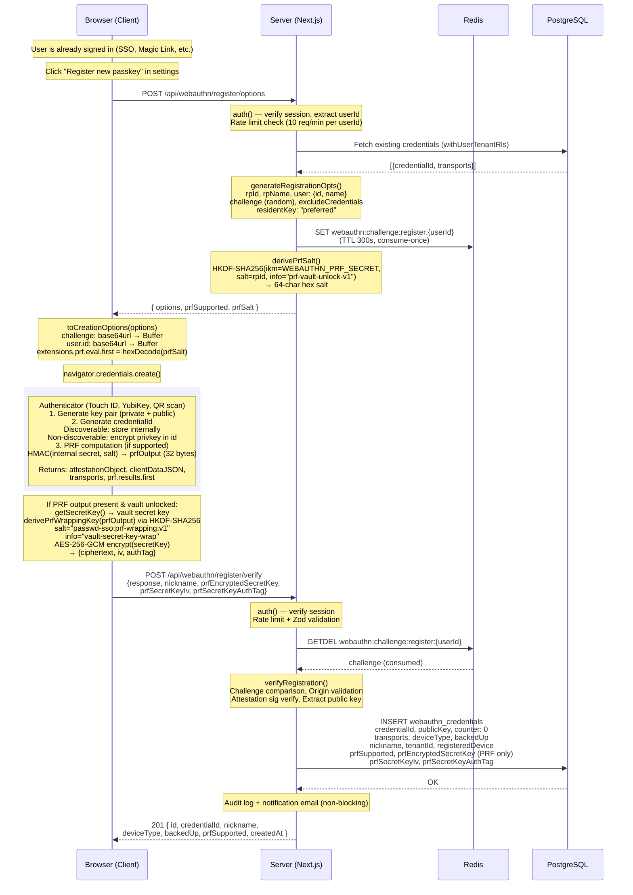

# WebAuthn Passkey Registration Flow

Sequence diagram showing the complete passkey registration flow including
PRF extension for vault auto-unlock key wrapping.

## Prerequisites

- User is already signed in (via SSO, Magic Link, or passkey)
- Vault may or may not be unlocked (PRF wrapping only occurs if unlocked)

## Sequence Diagram



## Key Implementation Files

| Component | File |
|-----------|------|
| Options route | `src/app/api/webauthn/register/options/route.ts` |
| Verify route | `src/app/api/webauthn/register/verify/route.ts` |
| Server helpers | `src/lib/webauthn-server.ts` |
| Client helpers | `src/lib/webauthn-client.ts` |
| PRF salt derivation | `src/lib/webauthn-server.ts` → `derivePrfSalt()` |
| PRF key wrapping | `src/lib/webauthn-client.ts` → `wrapSecretKeyWithPrf()` |
| Email template | `src/lib/email/templates/passkey-registered.ts` |

## Data Flow Examples

Concrete sample values showing how data is transformed at each step.
All values are fictional but structurally accurate.

### Step 1: Server generates options (POST /api/webauthn/register/options)

```text
userId (from session)  = "c3a1f8e2-7b4d-4e9a-b5c6-1234567890ab"
userName               = "alice@example.com"

generateRegistrationOpts() produces:
  challenge (32 random bytes)
    raw    = [0xa7, 0x3f, 0x1b, 0x9c, ...]  (32 bytes)
    base64url = "pz8bnJxE2k7Fq... "          (43 chars, no padding)

  user.id
    raw    = SHA-256(userId) truncated or raw bytes
    base64url = "w6Gf4ntNTpq1xh..."

derivePrfSalt():
  HKDF-SHA256(
    ikm  = WEBAUTHN_PRF_SECRET          // e.g. "a9f3...c7e1" (64-char hex from env)
    salt = "localhost"                   // rpId
    info = "prf-vault-unlock-v1"
  )
  → prfSalt = "b4e7a1d9c0f3285e6a1b7c9d4f2e8a0b3d5c7e9f1a2b4c6d8e0f1a3b5c7d9e0f"
                                          // 64-char hex (32 bytes)

Redis:
  SET webauthn:challenge:register:c3a1f8e2-7b4d-4e9a-b5c6-1234567890ab
      "pz8bnJxE2k7Fq..."
      EX 300
```

**Response to client:**

```json
{
  "options": {
    "rp": { "id": "localhost", "name": "passwd-sso" },
    "user": {
      "id": "w6Gf4ntNTpq1xh...",
      "name": "alice@example.com",
      "displayName": "alice@example.com"
    },
    "challenge": "pz8bnJxE2k7Fq...",
    "pubKeyCredParams": [
      { "type": "public-key", "alg": -7 },
      { "type": "public-key", "alg": -257 }
    ],
    "timeout": 60000,
    "excludeCredentials": [],
    "authenticatorSelection": {
      "residentKey": "preferred",
      "userVerification": "preferred"
    },
    "attestation": "none"
  },
  "prfSupported": true,
  "prfSalt": "b4e7a1d9c0f3285e6a1b7c9d4f2e8a0b3d5c7e9f1a2b4c6d8e0f1a3b5c7d9e0f"
}
```

### Step 2: Client converts options and calls authenticator

```text
toCreationOptions(options):
  challenge: "pz8bnJxE2k7Fq..."
    → base64urlDecode → Uint8Array(32) → .buffer → ArrayBuffer(32)

  user.id: "w6Gf4ntNTpq1xh..."
    → base64urlDecode → Uint8Array → .buffer → ArrayBuffer

  extensions.prf.eval.first:
    prfSalt "b4e7a1d9c0f3285e..."
    → hexDecode → Uint8Array(32) → .buffer → ArrayBuffer(32)

navigator.credentials.create({ publicKey: ... })
  → Authenticator performs biometric/PIN verification
  → Generates ES256 key pair (P-256 curve)
  → Returns PublicKeyCredential
```

### Step 3: Authenticator returns credential + PRF output

```text
credential.id          = "dGVzdC1jcmVkZW50aWFsLWlk"  (base64url, auto-generated)
credential.rawId       = ArrayBuffer(32)               (same as id, binary form)
credential.type        = "public-key"

response.attestationObject = ArrayBuffer(~350 bytes)
  Contains: CBOR-encoded { fmt, attStmt, authData }
  authData includes: rpIdHash(32) + flags(1) + counter(4) + credentialId + publicKey(COSE)

response.clientDataJSON = ArrayBuffer(~200 bytes)
  JSON: { "type": "webauthn.create",
          "challenge": "pz8bnJxE2k7Fq...",
          "origin": "http://localhost:3000" }

response.getTransports() = ["internal"]  (Touch ID)
                         or ["usb"]      (YubiKey)

extResults.prf.results.first = ArrayBuffer(32)
  PRF output: [0x8c, 0x2f, 0xa1, 0x3b, ...]  (32 bytes, unique per credential+salt)
```

### Step 4: Client wraps vault secret key with PRF (client-side only)

```text
prfOutput = Uint8Array(32)  // from Step 3

derivePrfWrappingKey(prfOutput):
  HKDF-SHA256(
    ikm  = prfOutput                          // 32 bytes from authenticator
    salt = "passwd-sso:prf-wrapping:v1"       // domain separation
    info = "vault-secret-key-wrap"
  )
  → CryptoKey (AES-256-GCM, non-extractable)

secretKey = getSecretKey()  // 32-byte vault secret key (from memory)
  = Uint8Array [0x4a, 0x7f, 0xd2, ...]

iv = crypto.getRandomValues(new Uint8Array(12))
  = [0xe3, 0x91, 0x0a, ...]  (12 bytes)

AES-256-GCM.encrypt(key, iv, secretKey):
  → ciphertext (32 bytes) + authTag (16 bytes)

Result (all hex-encoded):
  ciphertext = "5f8a2c...d4e1"       (64 chars = 32 bytes)
  iv         = "e3910a...7b2f"       (24 chars = 12 bytes)
  authTag    = "a1b2c3...f4e5"       (32 chars = 16 bytes)
```

### Step 5: Client sends verify request (POST /api/webauthn/register/verify)

```json
{
  "response": {
    "id": "dGVzdC1jcmVkZW50aWFsLWlk",
    "rawId": "dGVzdC1jcmVkZW50aWFsLWlk",
    "type": "public-key",
    "response": {
      "clientDataJSON": "eyJ0eXBlIjoid2ViYXV0aG4uY3JlYXRlIi...",
      "attestationObject": "o2NmbXRkbm9uZWdhdHRTdG10oGhh...",
      "transports": ["internal"]
    },
    "clientExtensionResults": { "prf": { "enabled": true } }
  },
  "nickname": "macOS (Chrome)",
  "prfEncryptedSecretKey": "5f8a2c...d4e1",
  "prfSecretKeyIv": "e3910a...7b2f",
  "prfSecretKeyAuthTag": "a1b2c3...f4e5"
}
```

### Step 6: Server verifies and stores credential

```text
Redis GETDEL webauthn:challenge:register:c3a1f8e2-...
  → "pz8bnJxE2k7Fq..."  (consumed, key deleted)

verifyRegistration():
  ✓ challenge matches
  ✓ origin = "http://localhost:3000"
  ✓ attestation signature valid
  → registrationInfo.credentialID       = Uint8Array(32)
  → registrationInfo.credentialPublicKey = Uint8Array(77)  (COSE EC2 P-256)
  → registrationInfo.counter            = 0
  → registrationInfo.credentialDeviceType = "multiDevice"
  → registrationInfo.credentialBackedUp   = true

uint8ArrayToBase64url(credentialID)  → "dGVzdC1jcmVkZW50aWFsLWlk"
uint8ArrayToBase64url(publicKey)     → "pQECAyYgASFYIPk8..."

INSERT INTO webauthn_credentials:
  userId       = "c3a1f8e2-7b4d-4e9a-b5c6-1234567890ab"
  tenantId     = "tenant-001"
  credentialId = "dGVzdC1jcmVkZW50aWFsLWlk"
  publicKey    = "pQECAyYgASFYIPk8..."
  counter      = 0 (BigInt)
  transports   = ["internal"]
  deviceType   = "multiDevice"
  backedUp     = true
  nickname     = "macOS (Chrome)"
  prfSupported = true
  prfEncryptedSecretKey = "5f8a2c...d4e1"
  prfSecretKeyIv        = "e3910a...7b2f"
  prfSecretKeyAuthTag   = "a1b2c3...f4e5"
  registeredDevice      = "Chrome 120 / macOS 14.2"
```

**Response to client:**

```json
{
  "id": "clxyz123-abcd-...",
  "credentialId": "dGVzdC1jcmVkZW50aWFsLWlk",
  "nickname": "macOS (Chrome)",
  "deviceType": "multiDevice",
  "backedUp": true,
  "prfSupported": true,
  "createdAt": "2026-03-06T10:30:00.000Z"
}
```

### Data Encoding Summary

| Data | Server format | Wire format | Client format |
| ---- | ------------- | ----------- | ------------- |
| challenge | random bytes | base64url string | ArrayBuffer |
| user.id | UUID string | base64url string | ArrayBuffer |
| credentialId | — | base64url string | ArrayBuffer |
| publicKey | — | base64url (in attestationObject) | — |
| PRF salt | HKDF output | hex string (64 chars) | ArrayBuffer (32 bytes) |
| PRF output | — (never sent to server) | — | ArrayBuffer (32 bytes) |
| PRF wrapped key | — | hex strings | — |

## Security Notes

- **Challenge**: Random, single-use (Redis GETDEL), 5-minute TTL
- **PRF salt**: RP-global via HKDF-SHA256 (not per-user — PRF output is already unique per credential)
- **PRF wrapping**: Client-side only. Server never sees the vault secret key or PRF output
- **PRF fields**: All-or-nothing validation (Zod refine: all 3 fields or none)
- **Rate limiting**: 10 req/min per userId on both options and verify endpoints
- **RLS**: Queries use `withUserTenantRls` for tenant isolation
