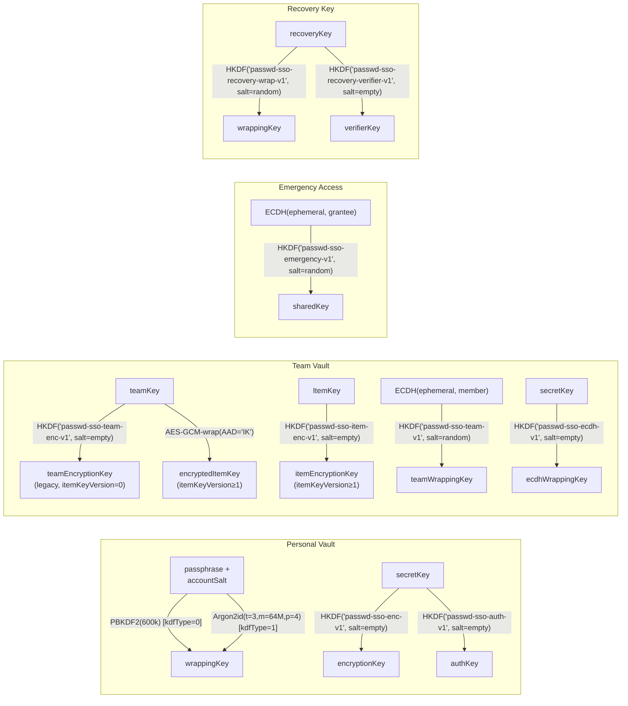

# Crypto Domain Separation Ledger

This document is the single source of truth for all cryptographic domain
separations used in passwd-sso. It is automatically verified by
`scripts/checks/check-crypto-domains.mjs` in CI.

Last verified: 2026-03-07

---

## HKDF Info Strings

| Domain | HKDF info | Purpose | Salt strategy | File | Constant |
|---|---|---|---|---|---|
| Vault encryption | `passwd-sso-enc-v1` | Derive AES-256-GCM encryption key from secretKey | Empty (32 bytes) | crypto-client.ts | `HKDF_ENC_INFO` |
| Vault auth | `passwd-sso-auth-v1` | Derive auth key from secretKey (server verification) | Empty (32 bytes) | crypto-client.ts | `HKDF_AUTH_INFO` |
| Team key wrap | `passwd-sso-team-v1` | Derive AES key from ECDH shared secret for team key wrapping | Random (32 bytes per wrap) | crypto-team.ts | `HKDF_TEAM_WRAP_INFO` |
| Team entry enc | `passwd-sso-team-enc-v1` | Derive AES key from team symmetric key for entry encryption | Empty (32 bytes) | crypto-team.ts | `HKDF_TEAM_ENC_INFO` |
| ECDH priv wrap | `passwd-sso-ecdh-v1` | Derive AES key from secretKey for ECDH private key wrapping | Empty (32 bytes) | crypto-team.ts | `HKDF_ECDH_WRAP_INFO` |
| Emergency access | `passwd-sso-emergency-v1` | Derive AES key from ECDH shared secret for emergency access | Random (32 bytes per escrow) | crypto-emergency.ts | `HKDF_INFO_BY_VERSION[1]` |
| Recovery key wrap | `passwd-sso-recovery-wrap-v1` | Derive AES key from recovery key for secret key wrapping | Random (32 bytes per wrap) | crypto-recovery.ts | `HKDF_RECOVERY_WRAP_INFO` |
| Recovery verifier | `passwd-sso-recovery-verifier-v1` | Derive verification hash from recovery key | Empty (32 bytes) | crypto-recovery.ts | `HKDF_RECOVERY_VERIFIER_INFO` |
| Item entry enc | `passwd-sso-item-enc-v1` | Derive AES key from ItemKey for entry/attachment encryption | Empty (32 bytes) | crypto-team.ts | `HKDF_ITEM_ENC_INFO` |

---

## AAD Scopes

| Scope | Code constant | Purpose | Fields | File |
|---|---|---|---|---|
| `PV` | `SCOPE_PERSONAL` | Personal vault entry encryption | userId, entryId | crypto-aad.ts |
| `OV` | `SCOPE_TEAM` | Team vault entry encryption | teamId, entryId, vaultType, itemKeyVersion | crypto-aad.ts |
| `AT` | `SCOPE_ATTACHMENT` | Attachment encryption | entryId, attachmentId | crypto-aad.ts |
| `OK` | `AAD_SCOPE_TEAM_KEY` | Team member key wrapping | teamId, toUserId, keyVersion, wrapVersion | crypto-team.ts |
| `IK` | `SCOPE_ITEM_KEY` | ItemKey wrapping | teamId, entryId, teamKeyVersion | crypto-aad.ts |

### AAD Binary Format (common)

```
[scope: 2B ASCII] [aadVersion: 1B uint8] [nFields: 1B uint8]
[field_len: 2B BE] [field: N bytes UTF-8] x nFields
```

AAD version: `1` for all scopes.

---

## Passphrase Verifier Domain

| Domain | Strategy | File | Constants |
|---|---|---|---|
| Verifier salt derivation | `SHA-256("verifier" \|\| accountSalt)` | crypto-client.ts | `VERIFIER_DOMAIN_PREFIX` |
| Verifier PBKDF2 | 600,000 iterations, SHA-256, 256-bit output | crypto-client.ts | `VERIFIER_PBKDF2_*` |

---

## Other Crypto Constants

| Constant | Value | File | Purpose |
|---|---|---|---|
| `VERIFICATION_PLAINTEXT` | `passwd-sso-vault-verification-v1` | crypto-client.ts | Known plaintext for encryption key verification |
| `CURRENT_TEAM_WRAP_VERSION` | `1` | crypto-team.ts | Team key wrap protocol version |
| `CURRENT_WRAP_VERSION` | `1` | crypto-emergency.ts | Emergency access wrap protocol version |
| `VERIFIER_VERSION` | `1` | crypto-client.ts | Passphrase verifier protocol version |

---

## Algorithm Parameters

| Parameter | Value | Scope |
|---|---|---|
| PBKDF2 iterations | 600,000 | Vault wrapping (kdfType=0) + verifier |
| Argon2id iterations | 3 | Vault wrapping (kdfType=1) |
| Argon2id memory | 65,536 KiB (64 MiB) | Vault wrapping (kdfType=1) |
| Argon2id parallelism | 4 | Vault wrapping (kdfType=1) |
| AES key length | 256 bits | All encryption |
| GCM IV length | 12 bytes (96 bits) | All AES-GCM |
| HKDF hash | SHA-256 | All HKDF derivations |
| HKDF empty salt | 32 zero bytes | When input has sufficient entropy |

### HKDF Empty Salt Rationale

Six of nine HKDF derivations use an empty (32 zero bytes) salt. This is a deliberate
design choice, not an omission.

[**RFC 5869 §2.2 (Step 1: Extract)**](https://www.rfc-editor.org/rfc/rfc5869#section-2.2) states: "if not provided, it is set to a string of HashLen zeros." The extract step then produces `PRK = HMAC-Hash(salt, IKM)`. [**RFC 5869 §3.3 ("To Skip or not to Skip")**](https://www.rfc-editor.org/rfc/rfc5869#section-3.3) explicitly addresses this case: when the IKM is already a uniformly random cryptographic key, the extract step is not strictly necessary for security, so a zero salt does not weaken the construction. This is the case for our `secretKey`, `teamKey`, `ItemKey`, and `recoveryKey` — all generated via `crypto.getRandomValues` with 256 bits of entropy. A zero salt is cryptographically acceptable because:

1. The IKM provides full entropy input to HMAC — the salt's purpose (to
   "standardize" weak IKM) is unnecessary.
2. Domain separation is fully achieved through the unique `info` parameter
   per derivation (see table above). No two derivations share the same
   `(info, salt)` pair.
3. Random salts are used where the IKM derives from a Diffie-Hellman shared
   secret (team key wrap, emergency access), as the DH output has structure
   that benefits from salt-based extraction.

**Migration path**: If a future audit requires non-zero salts, the `info` version
suffix (e.g., `-v1`) serves as the migration hook. A new version (e.g.,
a v2 info string) can introduce random salts while maintaining backward
compatibility via version-gated decryption.

---

## Key Derivation Chains



---

## Collision Analysis

All HKDF `info` strings use the `passwd-sso-` prefix with unique suffixes.
No two derivations share the same (info, salt strategy) pair.

Domain separation is enforced at multiple levels:

1. **HKDF info** — distinguishes key purpose
2. **AAD scope** — distinguishes encrypted object type
3. **AAD fields** — binds ciphertext to specific IDs and versions
4. **Salt strategy** — random salt for key wrapping, empty salt for deterministic derivation

This ensures no cross-domain key reuse even if the same root key material is shared.
